# Методические указания по выполнению лабораторной работы: in-memory база данных

## Оглавление

- [Методические указания по выполнению лабораторной работы: in-memory база данных](#методические-указания-по-выполнению-лабораторной-работы-in-memory-база-данных)
  - [Оглавление](#оглавление)
  - [Введение](#введение)
  - [Настройка IDE](#настройка-ide)
    - [Установка Python](#установка-python)
    - [Настройка Visual Studio Code](#настройка-visual-studio-code)
    - [Настройка PyCharm](#настройка-pycharm)
  - [Стандарты разработки и структура проекта](#стандарты-разработки-и-структура-проекта)
  - [Построение базы данных](#построение-базы-данных)
    - [Списки, кортежи и словари](#списки-кортежи-и-словари)
      - [Списки](#списки)
      - [Кортеж](#кортеж)
      - [Словари](#словари)
    - [Обработка ошибок](#обработка-ошибок)
    - [Пример реализции простой базы данных](#пример-реализции-простой-базы-данных)
    - [Реализация простого пользовательского интерфейса](#реализация-простого-пользовательского-интерфейса)
  - [Заключение](#заключение)


## Введение

Данная лабораторная работа посвящена реализации **in-memory** базы данных. Цель работы состоит в следующем:

1. Отработка практики работы с Git.
2. Освоение настройки и использования современных IDE.  
3. Первичное знакомство с базовыми концепциями баз данных (на уровне операций и структуры хранения).  
4. Практика применения структур данных: хэш-таблиц (на уровне `dict`), массивоподобных структур (`list`) и списков/последовательностей, а также навыков организации кода в виде модулей и пакетов.

## Настройка IDE

Для разработки лабораторных работ рекомендуется использовать современные интегрированные среды разработки (IDE). В данной методичке приводится инструкция по настройке двух IDE (на выбор): **Visual Studio Code** и **PyCharm**.

### Установка Python

Перед настройкой IDE необходимо установить Python. Рекомендуемый первоисточник для загрузки — официальный сайт Python: https://www.python.org/downloads/.

В зависимости от операционной системы возможны разные способы установки. Например, в актуальной документации для Windows описан **Python Install Manager**, который можно получить как с `python.org`, так и через Microsoft Store; он обеспечивает установку Python как глобальных команд и поддержку обновлений во времени.

Если вы используете классический графический установщик, то при установке обычно доступна опция добавления Python в `PATH` (например, «Add Python to PATH»); включение этой опции может упростить запуск `python` из терминала, однако в ряде сценариев это остаётся опциональным и зависит от выбранного механизма запуска и управления версиями.

При использовании установщика, ориентируйтесь на следующие шаги:

- при необходимости отметьте опцию `Add Python to PATH`;  
- нажмите `Install Now` и завершите установку.

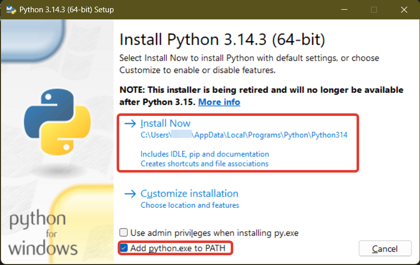

Если установка выполнена корректно, команда `python --version` выведет версию установленного интерпретатора.

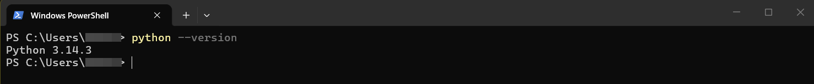

### Настройка Visual Studio Code

Для установки Visual Studio Code используйте официальный сайт: https://code.visualstudio.com/. Запустите установщик; параметры можно оставить по умолчанию.

Для полноценной работы с Python в Visual Studio Code следует установить официальные расширения для Python. В документации VS Code отмечается, что отладка Python предоставляется через расширение **Python Debugger**, которое устанавливается вместе с Python-расширением.

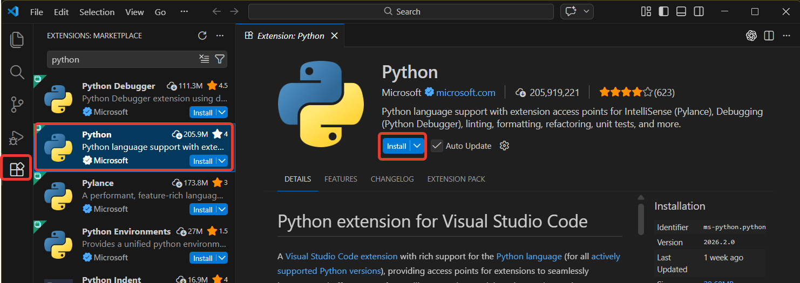

Дополнительно рекомендуется установить `Ruff` для статического анализа и форматирования кода (включая форматирование командой `ruff format`).

Далее необходимо открыть папку с вашим репозиторием `PIOA НомерГруппы` либо склонировать его.

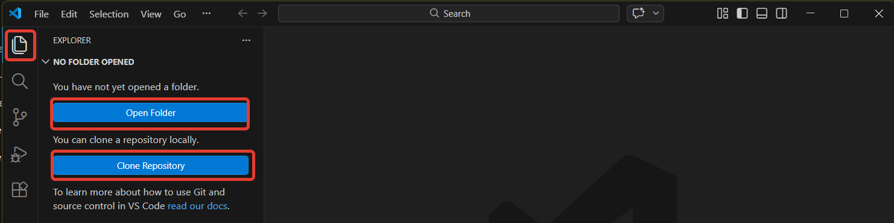

Если шаги выполнены корректно, на вкладке управления версиями подтянется репозиторий. Для работы с Git в VS Code используется представление **Source Control**, которое открывается сочетанием `Ctrl+Shift+G`.

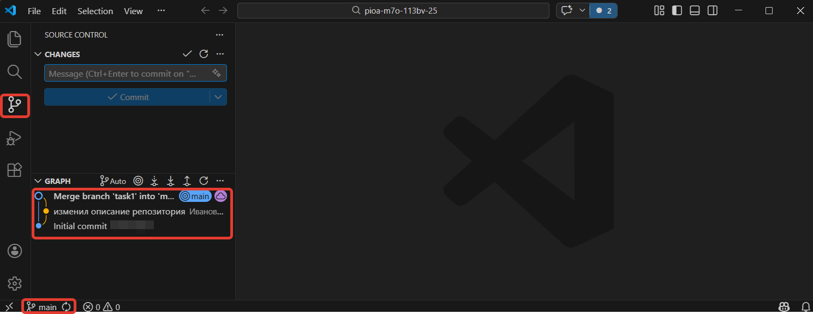

По заданию требуется создать ветку `task2` и выполнять лабораторную работу в этой ветке. Создайте ветку средствами IDE:

- на вкладке `Source Control` (`Ctrl+Shift+G`) нажмите `... -> Branch -> Create Branch`, затем введите имя ветки и нажмите Enter;  
- альтернативно: нажмите на название текущей ветки в нижней панели и выберите `Create New Branch`.

Обратите внимание: ветка создаётся **от текущей выбранной ветки**. Если требуется создать ветку от другой ветки, используйте вариант `Create new branch from...`.

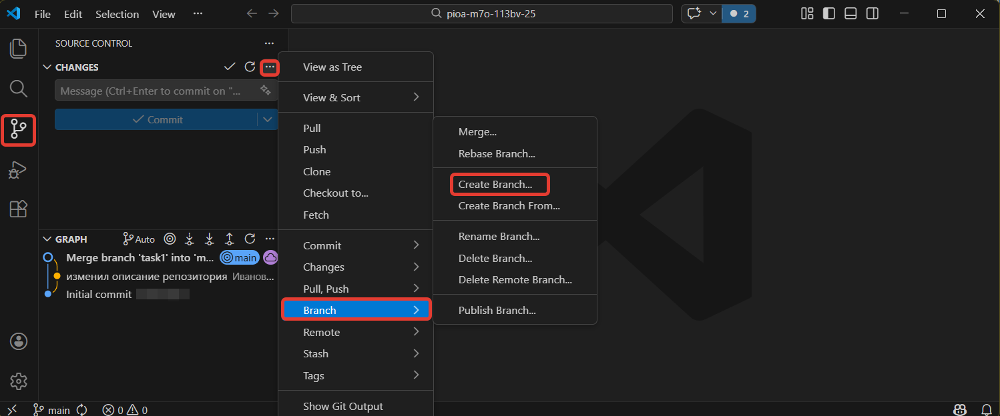
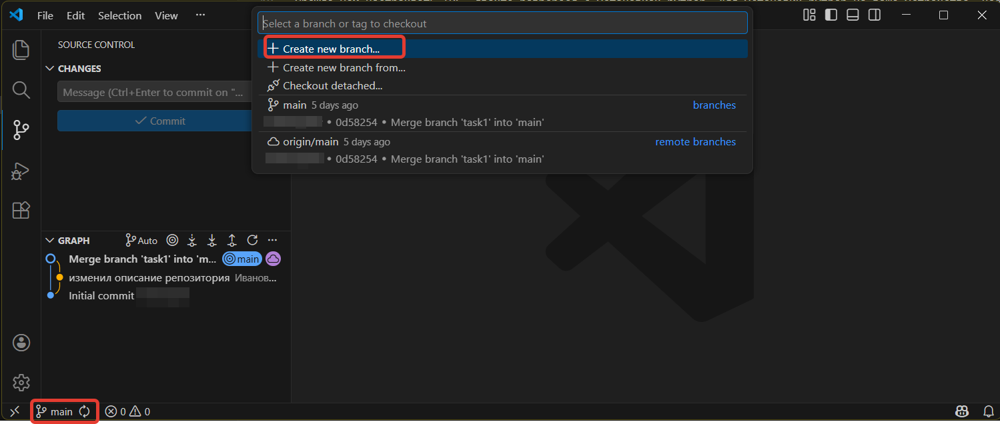
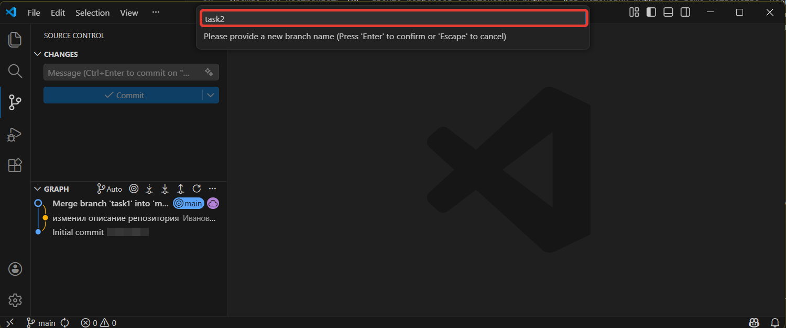

Если всё сделано верно, наименование ветки в нижней панели изменится на `task2`, а VS Code предложит опубликовать ветку в удалённом репозитории.

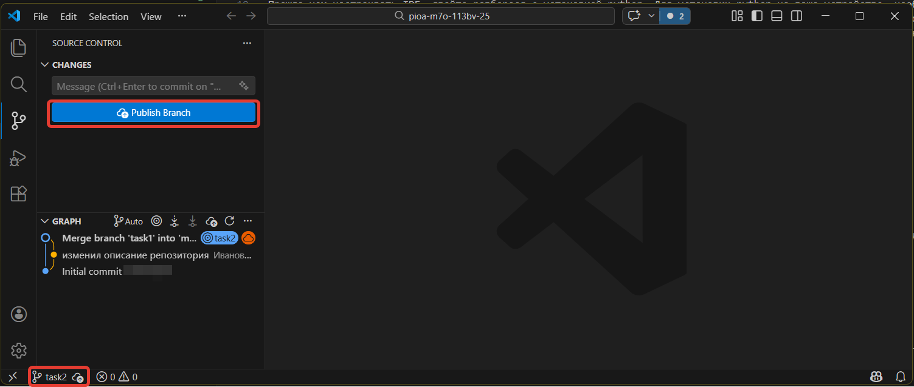

**Для теста** создайте в корне репозитория файл `main.py`, поместите в него код `print('Hello World')` и запустите. Запуск возможен через кнопку запуска или сочетанием `Ctrl+F5` (запуск без отладки).

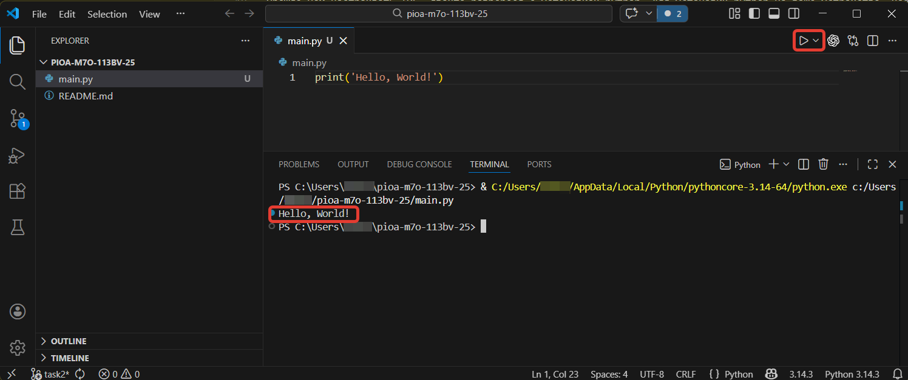

Чтобы запустить режим отладки:

1. Установите точку остановки (двойной клик слева от строки с кодом) в `main.py`.  
2. Нажмите кнопку запуска отладки или `F5`.  
3. При выборе конфигурации отладки укажите Python-отладчик (Python Debugger).

VS Code должен остановиться на точке остановки, а слева/в панели отладки отобразится состояние выполнения.

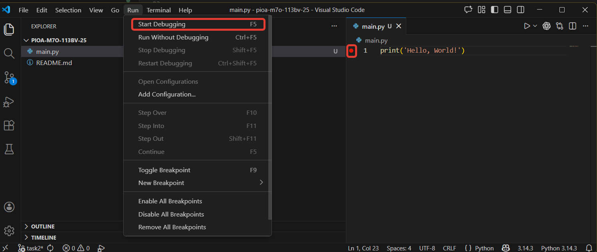
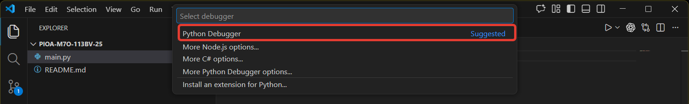
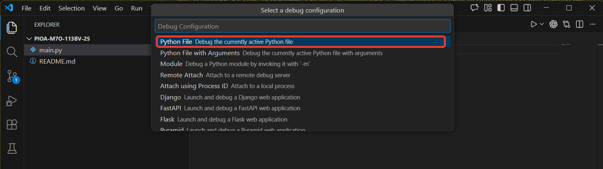
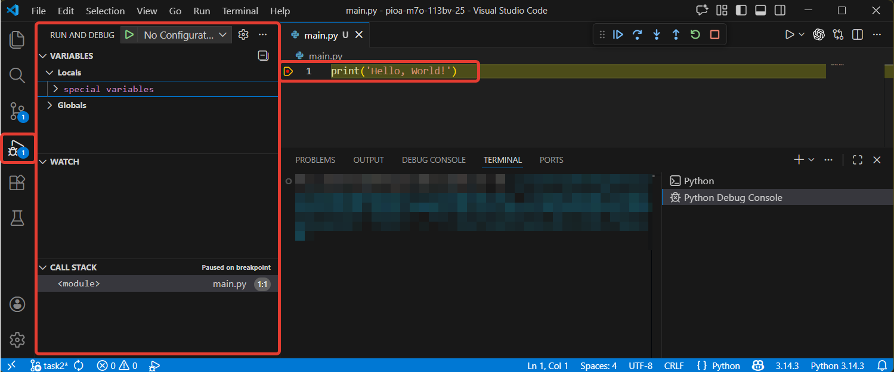

После проверки настройка завершена; файл `main.py` можно удалить.

### Настройка PyCharm

Скачайте PyCharm с официального сайта JetBrains: https://www.jetbrains.com/pycharm/download/ и установите как обычную программу.

PyCharm — IDE, ориентированная на Python, поэтому процесс первичной настройки часто проще.

Откройте папку с вашим репозиторием `PIOA НомерГруппы` либо склонируйте его.

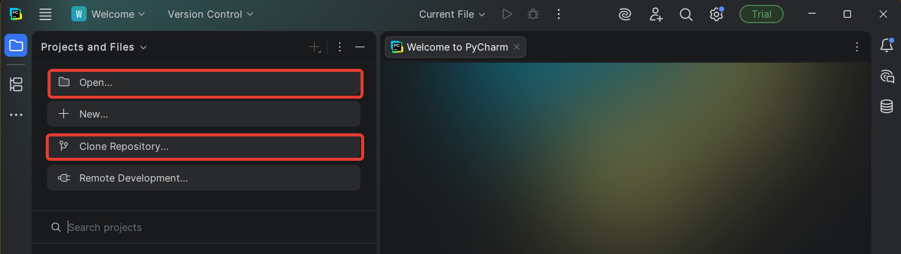

Если всё сделано верно, на вкладке Git подтянется ваш репозиторий; также в верхней части интерфейса будет видна текущая ветка.

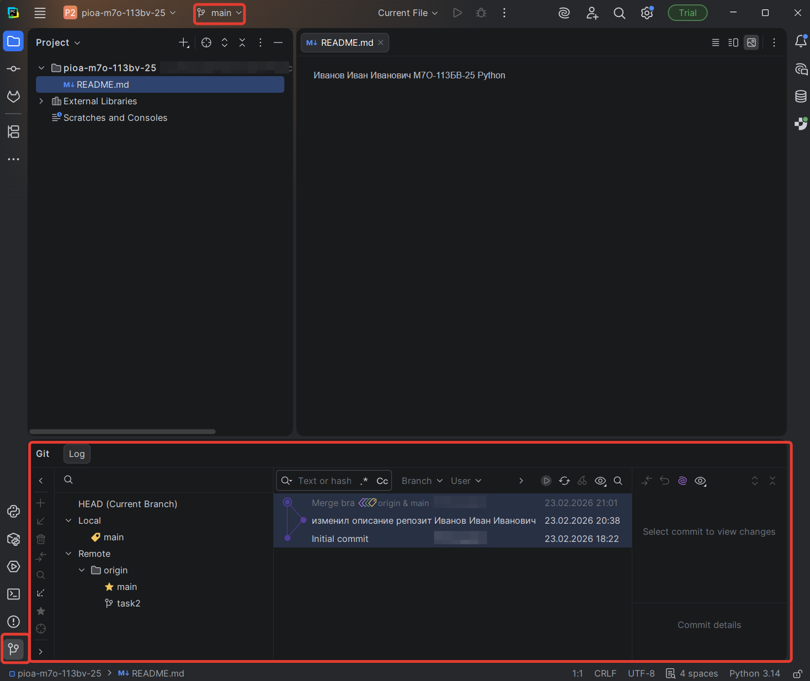

По заданию требуется создать ветку `task2`. Выполните создание ветки средствами PyCharm:

- на вкладке `Git` (`Alt+9`) нажмите `New branch` (`Ctrl+Alt+N`) и введите имя ветки;  
- альтернативно: нажмите на название текущей ветки в верхней панели и выберите `+ New Branch`.  

Обратите внимание: ветка создаётся **от текущей выбранной ветки**. Для создания ветки от другой ветки выберите нужную ветку, нажмите правой кнопкой и выберите `New Branch from ''`.

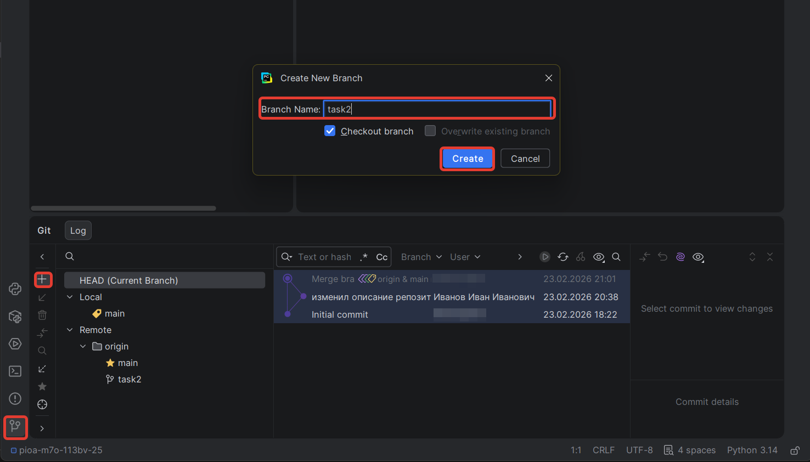
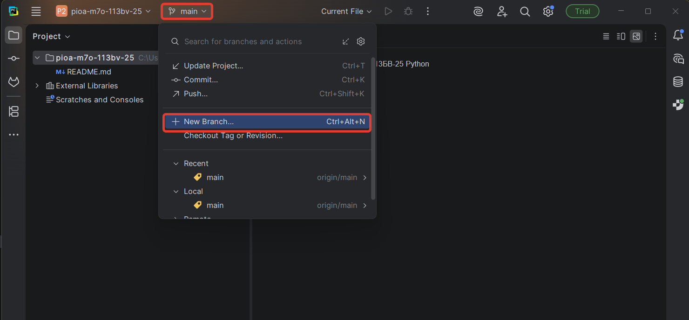
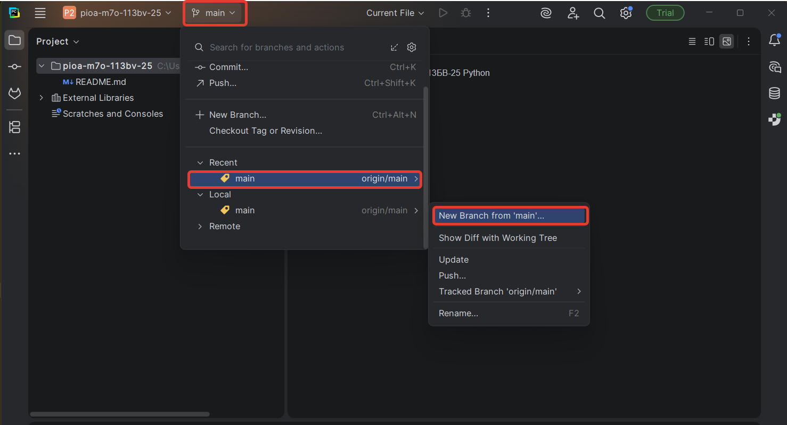

Если всё сделано верно, текущая ветка в верхней панели изменится на `task2`.

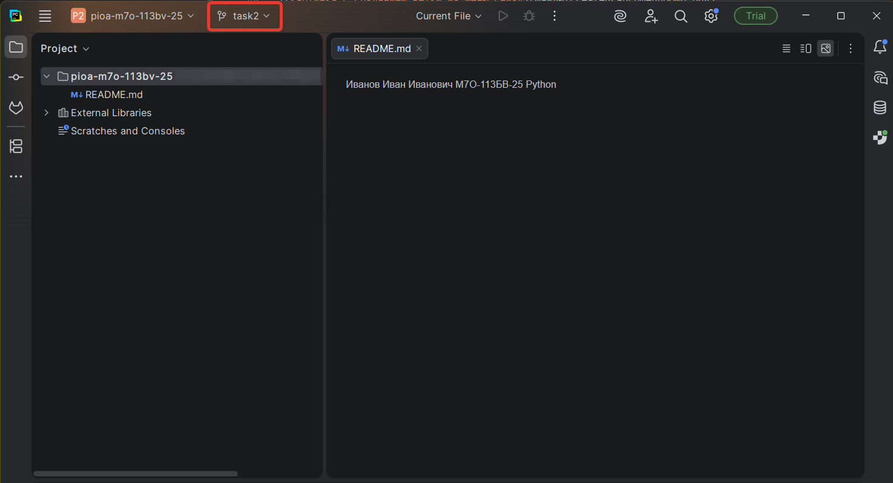

**Для теста** создайте в корне репозитория файл `main.py`, напишите `print('Hello World')` и запустите. Запуск возможен через кнопку запуска или сочетанием `Shift+F10` (Run).

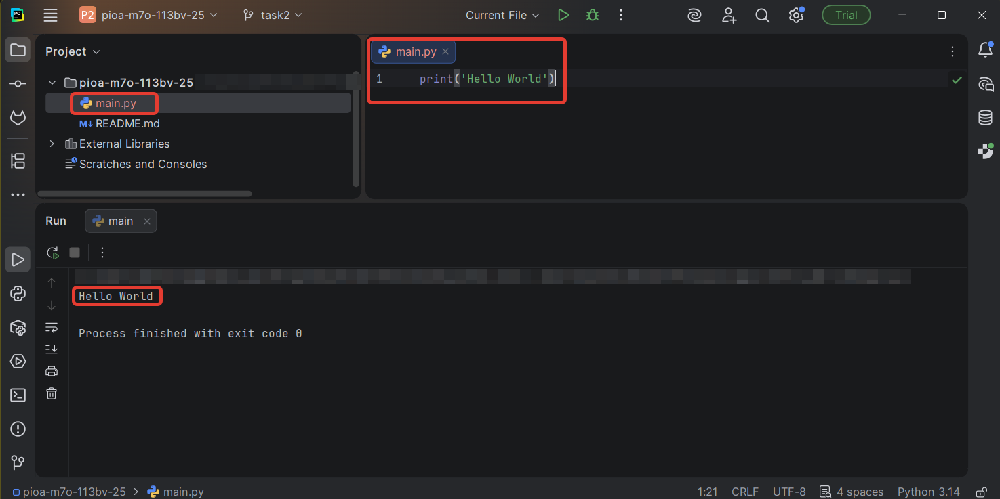

Чтобы запустить режим отладки:

1. Установите точку остановки (клик слева от строки).  
2. Запустите отладку кнопкой Debug или сочетанием `Shift+F9`.

Программа остановится на точке остановки, а в нижней панели отобразится состояние выполнения.

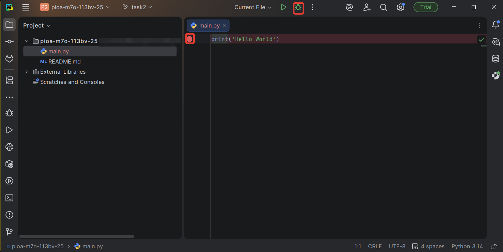
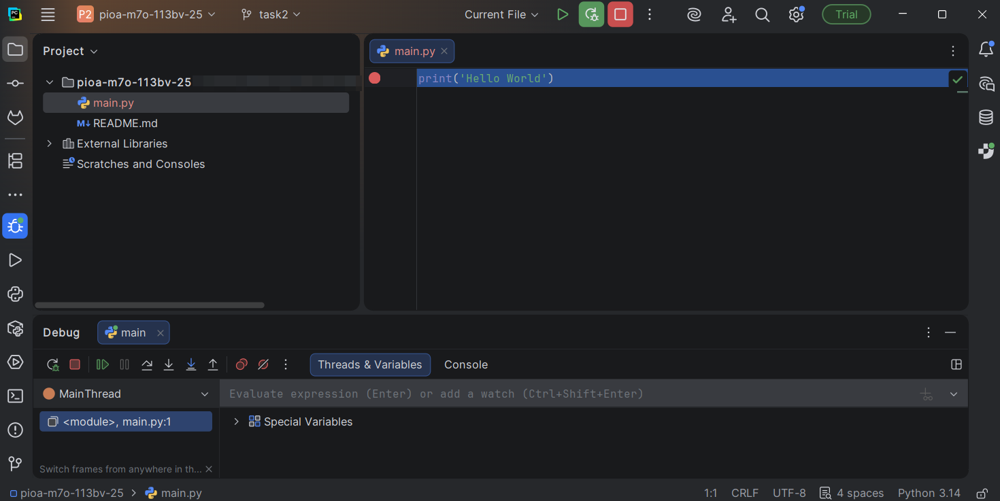

После проверки настройка завершена; файл `main.py` можно удалить.

## Стандарты разработки и структура проекта

Со временем языки программирования формируют правила и рекомендации (стандарты де-факто) для написания читаемого и поддерживаемого кода. Для Python ключевым документом по стилю является **PEP 8** — [«Style Guide for Python Code»](https://pythonworld.ru/osnovy/pep-8-rukovodstvo-po-napisaniyu-koda-na-python.html).

Для упрощения соблюдения стиля и повышения качества кода удобно применять линтеры и форматтеры (инструменты статического анализа и автоматического форматирования). В качестве примера может использоваться `Ruff`, который сочетает быстрый линтинг и форматирование.

Перед началом реализации определим термины:

- **Модуль** — отдельный Python-файл с расширением `.py`.  
- **Пакет** — импортируемая директория, содержащая (как правило) `__init__.py`.  

В учебных целях удобно хранить исходный код в отдельном каталоге `src` (от *source*). Такой подход («src-layout») обсуждается в руководствах по упаковке/структуре Python‑проектов и помогает отделять исполняемую часть проекта от прочих файлов репозитория.

Далее создайте пакет приложения. Для этого создайте каталог `db` (сокращение от *database*) внутри `src`.

Чтобы директория стала «обычным» пакетом (в смысле механизма импорта), принято добавлять файл `__init__.py`. В нашем случае он может быть пустым, поскольку используется именно для обозначения пакета и (при необходимости) для инициализации пространства имён.

Затем реализуйте исполняемый модуль со служебным именем `__main__.py`. Временный тестовый код:

```python
def main():
    print("Hello, this is the db module!")


if __name__ == "__main__":
    main()
```

Если всё сделано верно, следующая команда выведет на экран `Hello, this is the db module!`

```powershell
python -m src.db
```

Запуск с параметром `-m` означает выполнение **модуля или пакета как скрипта**; для пакета этот механизм достигается размещением `__main__.py`, который будет выполнен при запуске `python -m <package>`. 

Для работы с пользовательским интерфейсом рекомендуется выделить отдельный модуль. Назовём его `tui.py` (*text user interface* — текстовый пользовательский интерфейс).

Теперь необходимо создать модуль для работы с базой данных. Сделайте вложенный пакет `backend`: этот пакет будет реализовывать работу с базой данных. Внутри него создайте модуль `memory.py`, реализующий функциональность in-memory базы данных.

В итоге структура программы должна выглядеть следующим образом:

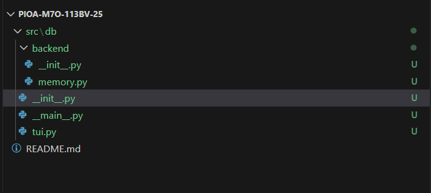

```
PIOA-НомерГруппы/
│
├── src/
│ └── db/
│   └── backend/
│   │  ├── __init__.py
│   │  └── memory.py
│   │
│   ├── __init__.py
│   ├── __main__.py
│   └── tui.py
│
└── README.md
```

Ниже приведена схема зависимости компонентов (пакет/модули) в виде mermaid‑диаграммы, которая отражает методику декомпозиции приложения (точка входа → UI → слой хранения):

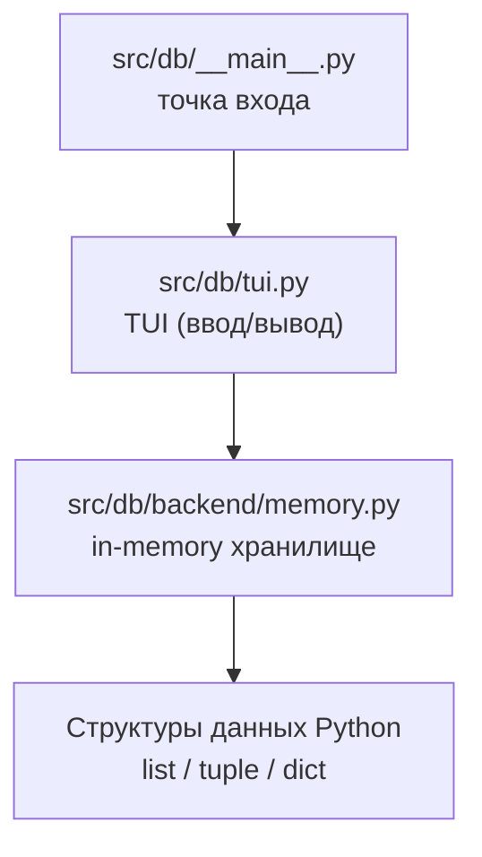
```mermaid
flowchart TD
  A["src/db/__main__.py<br/>точка входа"] --> B["src/db/tui.py<br/>TUI (ввод/вывод)"]
  B --> C["src/db/backend/memory.py<br/>in-memory хранилище"]
  C --> D["Структуры данных Python<br/>list / tuple / dict"]
```

## Построение базы данных

Современные системы хранения данных часто описываются через операции CRUD: **Create** (создать), **Read** (прочитать), **Update** (обновить), **Delete** (удалить). В контексте лабораторной работы ваша in-memory база данных должна реализовать эти операции на структуре данных, находящейся в оперативной памяти.

Далее требуется наметить интерфейс базы данных в файле `memory.py`:

```python
def create_record():
    """Добавляет новую запись в существующую таблицу."""
    pass


def select_record():
    """Возвращает записи, подходящие под запрос или фильтр."""
    pass


def update_record():
    """Обновляет поля существующей записи по идентификатору или фильтру."""
    pass


def delete_record():
    """Удаляет запись из таблицы по идентификатору или фильтру."""
    pass
```

Ниже представлена обобщённая схема CRUD‑цикла для in-memory хранения (создание → чтение → изменение → удаление), полезная при проектировании последовательности действий и тестировании:

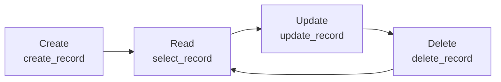
```mermaid
flowchart LR
  C[Create<br/>create_record] --> R[Read<br/>select_record]
  R --> U[Update<br/>update_record]
  U --> D[Delete<br/>delete_record]
  D --> R
```

### Списки, кортежи и словари

Для реализации базы данных требуются структуры хранения. Для «полноценной» реализации  «на пятёрку» рекомендуется использовать сочетание: списки, кортежи и словари.

#### Списки

Списки (`list`) в Python являются изменяемыми последовательностями. В CPython (*стандартная и самая распространённая реализация языка Python*) они реализованы как **массив переменной длины** (contiguous array of references), что обеспечивает доступ по индексу за время, в типичном случае не зависящее от размера списка.

Индексирование начинается с нуля. Список может содержать элементы различных типов.

```python
# Создание пустого списка двумя способами.
lst = []
lst = list()

# Создание списка с начальными значениями.
numbers = [10, 20, 30]

# Список может содержать элементы разных типов данных.
data = ["Ivan", 20, True, 4.5]


# === Чтение значений ===

# Доступ к элементу по индексу (индексация начинается с 0).
print(numbers[0])   # 10

# Отрицательный индекс означает обращение с конца списка.
print(numbers[-1])  # 30

# Срез списка: элементы с индекса 0 до 2 (не включая 2).
print(numbers[0:2])   # [10, 20]


# === Добавление элементов ===

# Добавление одного элемента в конец списка.
numbers.append(30)

# Вставка элемента по указанному индексу.
numbers.insert(1, 15)

# Добавление нескольких элементов из другой последовательности.
numbers.extend([40, 50])


# === Изменение элемента ===

# Присваивание нового значения по индексу.
numbers[1] = 99


# === Удаление элементов ===

# Удаление первого найденного элемента по значению.
numbers.remove(20)

# Удаление элемента по индексу.
# Метод возвращает удалённый элемент.
numbers.pop(1)

# Полная очистка списка (удаляются все элементы).
numbers.clear()


# === Перебор списка ===

# Итерация по значениям списка.
for value in numbers:
    print(value)

# Итерация с получением индекса и значения.
for i, value in enumerate(numbers):
    print(i, value)


# === Полезные методы ===

numbers.sort()      # Сортировка списка (по возрастанию).
numbers.reverse()   # Изменение порядка элементов на обратный.
numbers.count(1)    # Подсчёт количества вхождений значения.
numbers.index(4)    # Поиск индекса первого вхождения значения.
```

#### Кортеж

Кортеж (`tuple`) — неизменяемый тип данных. По семантике он близок к списку как к последовательности, но **не допускает изменения элементов** после создания. Это делает кортеж удобным для представления записи фиксированной структуры (например, строки «таблицы») и для использования в качестве части хэшируемых объектов при выполнении требований к ключам словаря.

```python
# Создание пустого кортежа двумя способами.
t = ()
t = tuple()

# Создание кортежа с начальными значениями.
t = (10, 20, 30)


# === Чтение значений ===

# Доступ к элементам осуществляется по индексу.
print(t[0])   # 10
print(t[1])   # 20

# Отрицательная индексация позволяет обращаться к элементам с конца.
print(t[-1])  # 30

# Срез кортежа: элементы с индекса 0 до 2 (не включая 2).
print(t[0:2])  # (10, 20)


# === Неизменяемость кортежа ===

t = (1, 2, 3)

# Попытка изменить элемент кортежа приводит к исключению TypeError,
# поскольку кортеж является неизменяемым типом данных.
t[0] = 100   # TypeError


# === Перебор элементов ===

# Итерация по значениям кортежа.
for value in t:
    print(value)


# === Методы кортежа ===

# Подсчёт количества вхождений значения.
print(t.count(10))

# Поиск индекса первого вхождения значения.
# Если значение отсутствует, будет вызвано исключение ValueError.
print(t.index(20))
```

#### Словари

Словари (`dict`) в CPython реализованы как **расширяемые хэш-таблицы**, что обеспечивает эффективные операции доступа по ключу в среднем случае.

Идея заключается в хранении пар «ключ → значение». При типичном распределении хэшей время доступа/вставки/удаления обычно оценивают как O(1) **в среднем**, однако в худшем случае возможно O(n).

Ключи должны удовлетворять требованию **hashable** (хэшируемости): объект должен иметь неизменяемое в течение жизни значение хэша и корректное сравнение на равенство; при этом большинство неизменяемых встроенных типов хэшируемы, а изменяемые контейнеры (списки, словари) — нет.

```python
# === Создание словаря ===

# Создание пустого словаря двумя способами.
d = {}
d = dict()

# Создание словаря с начальными значениями.
student = {
    "name": "Ivan",
    "age": 20,
    "grade": 4.5
}

# Альтернативный способ создания словаря.
student = dict(name="Ivan", age=20, grade=4.5)


# === Добавление и обновление значений ===

student = {}

# Добавление элементов посредством присваивания.
student["name"] = "Ivan"
student["age"] = 20

# Метод update() добавляет новые пары ключ–значение
# или обновляет существующие.
student.update({"city": "Moscow", "course": 2})


# === Чтение значений ===

# Доступ по ключу.
# При отсутствии ключа возникает исключение KeyError.
print(student["name"])

# Метод get() возвращает значение по ключу.
# Если ключ отсутствует, возвращается None.
print(student.get("name"))

# Метод get() позволяет указать значение по умолчанию.
# В данном случае при отсутствии ключа будет возвращено 0.
print(student.get("salary", 0))


# === Проверка существования ключа ===

# Оператор in проверяет наличие ключа в словаре.
if "age" in student:
    print("Возраст указан")


# === Удаление элементов ===

# Удаление элемента по ключу.
# При отсутствии ключа возникает исключение KeyError.
del student["age"]

# Метод pop() удаляет ключ и возвращает связанное с ним значение.
# Если ключ отсутствует, возвращается значение по умолчанию,
# указанное вторым аргументом (в данном случае None).
age = student.pop("age", None)
```

### Обработка ошибок

В программировании различают ошибки:

- **непредсказуемые** (внешние условия, сбои, неожиданные состояния),  
- **предсказуемые** (например, некорректный ввод пользователя), которые следует обрабатывать.

Пример необработанной ошибки:

```python
# Попытка деления на ноль приводит к возникновению исключения ZeroDivisionError.
print(10 / 0)  # ZeroDivisionError
```

Для обработки исключений в Python используется конструкция `try / except`:

```python
try:
    # Попытка преобразования введённого значения к типу int.
    # Если пользователь введёт нечисловое значение,
    # будет вызвано исключение ValueError.
    x = int(input("Введите число: "))

    # Если пользователь введёт 0,
    # произойдёт исключение ZeroDivisionError.
    print(10 / x)

except:
    # Конструкция except без указания типа исключения
    # перехватывает любое возникшее исключение.
    # В этом случае программа не завершается аварийно,
    # а выполняет данный блок кода.
    print("Произошла ошибка")
```

Наподобие условных конструкций, можно перехватывать конкретные ошибки (*что рекомендовано в PEP 8*):

```python
try:
    x = int(input("Введите число: "))
    print(10 / x)
except ZeroDivisionError:
    # Исключение возникает при попытке деления на ноль.
    # Ошибка генерируется в строке print(10 / x), если x == 0.
    print("Нельзя делить на ноль")
except ValueError:
    # Исключение возникает при невозможности преобразования
    # введённого значения к целому типу (int).
    # Ошибка генерируется в строке x = int(input(...)).
    print("Введите число!")
```

Основные встроенные исключения:

| Ошибка              | Когда возникает            |
| ------------------- | -------------------------- |
| `ZeroDivisionError` | Деление на 0               |
| `ValueError`        | Неверный тип значения      |
| `TypeError`         | Неверная операция для типа |
| `IndexError`        | Неверный индекс списка     |
| `KeyError`          | Нет ключа в словаре        |
| `FileNotFoundError` | Файл не найден             |

Ещё некоторые возможности в работе с ошибками:

```python
# Получение объекта исключения
try:
    x = int("abc")
except ValueError as e:
    # Переменная e содержит экземпляр исключения типа ValueError,
    # что позволяет получить текст сообщения об ошибке или
    # использовать дополнительные атрибуты объекта исключения.
    print("Ошибка:", e)


# Использование блока else
try:
    x = int(input("Введите число: "))
except ValueError:
    # Обрабатывается ситуация некорректного ввода,
    # когда преобразование к типу int невозможно.
    print("Ошибка ввода")
else:
    # Блок else выполняется только в том случае,
    # если в блоке try не возникло исключений.
    print("Вы ввели:", x)


# Использование блока finally
try:
    f = open("file.txt")
except FileNotFoundError:
    # Обработка исключения, возникающего при отсутствии файла.
    print("Файл не найден")
finally:
    # Блок finally выполняется независимо от того,
    # возникло исключение или нет.
    # Чаще всего используется для освобождения ресурсов
    # (закрытие файлов, соединений, освобождение памяти).
    print("Завершение работы")


# Явная генерация исключения
def divide(a, b):
    if b == 0:
        # Генерация исключения ValueError с пользовательским сообщением.
        raise ValueError("Деление на 0 запрещено")
    return a / b


# Создание пользовательского класса исключения
class DatabaseError(Exception):
    # Пользовательское исключение, наследуемое от базового класса Exception.
    # Может использоваться для логического разделения типов ошибок в приложении.
    pass


# Генерация пользовательского исключения
raise DatabaseError("Ошибка базы данных")

# Классическая схема конструкции try–except–else–finally
try:
    # Основной код
except SomeError:
    # Обработка конкретного исключения
else:
    # Выполняется, если исключения не было
finally:
    # Выполняется всегда
```

### Пример реализции простой базы данных

Далее приведён пример решения лабораторной работы на «тройку». Для начала создадим «таблицу». Для наглядности используются type hints. Это не обязательно для исполнения интерпретатором, но рекомендуется для развития навыков чтения и сопровождения кода. (*Стиль и рекомендации по исключениям и аннотациям также обсуждаются в PEP 8*)

В файле `memory.py` создадим таблицу `Student` с полями:  
`id` (уникальный идентификатор), `first_name` (имя), `second_name` (фамилия), `age` (возраст), `sex` (пол).

```python
# Определение пользовательского алиаса типа для записи таблицы.
# В качестве структуры записи используется кортеж,
# поскольку кортеж является неизменяемым типом данных.
# Структура записи Student: (id, first_name, second_name, age, sex)
type StudentRecord = tuple[int, str, str, int, str]

# Таблица Student представлена списком записей (кортежей).
Student: list[StudentRecord] = []
```

Теперь реализуем функцию добавления записей в таблицу:

```python
def create_record(
    student_id: int,   # Уникальный идентификатор записи
    first_name: str,   # Имя
    second_name: str,  # Фамилия
    age: int,          # Возраст
    sex: str,          # Пол
) -> StudentRecord:
    """
    Создаёт новую запись и добавляет её в таблицу Student.

    Выполняется валидация возраста и проверка уникальности идентификатора.
    В случае нарушения условий возбуждается исключение ValueError.
    """

    # Проверка корректности возраста.
    # Возраст не может быть отрицательным значением.
    if age < 0:
        raise ValueError("Поле age не может быть отрицательным.")

    # Проверка уникальности идентификатора.
    # Функция any() возвращает True, если хотя бы один элемент
    # последовательности удовлетворяет условию.
    if any(record[0] == student_id for record in Student):
        raise ValueError(f"Запись с id={student_id} уже существует.")

    # Формирование новой записи.
    # Метод strip() удаляет пробельные символы
    # в начале и в конце строки.
    new_record: StudentRecord = (
        student_id,
        first_name.strip(),
        second_name.strip(),
        age,
        sex.strip(),
    )

    # Добавление записи в таблицу.
    Student.append(new_record)

    # Возврат созданной записи.
    return new_record
```

Теперь реализуем функцию получения записей из базы данных:

```python
def select_record(
    student_id: int | None = None,   # Фильтр по идентификатору
    first_name: str | None = None,   # Фильтр по имени
    second_name: str | None = None,  # Фильтр по фамилии
    age: int | None = None,          # Фильтр по возрасту
    sex: str | None = None,          # Фильтр по полу
) -> list[StudentRecord]:
    """
    Выполняет выборку записей из таблицы Student
    в соответствии с переданными фильтрами.

    Если фильтры не заданы, возвращается копия всей таблицы.
    """

    # Проверка отсутствия всех фильтров.
    # В этом случае возвращается копия списка,
    # чтобы предотвратить изменение исходной таблицы
    # внешним кодом.
    if (
        student_id is None
        and first_name is None
        and second_name is None
        and age is None
        and sex is None
    ):
        return Student.copy()

    # Формирование результирующего списка.
    result: list[StudentRecord] = []

    # Итерация по всем записям таблицы.
    for record in Student:

        # Проверка соответствия каждому фильтру.
        # Если фильтр задан и запись ему не соответствует,
        # выполняется переход к следующей итерации цикла.

        if student_id is not None and record[0] != student_id:
            continue

        if first_name is not None and record[1] != first_name:
            continue

        if second_name is not None and record[2] != second_name:
            continue

        if age is not None and record[3] != age:
            continue

        if sex is not None and record[4] != sex:
            continue

        # Если запись удовлетворяет всем заданным условиям,
        # она добавляется в результирующий список.
        result.append(record)

    # Возврат списка найденных записей.
    return result
```

Остальные функции необходимо реализовать самостоятельно.

### Реализация простого пользовательского интерфейса

Для реализации пользовательского интерфейса создадим модуль `tui.py`. Интерфейс предлагается реализовать на функциях `print` (вывод информации) и `input` (ввод информации). Для поддержания работы приложения используется бесконечный цикл.

```python
# Импортируем из модуля backend.memory функции, реализующие операции
# создания записи и выборки записей из таблицы.
from .backend.memory import create_record, select_record
```

После импорта, для удобства работы, создадим набор вспомогательных функций:

```python
# Функция вывода текстового меню в консоль.
def _print_menu() -> None:
    # Символ \n обозначает перевод строки.
    print("\n=== База студентов ===")
    print("1. Добавить запись")
    print("2. Показать все записи")
    print("3. Найти записи по фильтру")
    print("0. Выход")

# Функция чтения целочисленного значения из консоли.
def _read_int(prompt: str) -> int:
    # Используется цикл с повторением до получения корректного ввода.
    while True:
        # Получение строки из консоли с удалением пробельных символов
        # в начале и в конце строки.
        raw = input(prompt).strip()
        try:
            # Преобразование строки к целому числу.
            return int(raw)
        except ValueError:
            # Исключение возникает при невозможности преобразования.
            # Пользователю выводится сообщение об ошибке,
            # после чего ввод повторяется.
            print("Ошибка: введите целое число.")

# Функция добавления новой записи в базу данных.
def _add_student() -> None:
    print("\nДобавление записи")

    student_id = _read_int("id: ")
    first_name = input("first_name: ").strip()
    second_name = input("second_name: ").strip()
    age = _read_int("age: ")
    sex = input("sex: ").strip()

    try:
        # Вызов функции слоя бизнес-логики.
        record = create_record(student_id, first_name, second_name, age, sex)

        # В случае успешного добавления запись выводится в консоль.
        print(f"Запись добавлена: {record}")

    except ValueError as exc:
        # Обработка ошибок валидации.
        print(f"Ошибка: {exc}")

# Вспомогательная функция вывода списка записей.
def _print_records(records: list[tuple[int, str, str, int, str]]) -> None:
    # Проверка на пустой список.
    if not records:
        print("Записи не найдены.")
        return

    # Последовательный вывод записей.
    for record in records:
        print(record)

# Функция вывода всех записей из базы данных.
def _show_all_students() -> None:
    print("\nСписок записей")
    _print_records(select_record())

# Функция чтения необязательного целочисленного значения.
# Пустой ввод интерпретируется как отсутствие фильтра (None).
def _read_optional_int(prompt: str) -> int | None:
    while True:
        raw = input(prompt).strip()

        if raw == "":
            return None

        try:
            return int(raw)
        except ValueError:
            print("Ошибка: введите целое число или оставьте поле пустым.")

# Функция поиска записей по заданным фильтрам.
def _find_students_by_filter() -> None:
    print("\nПоиск по фильтру (Enter = пропустить поле)")

    student_id = _read_optional_int("id: ")

    # Оператор `or` возвращает первое истинное значение.
    # Если строка после strip() пуста, будет возвращено None.
    first_name = input("first_name: ").strip() or None
    second_name = input("second_name: ").strip() or None

    age = _read_optional_int("age: ")
    sex = input("sex: ").strip() or None

    records = select_record(
        student_id=student_id,
        first_name=first_name,
        second_name=second_name,
        age=age,
        sex=sex,
    )

    _print_records(records)
```

Осталось реализовать функцию запуска интерфейса:

```python
def run() -> None:
    """
    Запускает основной цикл текстового пользовательского интерфейса.

    Цикл выполняется до тех пор, пока пользователь явно
    не выберет завершение программы.
    """
    while True:
        # Отображение меню доступных действий.
        _print_menu()

        # Получение команды пользователя.
        # Метод strip() удаляет пробельные символы
        # в начале и в конце строки.
        action = input("Выберите действие: ").strip()

        # Диспетчеризация пользовательской команды.
        if action == "1":
            _add_student()

        elif action == "2":
            _show_all_students()

        elif action == "3":
            _find_students_by_filter()

        elif action == "0":
            # Завершение работы программы.
            print("Выход из программы.")
            break

        else:
            # Обработка некорректного ввода команды.
            print("Неизвестная команда. Повторите ввод.")
```

Теперь добавьте запуск интерфейса в модуле точки входа `__main__.py`:

```python
from .tui import run


def main():
    run()


if __name__ == "__main__":
    main()
```

Далее можно запускать программу через интерфейс IDE или через консоль:

```powershell
python -m src.db
```

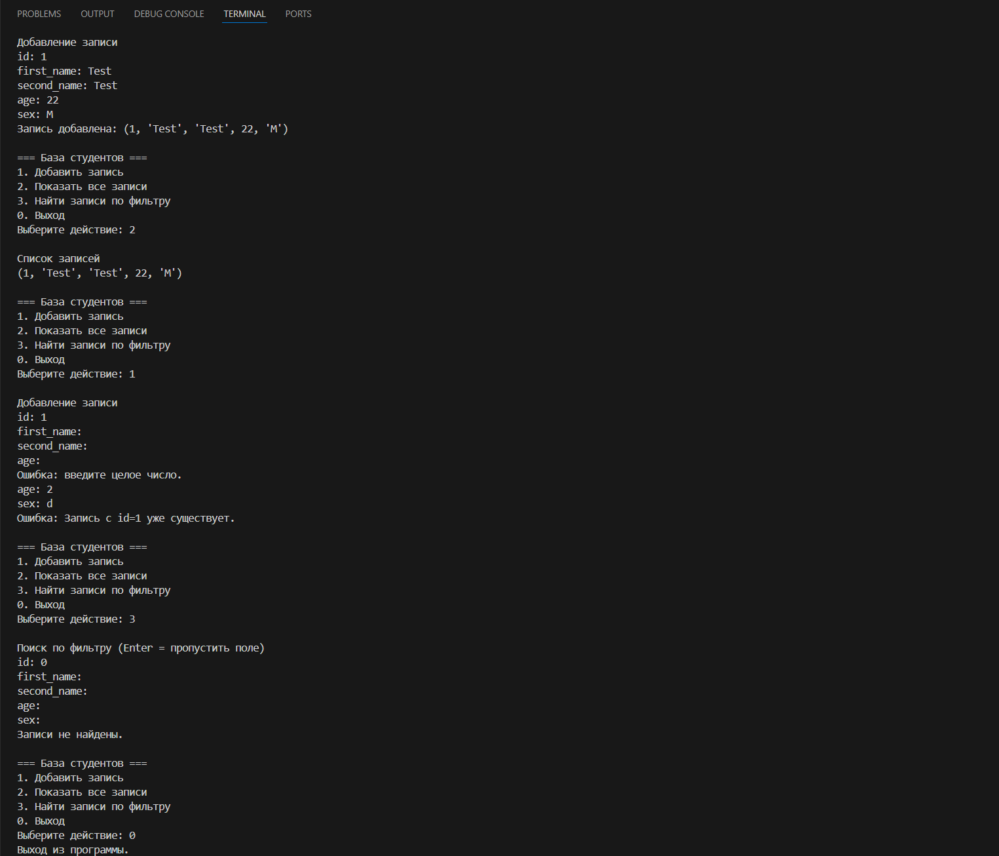

Ожидается, что остальную часть приложения вы реализуете самостоятельно.

## Заключение

После выполнения лабораторной работы необходимо заполнить файл `README.md` информацией о вашем проекте:

- Описание структуры проекта (где что лежит)  
- Описание функциональности проекта (что реализовано)  
- Инструкция по запуску проекта  

После этого закоммитьте изменения, выполните push в удалённый репозиторий GitLab и создайте merge request (*можно выполнять в IDE*).
