# Методические указания по выполнению лабораторной работы: Система контроля версий Git

## Оглавление

- [Методические указания по выполнению лабораторной работы: Система контроля версий Git](#методические-указания-по-выполнению-лабораторной-работы-система-контроля-версий-git)
  - [Оглавление](#оглавление)
  - [Введение](#введение)
  - [Теоретические основы систем контроля версий](#теоретические-основы-систем-контроля-версий)
    - [Основные возможности систем контроля версий](#основные-возможности-систем-контроля-версий)
  - [Начало работы с системой Git](#начало-работы-с-системой-git)
    - [Веб-платформы для работы с Git](#веб-платформы-для-работы-с-git)
  - [Установка и настройка системы Git](#установка-и-настройка-системы-git)
    - [Установка Git](#установка-git)
    - [Настройка конфигурационных параметров](#настройка-конфигурационных-параметров)
    - [Основные команды конфигурации](#основные-команды-конфигурации)
  - [Создание Git-репозитория](#создание-git-репозитория)
    - [Команды инициализации репозитория](#команды-инициализации-репозитория)
  - [Работа с локальными и удалёнными репозиториями](#работа-с-локальными-и-удалёнными-репозиториями)
    - [Отслеживание изменений в репозитории](#отслеживание-изменений-в-репозитории)
    - [Состояния файлов в системе Git](#состояния-файлов-в-системе-git)
    - [Команды управления состоянием файлов](#команды-управления-состоянием-файлов)
    - [Игнорирование файлов](#игнорирование-файлов)
    - [Шаблоны для файла .gitignore](#шаблоны-для-файла-gitignore)
  - [Работа с удалёнными репозиториями](#работа-с-удалёнными-репозиториями)
    - [Команды синхронизации с удалённым репозиторием](#команды-синхронизации-с-удалённым-репозиторием)
  - [Работа с коммитами](#работа-с-коммитами)
    - [Команды управления коммитами](#команды-управления-коммитами)
  - [Работа с ветками](#работа-с-ветками)
    - [Слияние веток (Merge)](#слияние-веток-merge)
    - [Перемещение коммитов (Rebase)](#перемещение-коммитов-rebase)
    - [Объединение нескольких коммитов](#объединение-нескольких-коммитов)
    - [Команды управления ветками](#команды-управления-ветками)
  - [Дополнительные образовательные ресурсы](#дополнительные-образовательные-ресурсы)
- [Методические указания по выполнению основной части лабораторной работы](#методические-указания-по-выполнению-основной-части-лабораторной-работы)
  - [Авторизация на платформе GitLab](#авторизация-на-платформе-gitlab)
  - [Установка системы Git](#установка-системы-git)
    - [Инструкции для операционной системы Windows](#инструкции-для-операционной-системы-windows)
    - [Проверка корректности установки](#проверка-корректности-установки)
  - [Основы работы с консольными приложениями](#основы-работы-с-консольными-приложениями)
  - [Настройка SSH-ключей для аутентификации](#настройка-ssh-ключей-для-аутентификации)
    - [Инструкции для студентов, работающих на учебных компьютерах](#инструкции-для-студентов-работающих-на-учебных-компьютерах)
    - [Инструкции для студентов, работающих на личных компьютерах](#инструкции-для-студентов-работающих-на-личных-компьютерах)
    - [Завершение настройки SSH-ключей](#завершение-настройки-ssh-ключей)
    - [Добавление ключей на платформу GitLab](#добавление-ключей-на-платформу-gitlab)
  - [Создание репозитория на платформе GitLab](#создание-репозитория-на-платформе-gitlab)
  - [Клонирование удалённого репозитория](#клонирование-удалённого-репозитория)
  - [Настройка имени пользователя и электронной почты](#настройка-имени-пользователя-и-электронной-почты)
  - [Создание ветки для выполнения лабораторной работы](#создание-ветки-для-выполнения-лабораторной-работы)
  - [Фиксация изменений и отправка на удалённый сервер](#фиксация-изменений-и-отправка-на-удалённый-сервер)
  - [Добавление участников в репозиторий](#добавление-участников-в-репозиторий)
  - [Создание Merge Request](#создание-merge-request)
- [Методические указания по выполнению дополнительной части лабораторной работы](#методические-указания-по-выполнению-дополнительной-части-лабораторной-работы)
  - [Создание форка репозитория](#создание-форка-репозитория)
  - [Описание дополнительных заданий](#описание-дополнительных-заданий)
    - [Задание Task1](#задание-task1)
    - [Задание Task2](#задание-task2)
    - [Задание Task3](#задание-task3)
    - [Задание Task4](#задание-task4)
    - [Задание Task5](#задание-task5)
    - [Задание Task6](#задание-task6)


## Введение

**Git** представляет собой распределённую систему контроля версий (СКВ, VCS — Version Control Systems), предназначенную для хранения состояний файлов проекта во времени и обеспечения возможности возврата к любому из сохранённых состояний. Система Git была разработана в **2005** году группой разработчиков ядра операционной системы Linux, включая Линуса Торвальдса, создателя Linux. При проектировании новой системы контроля версий основной целью являлось создание максимально эффективного инструмента для координации работы больших групп распределённых разработчиков, участвующих в разработке ядра Linux по всему миру.

## Теоретические основы систем контроля версий

Системы контроля версий (СКВ, VCS) представляют собой программные инструменты, предназначенные для фиксации всех изменений, вносимых разработчиками в программный код проекта.

### Основные возможности систем контроля версий

Применение систем контроля версий обеспечивает следующие преимущества:

- В случае возникновения критических ошибок в коде существует возможность восстановления предыдущего рабочего состояния проекта без необходимости ручного поиска и исправления ошибок
- Системы контроля версий обеспечивают эффективную организацию совместной работы нескольких разработчиков над единым проектом
- Изменения, вносимые различными участниками проекта, регистрируются независимо друг от друга
- Каждый участник команды разработки имеет возможность отслеживать текущую работу коллег и видеть историю изменений

## Начало работы с системой Git

### Веб-платформы для работы с Git

Существует ряд коммерческих и некоммерческих веб-платформ, предоставляющих возможность работы с распределёнными Git-репозиториями:

- **GitHub**
- **GitLab**
- **Bitbucket**

Использование данных платформ обеспечивает доступ к удалённым онлайн-хранилищам через интерфейс командной строки Git, что позволяет эффективно применять возможности децентрализованных удалённых репозиториев с полноценной системой контроля версий для разработки проекта.

При отсутствии необходимости использования удалённого репозитория система Git может применяться локально для индивидуальной работы.

## Установка и настройка системы Git

### Установка Git

Для установки системы Git необходимо загрузить дистрибутив с официального сайта https://git-scm.com/install/ для операционных систем Windows, macOS или Linux. После завершения установки следует проверить корректность установки, выполнив команду:

```bash
git --version
```

### Настройка конфигурационных параметров

Перед началом работы с системой Git необходимо настроить параметры имени пользователя и адреса электронной почты для идентификации автора изменений. Данные настройки сохраняются в конфигурационном файле системы.

### Основные команды конфигурации

| Описание | Шаблон команды | Пример использования |
|----------|----------------|---------------------|
| Установка имени пользователя, которое будет отображаться в поле автора выполняемых коммитов | `git config --global user.name "[имя]"` | `git config --global user.name "Иванов Иван Иванович"` |
| Установка адреса электронной почты, который будет использоваться для всех коммитов | `git config --global user.email "[адрес электронной почты]"` | `git config --global user.email "IIIvanov@mai.education"` |
| Управление подключениями к удалённым репозиториям | `git remote` | `git remote set-url origin ssh://git@gitlab.mai.ru:2222/IIIvanov/pioa_task1.git` |

## Создание Git-репозитория

Система Git хранит данные в виде набора снимков состояния файловой системы проекта. При каждом сохранении состояния Git фиксирует содержимое каждого файла в конкретный момент времени и сохраняет ссылку на данный снимок состояния.

### Команды инициализации репозитория

| Описание | Шаблон команды | Пример использования |
|----------|----------------|---------------------|
| Инициализация нового репозитория в текущем каталоге | `git init [название проекта]` | `git init my_cool_project` |
| Клонирование существующего удалённого репозитория | `git clone [url-адрес]` | `git clone ssh://git@gitlab.mai.ru:2222/IIIvanov/pioa_task1.git` |

## Работа с локальными и удалёнными репозиториями

### Отслеживание изменений в репозитории

Команда `git status` предназначена для отображения списка всех изменённых файлов в рабочей директории проекта.

### Состояния файлов в системе Git

В системе Git файлы могут находиться в одном из четырёх состояний:

1. **Неотслеживаемое состояние (untracked)** — файл присутствует в рабочей директории, но отсутствует в HEAD и в области подготовленных файлов (индексе). Система Git не осуществляет контроль версий данного файла.

2. **Изменённое состояние (modified)** — в рабочей директории существует более новая версия файла по сравнению с версией, хранящейся в HEAD или в области подготовленных файлов. Изменения ещё не подготовлены для включения в следующий коммит.

3. **Подготовленное состояние (staged)** — в рабочей директории и области подготовленных файлов находится более новая версия файла, чем в HEAD. Файл готов к фиксации в следующем коммите.

4. **Состояние без изменений** — идентичная версия файла существует во всех разделах, то есть последний коммит содержит актуальную версию данного файла.

### Команды управления состоянием файлов

| Описание | Шаблон команды | Примеры использования |
|----------|----------------|----------------------|
| Отображение списка новых или изменённых файлов, требующих индексации | `git status` | `git status` |
| Добавление файлов в индекс (область подготовленных файлов) | `git add [файл]` | `git add index.html`<br>`git add .`<br>`git add --all` |
| Удаление файла из рабочей директории с индексацией операции удаления | `git rm [файл]` | `git rm index.html` |
| Прекращение контроля версий файла при физическом сохранении файла на диске | `git rm --cached [файл]` | `git rm --cached index.html` |
| Перемещение или переименование файла с автоматической индексацией для последующего коммита | `git mv [исходный файл] [новое имя]` | `git mv index.html index.txt` |
| Отображение различий между текущей версией файлов и проиндексированной версией | `git diff` | `git diff` |
| Отображение различий между проиндексированной версией и последней зафиксированной версией файлов | `git diff --staged` | `git diff --staged` |
| Отображение истории изменений указанного файла | `git log --follow [файл]` | `git log --follow index.txt` |

### Игнорирование файлов

В процессе работы над проектом часто возникает необходимость исключения определённых файлов из контроля версий:

- **Файлы с конфиденциальной информацией** — пароли, ключи доступа
- **Большие бинарные файлы** — архивы, видеофайлы
- **Системные файлы операционной системы или среды разработки** — `.DS_Store` для macOS, `.iml` для IntelliJ IDEA

Для исключения файлов из контроля версий используется специальный файл `.gitignore`.

### Шаблоны для файла .gitignore

- `/___` — позволяет избежать рекурсивного применения правила, соответствует файлам только в текущей директории
- `__/` — соответствует всем файлам в указанной директории
- `___` — соответствует всем файлам с указанным окончанием
- `!` — исключение файлов из правила игнорирования, соответствующих указанному шаблону
- `[__]` — соответствует любому символу из набора символов, указанных в квадратных скобках
- `?` — соответствует любому одиночному символу
- `/**/` — соответствует вложенным директориям произвольной глубины (например, `a/**/d` соответствует путям `a/d`, `a/b/d`, `a/b/c/d` и т. д.)

## Работа с удалёнными репозиториями

Команда `git remote -v` предназначена для отображения списка удалённых репозиториев, отслеживаемых локальным репозиторием, а также локальных имён, присвоенных данным удалённым репозиториям.

При использовании команды `git clone <url репозитория>` выполняется не только загрузка копии репозитория, но и автоматическая настройка отслеживания удалённого сервера, расположенного по указанному адресу, которому присваивается имя **origin**.

### Команды синхронизации с удалённым репозиторием

| Описание | Шаблон команды | Примеры использования |
|----------|----------------|----------------------|
| Загрузка истории изменений из удалённого репозитория без слияния с локальной веткой | `git fetch [удалённый репозиторий]` | `git fetch` |
| Отправка всех изменений локальной ветки в удалённый репозиторий | `git push [удалённый репозиторий] [ветка]` | `git push` |
| Загрузка истории из удалённого репозитория с последующим автоматическим слиянием с локальной веткой (эквивалентно последовательному выполнению команд fetch и merge) | `git pull` | `git pull` |

## Работа с коммитами

Коммиты представляют собой ключевой механизм работы с системой Git. Каждый коммит является точкой фиксации и применения набора изменений. Команда `git commit` открывает текстовый редактор для ввода сообщения коммита.

Коммиты сохраняют состояние файловой системы проекта в определённый момент времени и содержат ссылки на предыдущие коммиты.

Каждый коммит идентифицируется уникальной контрольной суммой (хеш-значением), которую система Git использует для ссылок на данный коммит. Для навигации по истории Git поддерживает указатель HEAD, ссылающийся на текущий коммит (обычно последний коммит в активной ветке).

Ссылки на коммиты могут осуществляться либо через полную контрольную сумму, либо через относительную позицию относительно указателя **HEAD**, например `HEAD~4` ссылается на коммит, предшествующий текущему коммиту **HEAD** на четыре позиции.

### Команды управления коммитами

| Описание | Шаблон команды | Примеры использования |
|----------|----------------|----------------------|
| Фиксация проиндексированных изменений с сохранением их в истории версий | `git commit -m "[описание коммита]"` | `git commit -m "Added new feature."` |
| Изменение сообщения последнего коммита | `git commit --amend -m "новое описание коммита"` | `git commit --amend -m "Added new feature. Task in Jira 3247"` |
| Отображение истории изменений (коммитов) проекта | `git log` | `git log` |
| Отображение детальной информации и изменений в указанном коммите | `git show [номер коммита]` | `git show 73b64290a107f6325ab88c7950637a4ce44c42a6` |
| Отмена всех коммитов после указанного с сохранением всех изменений в рабочей директории | `git reset [номер коммита]` | `git reset 73b64290a107f6325ab88c7950637a4ce44c42a6` |
| Полный сброс истории вместе с состоянием рабочей директории до указанного коммита | `git reset --hard [коммит]` | `git reset --hard 73b64290a107f6325ab88c7950637a4ce44c42a6` |
| Отмена всех коммитов после указанного путём создания нового коммита, отменяющего изменения | `git revert [номер коммита]` | `git revert 73b64290a107f6325ab88c7950637a4ce44c42a6` |
| Применение изменений из указанного коммита в текущей ветке | `git cherry-pick [номер коммита]` | `git cherry-pick 73b64290a107f6325ab88c7950637a4ce44c42a6` |
| Отображение истории изменений (коммитов) проекта в виде графа | `git log --graph --oneline --stat` | `git log --graph --oneline --stat` |

## Работа с ветками

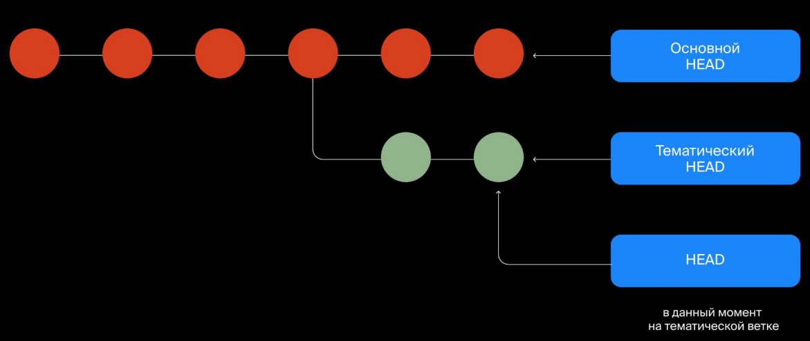

Механизм ветвления предоставляет возможность одновременной работы над различными версиями проекта. Вместо единого линейного списка упорядоченных коммитов история проекта может расходиться в определённых точках, образуя параллельные линии разработки.

Каждая ветвь содержит легковесный указатель **HEAD** на последний коммит в данной ветви, что обеспечивает возможность эффективного создания множества веток без существенных затрат ресурсов.

Ветка, создаваемая по умолчанию, называется **main** (в некоторых случаях **master**). Рекомендуется использовать для веток осмысленные названия, отражающие их назначение (например, release, feature-authentication, hotfix-database).

Локальный и удалённый репозитории могут содержать множество веток. При отслеживании удалённого репозитория локальные ветки могут быть связаны с соответствующими удалёнными ветками (например, команда `git clone` автоматически связывает локальную ветку **main** с удалённой веткой **origin/main**).

### Слияние веток (Merge)

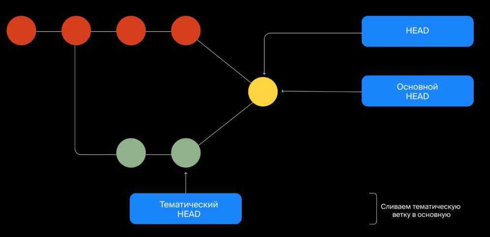

Ветка, в которую осуществляется интеграция изменений, называется основной веткой, а ветка, из которой производится интеграция изменений, называется тематической веткой.

Операция слияния включает создание нового коммита слияния, основанного на общем коммите-предке двух веток и содержащего указатели на последние коммиты обеих сливаемых веток в качестве родительских коммитов.

Для выполнения слияния необходимо переключиться на основную ветку и выполнить команду `git merge <тематическая ветка>`.

В случае если обе ветви вносят изменения в одну и ту же часть файла, возникает конфликт слияния — ситуация, в которой система Git не может автоматически определить, какую версию файла следует сохранить. Разрешение конфликта слияния требует ручного вмешательства разработчика.

Для отображения списка файлов с конфликтами используется команда `git status`.

### Перемещение коммитов (Rebase)

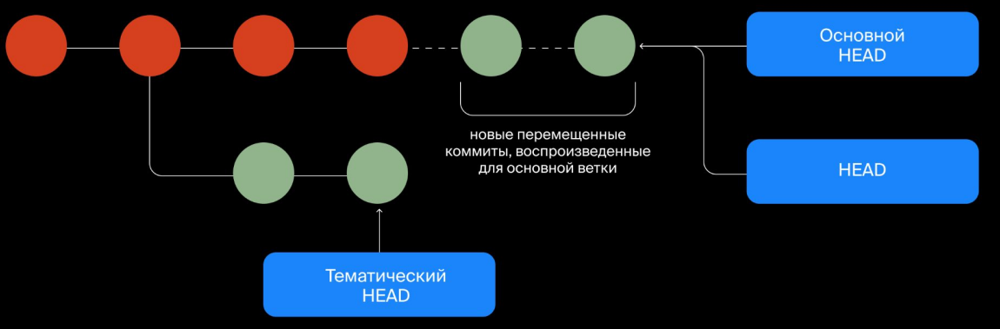

В отличие от операции слияния, создающей коммит слияния для объединения двух веток, операция перемещения (rebase) воспроизводит коммиты тематической ветки в виде набора новых коммитов, применяемых к основной ветке, что обеспечивает более линейную и чистую историю коммитов.

Для выполнения операции перемещения используется команда `git rebase <основная ветка> <тематическая ветка>`, которая воспроизводит изменения тематической ветки поверх основной ветки. Указатель **HEAD** тематической ветки после завершения операции указывает на последний воспроизведённый коммит.

### Объединение нескольких коммитов

**Сжатие коммитов в интерактивном режиме:**

- `git cherry -v master` — отображение коммитов текущей ветки, отсутствующих в ветке master
- `git rebase -i HEAD~3` — запуск интерактивного режима перемещения для объединения последних трёх коммитов (параметр `-i` активирует интерактивный режим, `HEAD~3` указывает количество коммитов для обработки)
- `pick` — сохранение первого коммита без изменений
- `squash` — объединение указанных коммитов с первым коммитом

**Сжатие коммитов при слиянии веток:**

- `git merge --squash feature-branch` — объединение всех коммитов из ветки feature-branch и их слияние с текущей веткой в виде единого набора изменений

### Команды управления ветками

| Описание | Шаблон команды | Примеры использования |
|----------|----------------|----------------------|
| Отображение списка существующих веток | `git branch` | `git branch` |
| Создание новой ветки | `git branch [имя ветки]` | `git branch feature1` |
| Переключение на указанную ветку | `git checkout [имя ветки]` | `git checkout feature1` |
| Удаление указанной ветки | `git branch -d [имя ветки]` | `git branch -d feature1` |
| Переименование ветки | `git branch -m [старое_название] [новое_название]` | `git branch -m feature1 SuperButtonFeature` |
| Слияние указанной ветки с текущей веткой | `git merge [имя ветки]` | `git merge hotfix` |
| Удаление ветки на удалённом сервере | `git push origin --delete [имя ветки]` | `git push origin --delete feature1` |

## Дополнительные образовательные ресурсы

Для углублённого изучения системы Git рекомендуется интерактивный курс по адресу: https://learngitbranching.js.org/?locale=ru_RU

***

# Методические указания по выполнению основной части лабораторной работы

## Авторизация на платформе GitLab

После выполнения авторизации на платформе GitLab система предложит настроить двухфакторную аутентификацию. Для выполнения данной настройки необходимо использовать любое приложение для генерации одноразовых паролей (OTP — One-Time Password), такое как Яндекс ID, Google Authenticator, Microsoft Authenticator или KeePass, для сканирования предоставленного QR-кода.

## Установка системы Git

Система Git представляет собой отдельное консольное приложение, требующее установки (в дистрибутивах операционной системы Linux и macOS Git обычно предустановлен). Для установки необходимо загрузить дистрибутив с официального сайта: https://git-scm.com/install

### Инструкции для операционной системы Windows

При выполнении установки необходимо запустить установочный файл и следовать инструкциям мастера установки до этапа выбора текстового редактора (остальные параметры можно оставить со значениями по умолчанию).

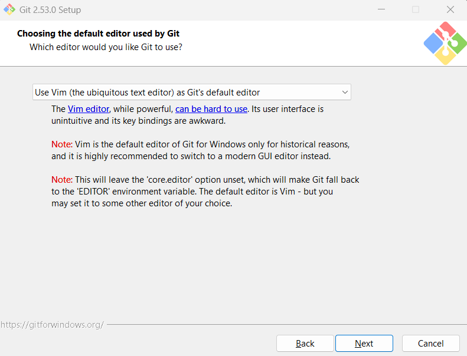

По умолчанию система Git использует текстовый редактор Vim. Данный редактор обладает мощными возможностями, однако может представлять сложность для начинающих пользователей (для выхода из редактора Vim необходимо ввести команду `:q!`). Рекомендуется выбрать более знакомый текстовый редактор, например, стандартный Блокнот Windows (Notepad).

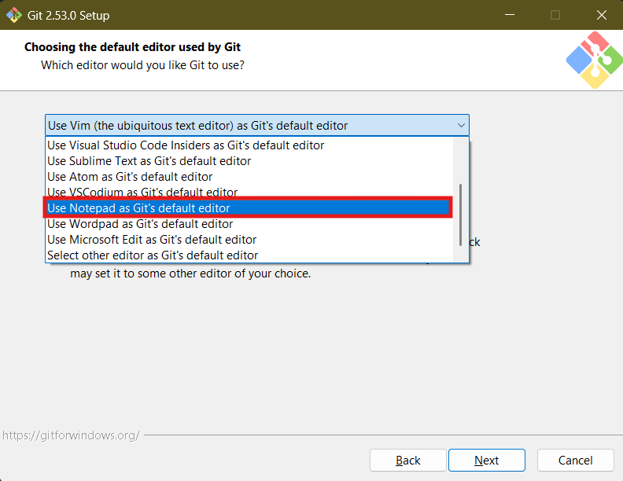

После завершения установки в системе появятся программы Git CMD и Git Bash. Первая программа представляет собой стандартную консоль Windows, вторая — консоль, использующую синтаксис операционной системы Linux. Возможно использование любого из предложенных приложений. В данных методических указаниях используется стандартный терминал Windows (PowerShell).

### Проверка корректности установки

Откройте терминал и выполните команду `git --version`. При корректной установке система выведет сообщение, подобное следующему: `git version 2.53.0.windows.1`

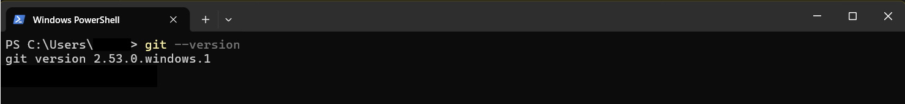

## Основы работы с консольными приложениями

Система Git представляет собой консольное приложение, не имеющее графического интерфейса по умолчанию (графические интерфейсы для Git существуют в виде отдельных приложений и интегрированных сред разработки). Для управления системой Git необходимо вводить текстовые команды в терминале.

При вводе команды Git первым элементом команды должно быть название приложения — `git` или `git.exe`. Путь к исполняемому файлу Git настроен в переменных окружения системы. При необходимости возможно указание полного пути к исполняемому файлу: `C:\Program Files\Git\bin\git.exe`.

После названия приложения через пробел указывается команда, например `git init` или `git clone`. Некоторые команды принимают параметры. Параметры могут быть позиционными: `git clone ssh://git@gitlab.mai.ru:2222/KonoplevTE/pioa.git`, где `ssh://git@gitlab.mai.ru:2222/KonoplevTE/pioa.git` является параметром, указывающим путь к клонируемому репозиторию.

Параметры также могут быть именованными: `git commit -m "Тестовый коммит"` или `git commit --message "Тестовый коммит"`. Здесь `-m` и `--message` представляют собой краткую и полную формы одного именованного параметра. При использовании полной формы именованного параметра применяются два дефиса (`--message`), при использовании краткой формы применяется один дефис (`-m`). После имени параметра указывается его значение, в данном случае `"Тестовый коммит"`. Не все параметры требуют указания значения, например `git --version`. В некоторых случаях параметры задаются через знак равенства, например `git commit -m="Тестовый коммит"`.

Для повторного ввода ранее выполненных команд используется клавиша стрелка вверх. Клавиша TAB обеспечивает функцию автодополнения на основе контекста.

Для перемещения между директориями используется команда `cd` (сокращение от `change directory`). Текущая рабочая директория отображается в командной строке сразу после символов PS. Для перехода в другой каталог можно указать полный путь, например `cd C:\Users\ИмяВашегоПользователя`, либо воспользоваться относительным путём относительно текущего каталога, например `cd .ssh`. Для перехода на один уровень выше применяется команда `cd ..`, а для перехода в домашний каталог пользователя используется команда `cd ~`. Рекомендуется обращать внимание на то, как изменяется путь, отображаемый после `PS`, при выполнении указанных команд.

Для просмотра списка всех файлов и подкаталогов, находящихся в текущей директории, используется команда `ls` (сокращение от `list`).

## Настройка SSH-ключей для аутентификации

Существует два основных метода работы с удалёнными репозиториями на платформах GitHub и GitLab: по протоколу HTTP или SSH. Политика информационной безопасности учебного заведения запрещает использование протокола HTTP для работы с GitLab. Следовательно, необходима настройка SSH-аутентификации.

Для настройки SSH-аутентификации требуется генерация пары ключей: публичного и приватного (асимметричное шифрование). Публичный ключ может быть безопасно передан третьим лицам, в то время как **приватный ключ должен храниться в секрете**. При подключении к серверу GitLab сервер шифрует передаваемую информацию с использованием публичного ключа пользователя. Данная информация может быть расшифрована только с использованием соответствующего приватного ключа, что обеспечивает подтверждение личности пользователя.

### Инструкции для студентов, работающих на учебных компьютерах

На учебных компьютерах используется общая учётная запись для нескольких пользователей, что создаёт определённые сложности при работе с SSH-ключами. Все SSH-ключи создаются в общей директории, что приводит к перезаписи ключей различных пользователей. Для корректной работы необходимо выполнить следующую последовательность действий.

Сначала необходимо переключиться на директорию локального пользователя. Для этого выполните команду:

```powershell
cd C:\Users\ИмяВашегоПользователя
```

Замените `ИмяВашегоПользователя` на имя учётной записи, под которой выполнен вход в систему.

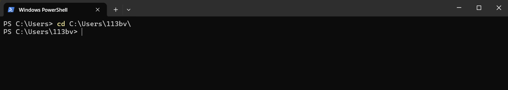

Затем создайте директорию для хранения SSH-ключей в локальной папке пользователя. Для этого выполните следующую команду:

```powershell
mkdir .ssh
```

`mkdir` - это сокращение от `make directory`.

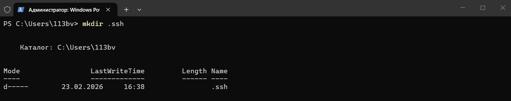

Для генерации ключей выполните команду `ssh-keygen`. Первый запрос системы касается пути сохранения ключей (`Enter file in which to save the key`). Введите путь к созданной директории с именем файла: `C:\Users\ИмяВашегоПользователя\.ssh\id_ed25519`. Затем система запросит ввод пароля для защиты ключей. **Установка пароля не является обязательной** — просто нажмите клавишу ENTER для пропуска данного шага. При успешном выполнении операции система отобразит ASCII-арт изображение отпечатка ключа.

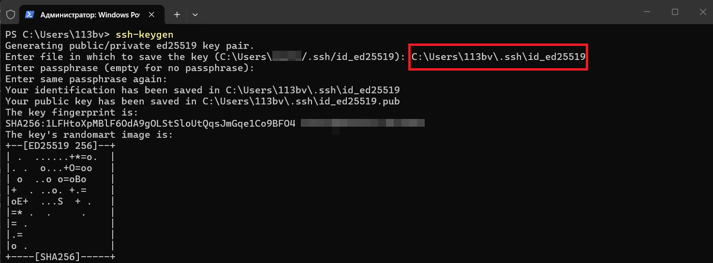

Далее необходимо указать системе Git, какой SSH-ключ следует использовать. Для этого настройте переменную окружения, выполнив команду:

```powershell
$env:GIT_SSH_COMMAND = "ssh -i C:/Users/ИмяВашегоПользователя/.ssh/id_ed25519 -o IdentitiesOnly=yes"
```

Система не выведет никакого сообщения в ответ на данную команду.

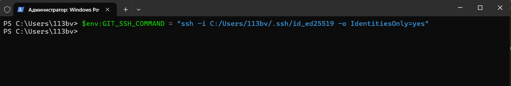

Выполненных действий достаточно для работы. Однако **при перезапуске терминала необходимо повторно выполнить следующие команды**:

```powershell
cd C:\Users\ИмяВашегоПользователя
$env:GIT_SSH_COMMAND = "ssh -i C:/Users/ИмяВашегоПользователя/.ssh/id_ed25519 -o IdentitiesOnly=yes"
```

### Инструкции для студентов, работающих на личных компьютерах

Выполните команду `ssh-keygen`. Система запросит путь для сохранения ключей и пароль для их защиты. Все параметры можно оставить по умолчанию, нажимая клавишу ENTER. При успешном выполнении операции система отобразит ASCII-арт изображение отпечатка ключа. SSH-ключи будут сохранены по пути `C:\Users\ИмяВашегоПользователя\.ssh\`

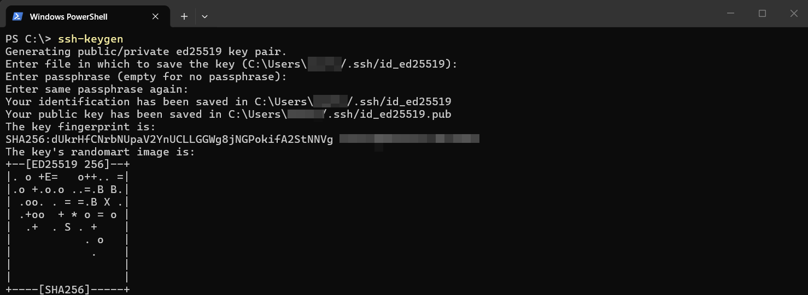

### Завершение настройки SSH-ключей

В директории `.ssh` должны находиться два файла: `id_ed25519` (приватный ключ) и `id_ed25519.pub` (публичный ключ). Откройте публичный ключ с помощью текстового редактора Блокнот и скопируйте его содержимое. Альтернативный способ: выполните в консоли команду `cat .ssh\id_ed25519.pub` (сокращение от `concatenate`) и скопируйте выведенную строку.

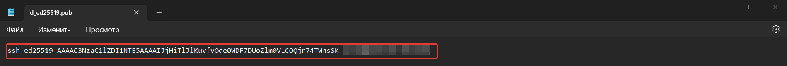

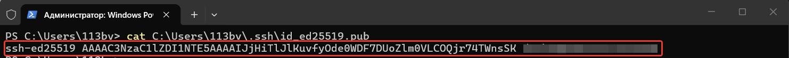

### Добавление ключей на платформу GitLab

Перейдите на веб-сайт gitlab.mai.ru. Откройте настройки профиля, выбрав пункт меню `Ваш аватар → Edit profile`.

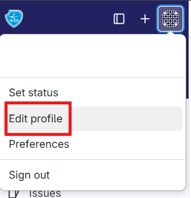

В меню слева выберите раздел `SSH Keys`.

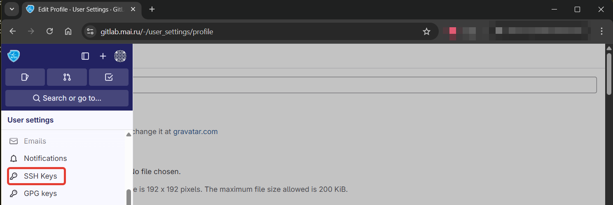

На открывшейся странице нажмите кнопку `Add new key`.

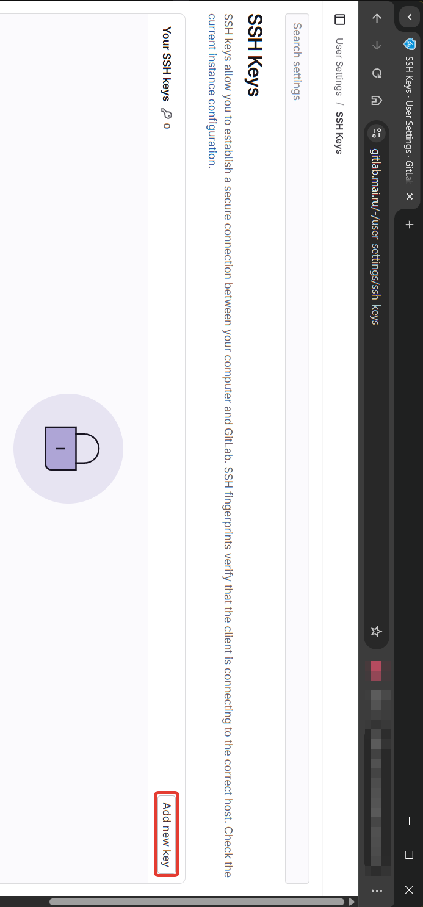

Вставьте скопированное ранее содержимое публичного ключа в поле `Key`. При корректном выполнении операции остальные поля формы заполнятся автоматически. Затем нажмите кнопку `Add key`.

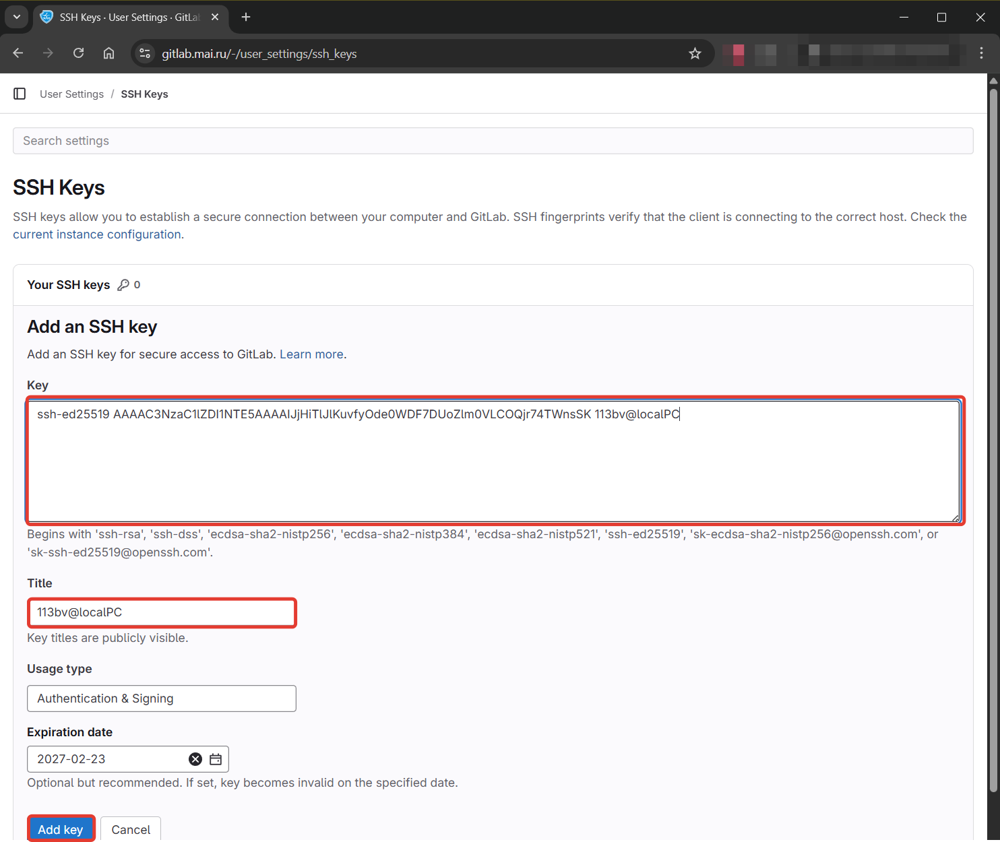

## Создание репозитория на платформе GitLab

Для создания основного репозитория курса в левом меню платформы GitLab нажмите кнопку `+`, затем выберите пункт `New project/repository`.

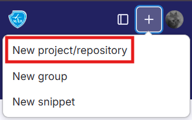

На следующей странице выберите тип проекта. Для данной лабораторной работы выберите опцию **Create blank project**.

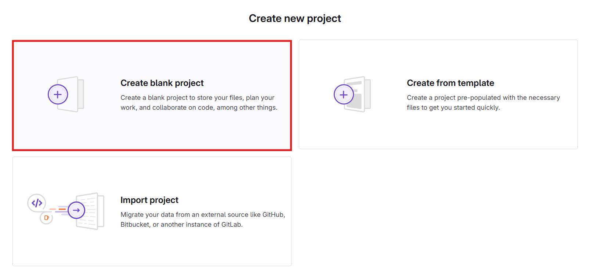

Заполните поле **Project name** в формате `PIOA НомерГруппыНаАнглийском`. При корректном заполнении поле `Project slug` заполнится автоматически.

Параметр уровня видимости `Visibility Level` может быть выбран произвольно. Рекомендуется сохранить отметку `Initialize repository with README`, что автоматически создаст основную ветку и файл README. Затем нажмите кнопку `Create project`.

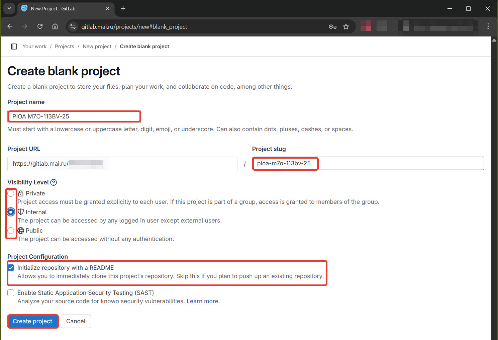

В результате будет создан репозиторий с веткой `main`, содержащей начальный коммит `Initial commit` и файл README с содержимым по умолчанию.

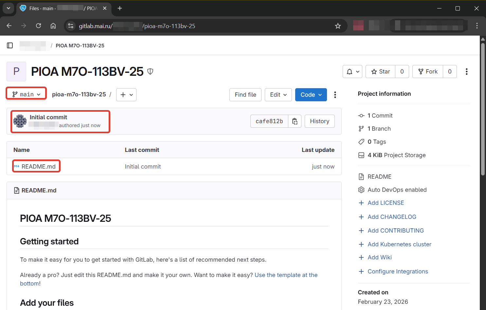

## Клонирование удалённого репозитория

Выполненные выше действия инициализировали удалённый репозиторий на платформе GitLab (для инициализации локального репозитория используется команда `git init`). Для работы с репозиторием на локальном компьютере необходимо выполнить его клонирование.

Скопируйте SSH-адрес репозитория, нажав кнопку `Code`, затем кнопку копирования в буфер обмена рядом с SSH-адресом.

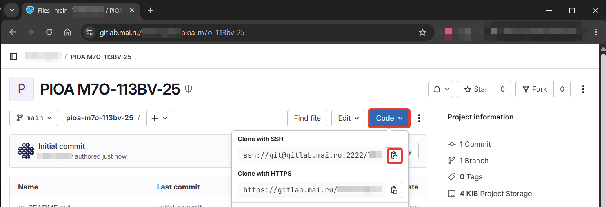

Вернитесь в терминал и выполните команду `git clone ПутьКоторыйВыСкопировали`. Система Git запросит подтверждение подлинности удалённого репозитория. Введите `yes` для подтверждения. Затем репозиторий будет клонирован в директорию с именем проекта. **Репозиторий клонируется в текущую рабочую директорию, путь к которой отображается в приглашении командной строки после символов PS**.

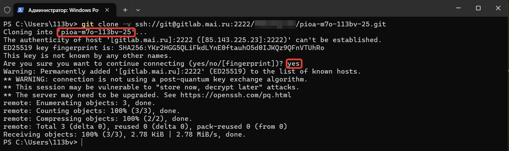

При корректном выполнении операции репозиторий можно открыть через проводник файловой системы. По умолчанию путь к репозиторию: `C:\Users\ИмяВашегоПользователя\ИмяВашегоРепозитория`

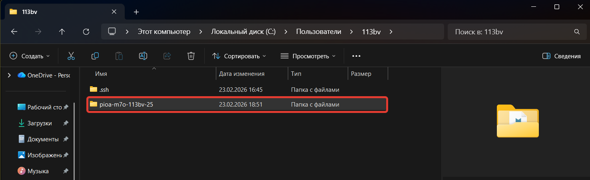

Перейдите в данную директорию в проводнике и в терминале, выполнив команду `cd ИмяВашегоРепозитория`.

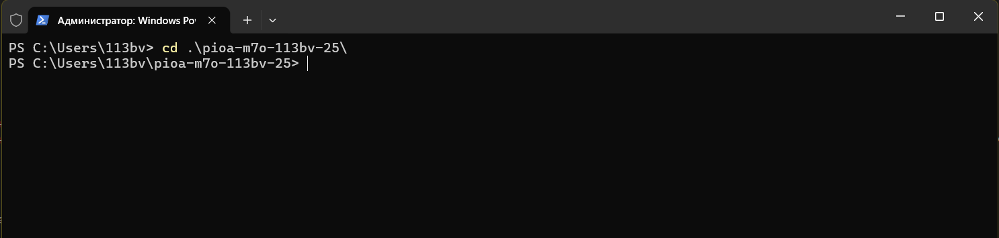

## Настройка имени пользователя и электронной почты

Система Git связывает каждый коммит с определённым пользователем, используя настройки `user.name` и `user.email`. Данные настройки могут быть применены локально к конкретному репозиторию или глобально ко всей операционной системе.

Для настройки локальных параметров (**рекомендуется для студентов, работающих на учебных компьютерах**) выполните следующие команды:

```bash
git config --local user.name "ФИО"
git config --local user.email "Электронная почта"
```

Студенты, работающие на личных компьютерах, могут настроить глобальные параметры:

```bash
git config --global user.name "ФИО"
git config --global user.email "Электронная почта"
```

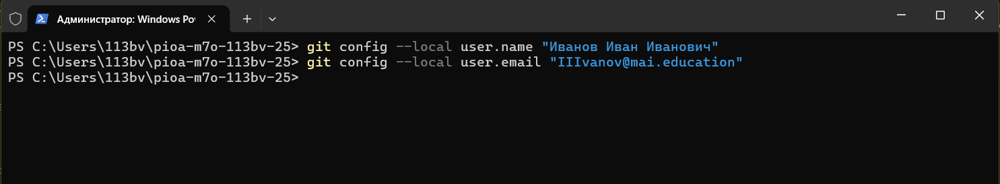

## Создание ветки для выполнения лабораторной работы

Каждую новую лабораторную работу необходимо выполнять в отдельной ветке. Для создания ветки `task1` используется команда `git branch task1`, затем необходимо переключиться на данную ветку командой `git switch task1`. Альтернативный способ — создание и переключение на новую ветку одной командой: `git switch -c task1`.

При корректном выполнении операции команда `git branch` отобразит две ветки: `main` и `task1`, с индикацией текущей активной ветки `task1`.

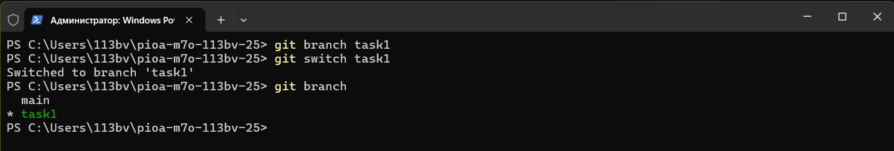

## Фиксация изменений и отправка на удалённый сервер

При корректной настройке команда `git status` отобразит, что изменений в рабочей директории не обнаружено. Согласно заданию необходимо отредактировать файл README.md. Данный файл содержит текст, отображаемый на главной странице репозитория GitLab. Расширение `.md` обозначает формат Markdown. Для получения дополнительной информации о формате Markdown обратитесь к справочным материалам, например: https://gist.github.com/Jekins/2bf2d0638163f1294637

Для редактирования файла откройте его в текстовом редакторе через проводник. Удалите автоматически сгенерированное содержимое GitLab и замените его информацией о себе: ФИО, номер группы и язык программирования, планируемый для использования при выполнении лабораторных работ.

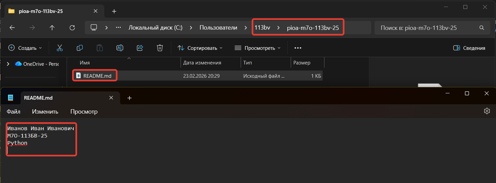

При корректном выполнении редактирования команда `git status` отобразит, что файл README.md модифицирован, но изменения не подготовлены для фиксации в коммите.

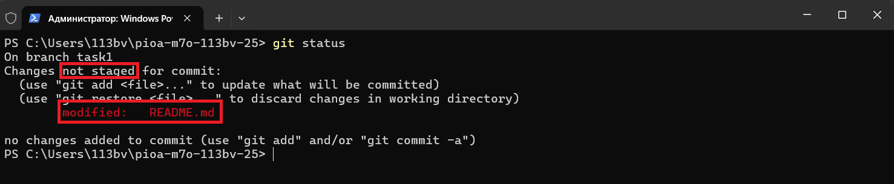

Для подготовки изменений к фиксации (индексирования) выполните команду `git add README.md` или `git add .` для индексирования всех изменённых файлов в репозитории. При корректном выполнении операции команда `git status` отобразит, что файл README.md модифицирован и изменения подготовлены для фиксации в коммите.

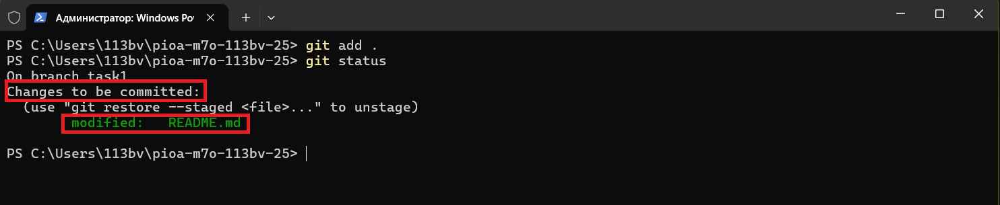

Далее необходимо зафиксировать изменения путём создания коммита (точки сохранения в истории проекта). Для этого выполните команду `git commit`, после чего откроется текстовый редактор по умолчанию для ввода сообщения коммита. Альтернативный способ — использование команды `git commit -m "изменил описание репозитория"`, где после параметра `-m` в кавычках указывается сообщение коммита.

При корректном выполнении операции команда `git status` отобразит, что изменений в рабочей директории не обнаружено.

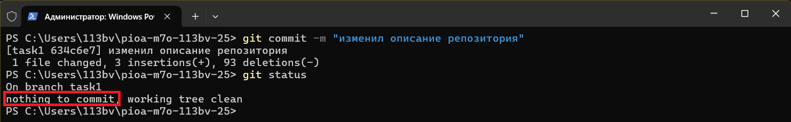

Выполненные изменения сохранены только локально на компьютере. Для отправки изменений в удалённый репозиторий на платформе gitlab.mai.ru выполните команду `git push`. Система Git сообщит, что невозможно отправить изменения в удалённый репозиторий, поскольку ветка `task1` существует только локально и должна быть связана с удалённым репозиторием. Система предложит выполнить команду `git push --set-upstream origin task1`. **Данную команду необходимо выполнить только один раз**. В последующих случаях достаточно использовать команду `git push`.

При корректном выполнении операции в удалённом репозитории появится ветка `task1` с изменённым файлом README.

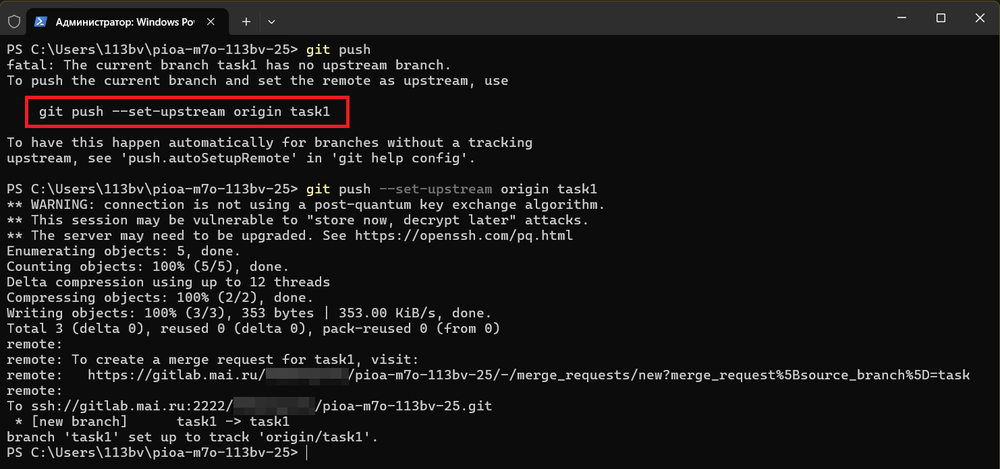
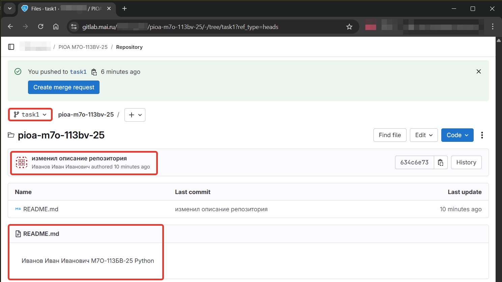

## Добавление участников в репозиторий

Согласно заданию необходимо создать Merge Request (запрос на слияние с основной веткой). Для выполнения данной операции необходимо добавить преподавателя @KonoplevTE в качестве участника проекта с правами разработчика.

Для добавления участников репозитория в меню проекта выберите пункт **Manage → Members**.

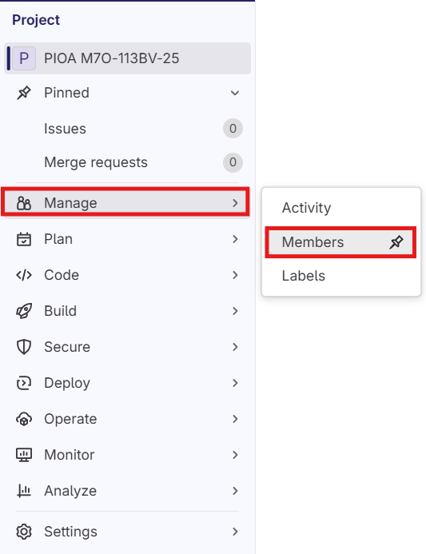

Затем нажмите кнопку **Invite members**.

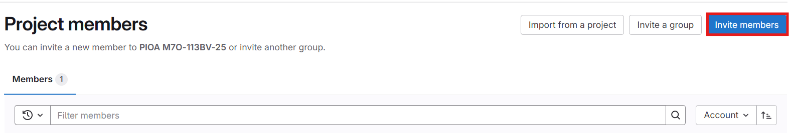

В открывшемся диалоговом окне введите имя пользователя @KonoplevTE, выберите роль `Developer` и нажмите кнопку **Invite**.

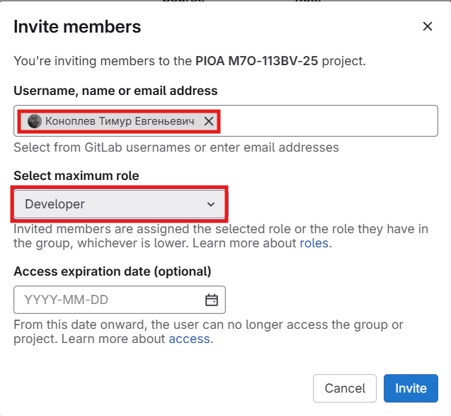

## Создание Merge Request

При необходимости слияния тематической ветки с веткой `main` рекомендуется создание Merge Request (MR). При наличии изменений в ветке платформа GitLab может автоматически предложить создание Merge Request.

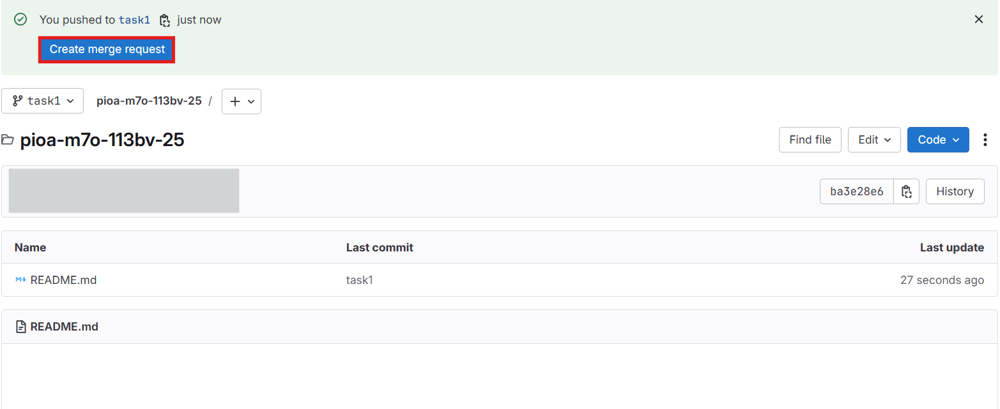

На странице создания Merge Request необходимо указать заголовок MR (обязательное поле), описание (опциональное поле) и выбрать ревьюера для проверки кода.

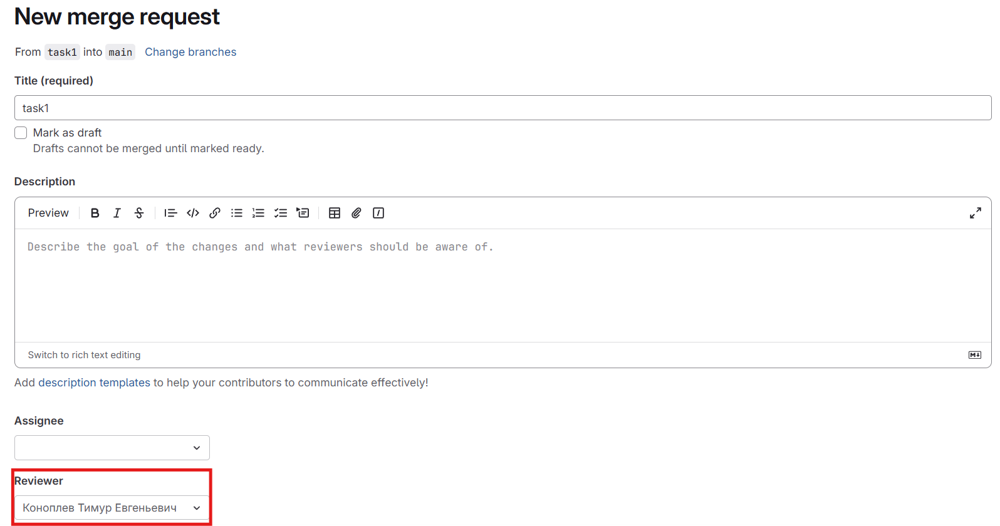

При назначении ревьюера необходимо дождаться одобрения (approve) изменений или получения комментариев. После получения одобрения можно выполнить операцию слияния (merge) тематической ветки с основной веткой.

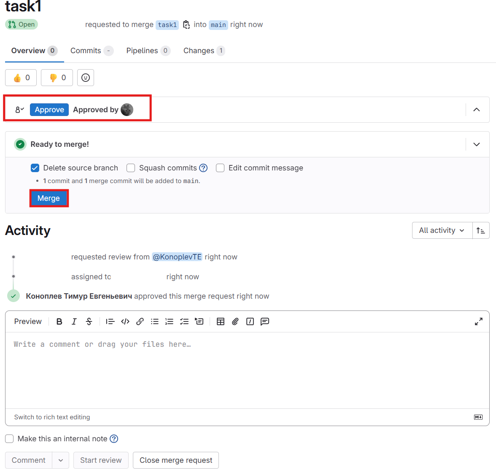

После выполнения слияния в репозитории останется только ветка `main` со всеми внесёнными изменениями.

Выполнение вышеперечисленных действий соответствует минимальным требованиям для получения удовлетворительной оценки. Для получения более высоких оценок необходимо выполнить дополнительные задания.

***

# Методические указания по выполнению дополнительной части лабораторной работы

## Создание форка репозитория

Согласно дополнительному заданию необходимо создать форк репозитория, расположенного по адресу: https://gitlab.mai.ru/KonoplevTE/pioa_task1.git

Форк представляет собой копию репозитория в пространстве имён пользователя. Для создания форка необходимо перейти в исходный репозиторий и нажать кнопку `Fork`.

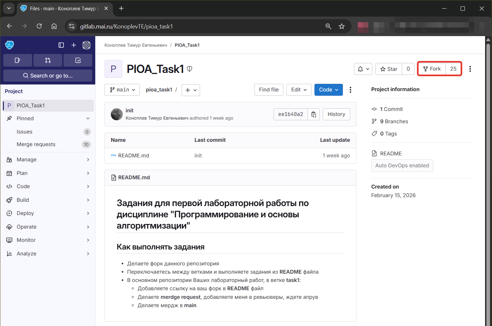

В открывшемся диалоговом окне необходимо выбрать namespace (ваш логин) и уровень видимости проекта. Рекомендуется выбрать уровень видимости `Internal`, в противном случае потребуется добавление преподавателя в участники проекта. Затем нажмите кнопку `Fork project`.

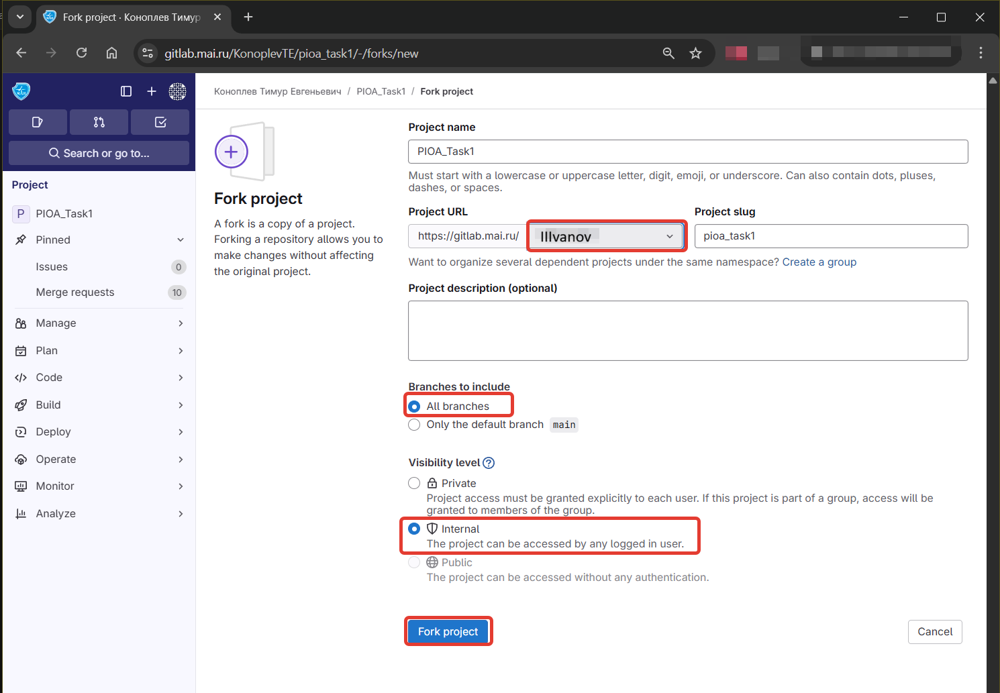

При корректном выполнении операции по адресу https://gitlab.mai.ru/ВашЛогин/pioa_task1.git будет доступен созданный форк репозитория.

Далее необходимо клонировать созданный форк на локальный компьютер (процедура описана в разделе [«Клонирование удалённого репозитория»](#клонирование-удалённого-репозитория)), переключаться между ветками task1-task6 (процедура описана в разделе [«Создание ветки для выполнения лабораторной работы»](#создание-ветки-для-выполнения-лабораторной-работы)), изучать задания в файле README.md каждой ветки и выполнять их.

После выполнения дополнительных заданий необходимо в основной репозиторий с названием `PIOA НомерГруппы` в ветку `task1` добавить директорию `task1`. Внутри данной директории следует создать файл `README.md`, в который необходимо поместить ссылку на репозиторий с выполненными дополнительными заданиями: https://gitlab.mai.ru/ВашЛогин/pioa_task1.git. Завершающим этапом является создание и отправка Merge Request для слияния внесённых изменений с основной веткой.

## Описание дополнительных заданий

### Задание Task1

В данном задании необходимо корректно настроить файл `.gitignore` для игнорирования определённых файлов и правильно применить команду `git rm -r --cached` для удаления ранее проиндексированных файлов из области подготовленных файлов с сохранением их в рабочей директории.

**Ожидаемый результат:** В репозитории должны отсутствовать файлы, указанные в `.gitignore`, а история коммитов должна отражать корректное удаление файлов из индекса.
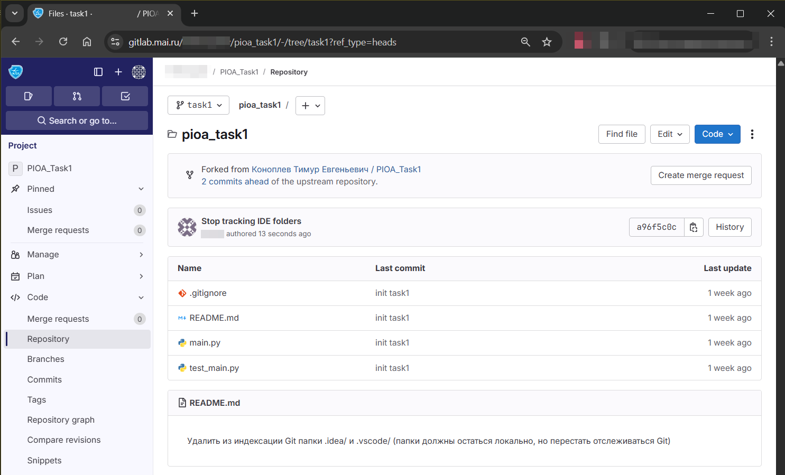
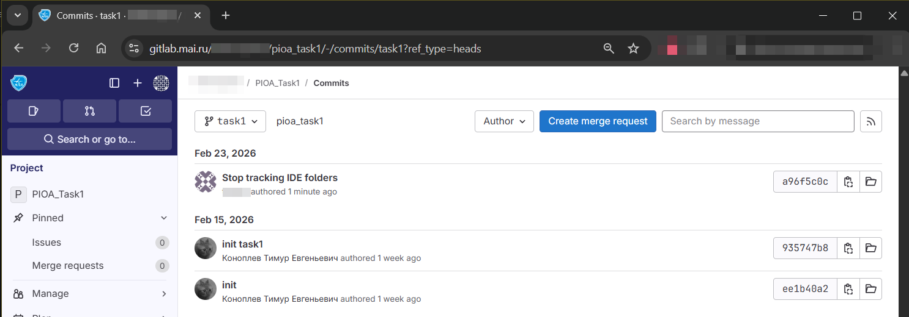

### Задание Task2

В данном задании необходимо корректно применить команду `git rebase -i` для интерактивного изменения истории коммитов и выполнить принудительную отправку изменений в удалённый репозиторий с использованием параметра `--force-with-lease` или `--force`.

**Ожидаемый результат:** История коммитов должна быть упорядочена и очищена согласно требованиям задания, изменения отправлены в удалённый репозиторий.

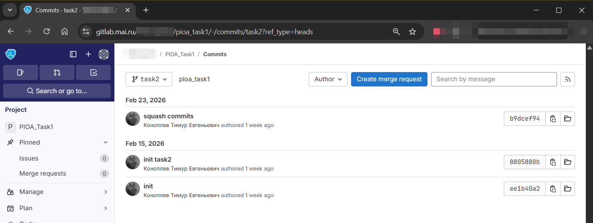

### Задание Task3

В данном задании необходимо корректно применить команду `git revert` для отмены изменений, внесённых определённым коммитом, путём создания нового коммита, отменяющего данные изменения.

**Ожидаемый результат:** В истории коммитов должен присутствовать новый коммит, отменяющий изменения указанного коммита, при этом исходный коммит сохраняется в истории.
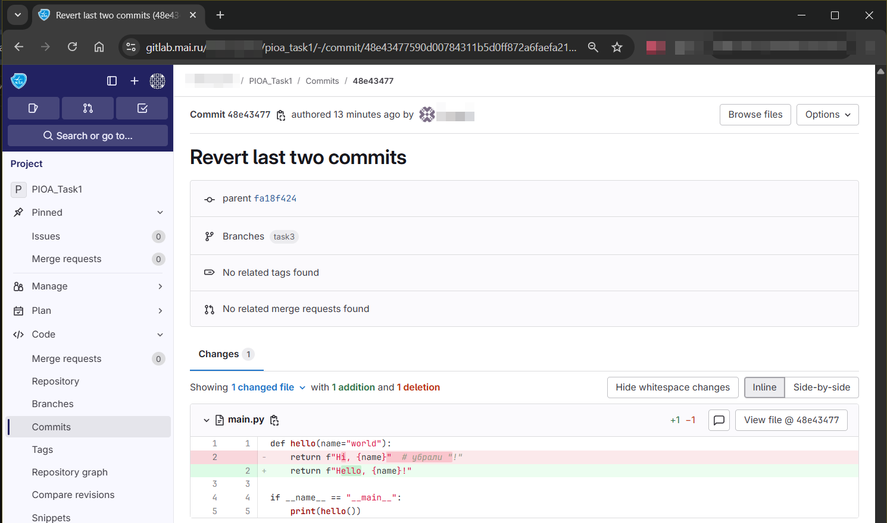
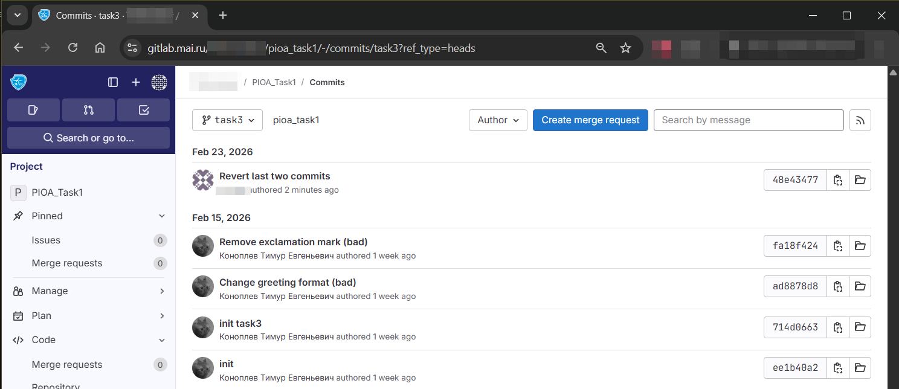

### Задание Task4

В данном задании необходимо корректно применить команду `git merge` для слияния веток и вручную разрешить возникающие конфликты слияния.

**Ожидаемый результат:** Ветки успешно объединены, все конфликты разрешены, создан коммит слияния.

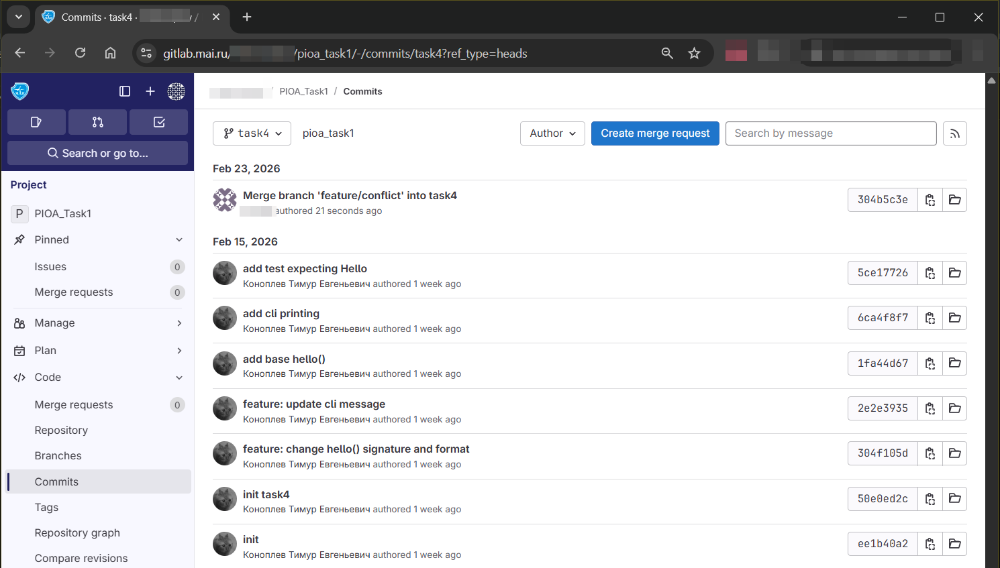

### Задание Task5

В данном задании необходимо проанализировать коммиты из ветки `feature/change`, определить полезные коммиты и корректно применить команду `git cherry-pick` для выборочного применения необходимых коммитов в текущую ветку.

**Ожидаемый результат:** В текущую ветку добавлены только полезные коммиты из ветки `feature/change` с сохранением корректной истории изменений.
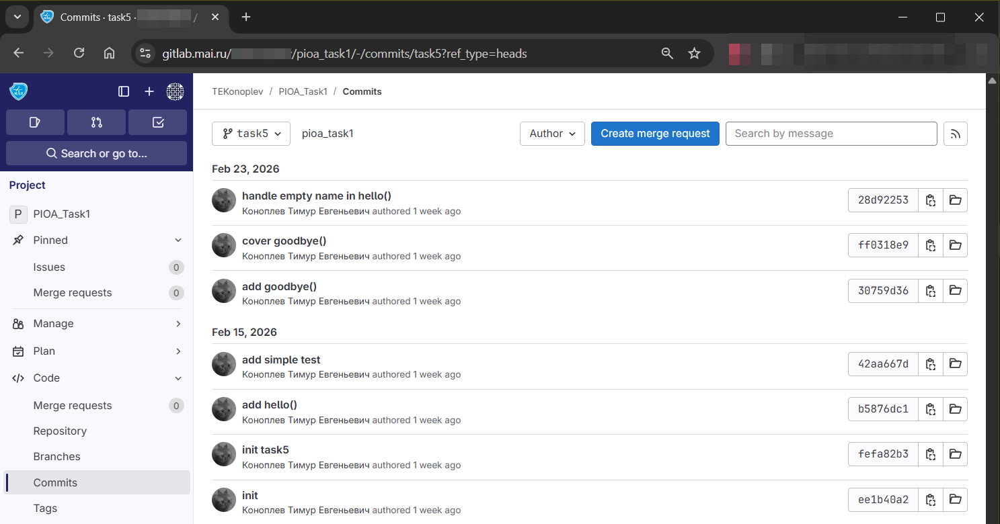

### Задание Task6

В данном задании необходимо проанализировать файл с тестами и основной код для идентификации программной ошибки, затем определить коммит, в котором данная ошибка была внесена, и исправить её. Для выполнения задания необходимо корректно применить команды `git rebase -i` и `git commit --amend`.

**Ожидаемый результат:** История коммитов не изменилась по структуре, но ошибка исправлена в соответствующем коммите, все тесты проходят успешно.
