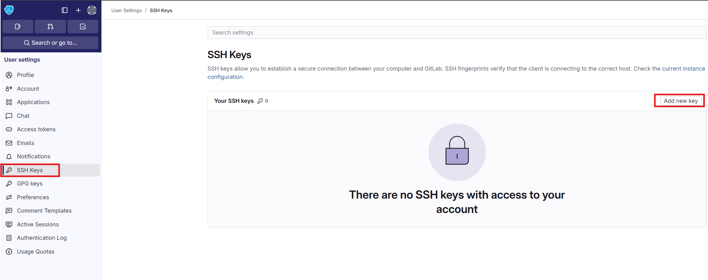
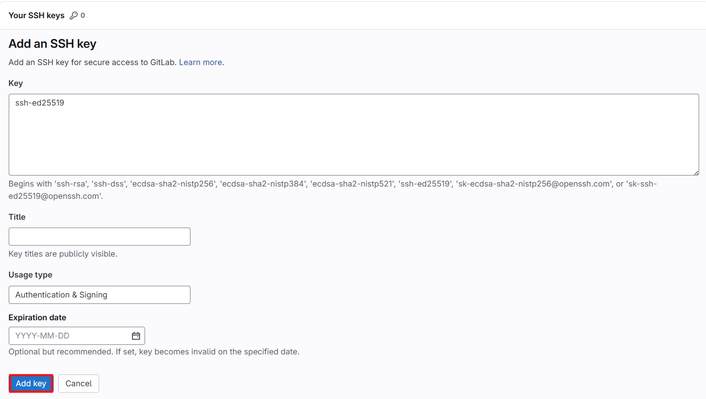

# Оглавление

1. [GIT](#git)
   1. [Что такое Git](#что-такое-git)
   2. [Системы контроля версий](#системы-контроля-версий)
   3. [Начинаем работать с Git](#начинаем-работать-с-git)
   4. [Как и где использовать Git](#как-и-где-использовать-git)
      1. [Установка Git](#установка-git)
      2. [Настройка конфигурационного файла](#настройка-конфигурационного-файла)
      3. [Основные команды](#основные-команды)
   5. [Создаём Git-репозиторий](#создаём-git-репозиторий)
      1. [Основные команды](#основные-команды-1)
   6. [Локальные и удалённые репозитории](#локальные-и-удалённые-репозитории)
      1. [Просмотр изменений в репозитории](#просмотр-изменений-в-репозитории)
      2. [Основные команды](#основные-команды-2)
      3. [Игнорирование файлов](#игнорирование-файлов)
         1. [Шаблоны для gitignore](#шаблоны-для-gitignore)
   7. [Удалённые репозитории](#удалённые-репозитории)
      1. [Основные команды](#основные-команды-3)
   8. [Коммиты](#коммиты)
      1. [Основные команды](#основные-команды-4)
   9. [Работа с ветками](#работа-с-ветками)
      1. [Merge](#merge)
      2. [Rebase](#rebase)
      3. [Объединение нескольких коммитов](#объединение-нескольких-коммитов)
      4. [Основные команды](#основные-команды-5)
2. [Работа с GitLab](#работа-с-gitlab)
   1. [Создание репозитория](#создание-репозитория)
   2. [Генерация SSH-ключей](#генерация-ssh-ключей)
   3. [Добавление участников репозитория](#добавление-участников-репозитория)
   4. [Создание Merge Request (MR)](#создание-merge-request-mr)

# GIT

## Что такое Git

**Git** — это распределённая система контроля версий (СКВ, VCS, Version Control Systems). Основная задача — хранить в течение времени состояния файлов (версии) и, в случае необходимости, давать возможность вернуться к любому из состояний.

Git появился в **2005** году как основной инструмент контроля версий разработчиков ядра Linux (в их числе — Линус Торвальдс, создатель Linux). В новой СКВ старались учитывать чужие ошибки и сделать максимально эффективный инструмент для больших групп разработчиков (к разработке ядра причастно множество программистов со всего мира).

## Системы контроля версий

Системы контроля версий (СКВ, VCS, Version Control Systems) позволяют разработчикам сохранять все изменения, внесённые в код.

**Основные возможности:**

- В случае «аварии» вы сможете откатить код до рабочего состояния и не тратить время на отлов ошибок.
- СКВ обеспечивает совместную работу над одним проектом для нескольких разработчиков.
- Внесённые изменения сохраняются независимо друг от друга.
- Каждый участник команды видит, над чем работают коллеги.

## Начинаем работать с Git

Существует некоторое количество платных и бесплатных сервисов, которые позволяют использовать git для работы с ними:

- **GitHub**
- **GitLab**
- **Bitbucket**

Работая с этими сервисами вы получаете доступ к онлайн хранилищу с помощью интерфейса командной строки Git и можете использовать его для разработки вашего проекта, получая всю мощь децентрализованного удалённого репозитория с системой контроля версий.

Но если вам это не нужно — можно использовать Git локально и в одиночку.

## Как и где использовать Git

### Установка Git

Чтобы установить Git, скачайте [Git](https://git-scm.com/install/) для Windows, macOS или Linux и проверьте версию командой:
```bash
git --version
```

### Настройка конфигурационного файла

Первым делом — настройте имя пользователя и email для авторизации. Эти настройки хранятся в конфигурационном файле.

### Основные команды

| Описание                                                                                | Шаблон команды                                             | Примеры                                                                                 |
| --------------------------------------------------------------------------------------- | ---------------------------------------------------------- | --------------------------------------------------------------------------------------- |
| Устанавливает имя, которое будет отображаться в поле автора у выполняемых вами коммитов | git config --global user.name "[имя]"                      | git config --global user.name "Иванов Иван Иванович"                                          |
| Задает адрес электронной почты, которая будет использоваться для всех коммитов          | git config --global user.email "[адрес электронной почты]" | git config --global user.email "IIIvanov@mai.education"                                      |
| Позволяет управлять подключениями к репозиториям                                        | git remote                                                 | git remote set-url origin ssh://git@gitlab.mai.ru:2222/IIIvanov/pioa_task1.git |

## Создаём Git-репозиторий

Git хранит данные в виде набора снимков миниатюрной файловой системы. При каждом сохранении состояния проекта Git запоминает, как выглядит каждый файл в конкретный момент и сохраняет ссылку на этот снимок.

### Основные команды

| Описание                                  | Шаблон команды              | Примеры                                                                                                |
| ----------------------------------------- | --------------------------- | ------------------------------------------------------------------------------------------------------ |
| Создание репозитория в текущей каталоге | git init [название проекта] | git init my_cool_project                                                                               |
| Скачать удаленный репозиторий             | git clone [url-адрес]       | git clone ssh://git@gitlab.mai.ru:2222/IIIvanov/pioa_task1.git |

## Локальные и удалённые репозитории

### Просмотр изменений в репозитории

Команда `git status` отображает все файлы, которые были изменены.

**У файлов есть 4 состояния:**

1. **Неотслеживаемый (untracked)** — находится в рабочей директории, но отсутствуют версии в HEAD или в области подготовленных файлов (Git не знает о файле).

2. **Изменён (modified)** — в рабочей директории есть более новая версия, чем та, что хранится в HEAD или в области подготовленных файлов (изменения не находятся в следующем коммите).

3. **Подготовлен (staged)** — в рабочей директории и области подготовленных файлов находится более новая версия, чем та, что хранится в HEAD (готов к коммиту).

4. **Без изменений** — одна версия файла во всех разделах, то есть последний коммит содержит актуальную версию.

### Основные команды

| Описание                                                                                 | Шаблон команды                         | Примеры                                  |
| ---------------------------------------------------------------------------------------- | -------------------------------------- | ---------------------------------------- |
| Перечисляет все новые или изменённые файлы, которые нуждаются в фиксации в индексе       | git status                             | git status                               |
| Добавляем файлы в индекс                                                                  | git add [файл]                         | `git add index.html` `git add .` `git add --all` |
| Удаляет файл из рабочей директории и индексирует его удаление                            | git rm [файл]                          | git rm index.html                        |
| Убирает файл из контроля версий, но физически оставляет его на своём месте               | git rm --cached [файл]                 | git rm --cached index.html               |
| Перемещает или переименовывает файл, сразу индексируя его для последующего коммита       | git mv [оригинальный файл] [новое имя] | git mv index.html index.txt              |
| Показывает различия по внесённым изменениям в ещё не проиндексированных файлах           | git diff                               | git diff                                 |
| Показывает различия между проиндексированной и последней зафиксированной версиями файлов | git diff --staged                      | git diff --staged                        |
| История изменений конкретного файла                                                      | git log --follow [файл]                | git log --follow index.txt               |

### Игнорирование файлов

Зачастую нам не нужно, чтобы Git отслеживал все файлы в репозитории:

- **Файлы с чувствительной информацией** — пароли
- **Большие бинарные файлы** — архивы, видео
- **Файлы, специфичные для ОС/IDE** — `.DS_Store` для macOS, `.iml` для IntelliJ IDEA

Для игнорирования используется файл `.gitignore`.

#### Шаблоны для .gitignore

- `/___` — позволяет избежать рекурсивности — соответствует файлам только в текущей директории
- `__/` — соответствует всем файлам в указанной директории
- `___` — соответствует всем файлам с указанным окончанием
- `!` — игнорирование файлов, попадающих под указанный шаблон
- `[__]` — соответствует любому символу из указанных в квадратных скобках
- `?` — соответствует любому символу
- `/**/` — соответствует вложенным директориям (например, `a/**/d` соответствует `a/d`, `a/b/d`, `a/b/c/d` и т. д.)

## Удалённые репозитории

`git remote -v` выводит список удалённых репозиториев, которые мы отслеживаем, и имена, которые мы им присвоили.

При использовании команды `git clone <url репозитория>` мы не только загружаем себе копию репозитория, но и неявно отслеживаем удалённый сервер, который находится по указанному адресу и которому присваивается имя origin.

### Основные команды

| Описание                                                                                      | Шаблон команды                           | Примеры   |
| --------------------------------------------------------------------------------------------- | ---------------------------------------- | --------- |
| Скачивает историю из удалённого репозитория                                                   | git fetch [удалённый репозиторий]        | git fetch |
| Загружает все изменения локальной ветки в удалённый репозиторий                               | git push [удалённый репозиторий] [ветка] | git push  |
| Загружает историю из удалённого репозитория и объединяет её с локальной. pull = fetch + merge | git pull                                 | git pull  |


## Коммиты

Одна из ключевых вещей при работе с Git – это коммиты (commits). Каждый коммит является точкой сохранения и применения изменений. Команда `git commit` откроет текстовый редактор для ввода сообщения коммита.

Коммиты хранят состояние файловой системы в определённый момент времени и отсылки на предыдущие коммиты. 

Каждый коммит содержит уникальную контрольную сумму — идентификатор, который Git использует, чтобы ссылаться на коммит. Чтобы отслеживать историю, Git хранит указатель HEAD на текущий коммит (обычно последний в активной ветке).

Мы можем ссылаться на коммит либо через его контрольную сумму, либо через его позицию относительно **HEAD**, например `HEAD~4` ссылается на коммит, который находится 4 коммитами ранее **HEAD**.

### Основные команды

| Описание                                                                            | Шаблон команды                                  | Примеры                                                     |
| ----------------------------------------------------------------------------------- | ----------------------------------------------- | ----------------------------------------------------------- |
| Фиксирует проиндексированные изменения и сохраняет их в историю версий              | git commit -m "[описание коммита]"              | git commit -m "Added new feature."                          |
| Изменение сообщения последнего коммита                                              | git commit –amend -m "новое описание к коммиту" | git commit –amend -m "Added new feature. Task in Jira 3247" |
| Просмотр изменений (коммитов) проекта                                               | git log                                         | git log                                                     |
| Выводит информацию и показывает изменения в выбранном коммите                       | git show [номер коммита]                        | git show 73b64290a107f6325ab88c7950637a4ce44c42a6           |
| Отменяет все коммиты после заданного, оставляя все изменения в рабочей директории   | git reset [номер коммита]                       | git reset 73b64290a107f6325ab88c7950637a4ce44c42a6          |
| Сбрасывает всю историю вместе с состоянием рабочей директории до указанного коммита | git reset --hard [коммит]                       | git reset --hard 73b64290a107f6325ab88c7950637a4ce44c42a6   |
| Отменяет все коммиты после заданного путём создания нового коммита                  | git revert [номер коммита]                      | git revert 73b64290a107f6325ab88c7950637a4ce44c42a6         |
| Получение определенного коммита из тематической ветки                               | git cherry-pick [номер коммита]                 | git cherry-pick 73b64290a107f6325ab88c7950637a4ce44c42a6    |
| Просмотр изменений (коммитов) проекта в виде графа                                  | git log --graph --oneline --stat                | git log --graph --oneline --stat                            |


## Работа с ветками


Ветвление — это возможность работать над разными версиями проекта: вместо одного списка с упорядоченными коммитами история будет расходиться в определённых точках.

Каждая ветвь содержит легковесный указатель **HEAD** на последний коммит, что позволяет без лишних затрат создать много веток.

Ветка по умолчанию называется **main** (иногда **master**), но лучше назвать её так, чтобы вы сразу понимали, для чего она создана (например, release). То же самое относится к веткам, которые вы будете создавать сами.

Локальный и удалённый репозитории могут иметь достаточно ветвей, поэтому когда вы отслеживаете удалённый репозиторий — отслеживается удалённая ветка (`git clone` привязывает вашу ветку **main** к ветке **origin/main** удалённого репозитория). 

### Merge


Ветку, в которую мы хотим добавить (слить) изменения, будем называть основной, а ветку, из которой мы будем их сливать, — тематической. 

Слияние включает в себя создание нового коммита, который основан на общем коммите-предке двух ветвей и указывает на оба HEAD в качестве предыдущих коммитов.

Для слияния мы переходим на основную ветку и используем команду `git merge <тематическая ветка>`. 

Если обе ветви меняют одну и ту же часть файла, то возникает конфликт слияния — ситуация, в которой Git не знает, какую версию файла сохранить, поэтому разрешать конфликт нужно вручную.

Чтобы увидеть конфликтующие файлы, вводите `git status`. 

### Rebase


Вместо совмещения двух ветвей коммитом слияния, перемещение заново воспроизводит коммиты тематической ветки в виде набора новых коммитов базовой ветки, что выливается в более чистую историю коммитов.

Для перемещения используется команда `git rebase <основная ветка> <тематическая ветка>`, которая воспроизводит изменения тематической ветки на основной; **HEAD** тематической ветки указывает на последний воспроизведённый коммит. 

### Объединение нескольких коммитов

Сжатие коммитов в интерактивном режиме:
- `git cherry -v master` — покажет, какие коммиты были сделаны в сравнении с веткой master. 
- `git rebase -i HEAD~3`: ключ `-i` означает работу в интерактивном режиме, а `HEAD~3` — что объединяться будут последние 3 коммита. 
- `pick` — это первый коммит. 
- `squash` — коммиты, которые вы будете сливать с первым.

Сжатие коммитов при слиянии веток: 
- `git merge --squash feature-branch` — коммиты из ветки feature-branch будут объединены и слиты с текущей веткой. 

### Основные команды

| Описание                                                         | Шаблон команды                                               | Примеры                                   |
| ---------------------------------------------------------------- | ------------------------------------------------------------ | ----------------------------------------- |
| Список веток                                            | git branch                                                   | git branch                                |
| Создать новую ветку                                              | git branch [имя ветки]                                       | git branch feature1                       |
| Переключиться на выбранную ветку                                 | git checkout [имя ветки]                                     | git checkout feature1                     |
| Удалить выбранную ветку                                          | git branch -d [имя ветки]                                    | git branch -d feature1                    |
| Переименование ветки                                             | git branch –m [старое_название_ветки] [новое_название_ветки] | git branch –m feature1 SuperButtonFeature |
| Слияние веток (вносит изменения указанной ветки в текущую ветку) | git merge [имя ветки]                                        | git merge hotfix                          |
| Удалить ветку на сервере                                         | git push origin --delete [имя ветки]                         |                                           |

# Работа с GitLab

## Создание репозитория

Чтобы создать репозиторий, необходимо нажать на **+** и выбрать **New project/repository**.


Далее необходимо выбрать тип проекта. В нашем случае выбираем **Create blank project**.


Заполняем **Project name**, **Project URL (path)** и **Visibility level**.


GitLab автоматически показывает подсказку с шагами, которые нужно выполнить, чтобы начать работать с репозиторием.


## Генерация SSH-ключей

Для удобства и безопасности рекомендуется работать с GitLab по SSH. Для этого необходимо сгенерировать SSH-ключ. В терминале выполните команду:
 ```bash
ssh-keygen -t ed25519
```
где t тип ключа (алгоритм): `ed25519`, `rsa`, `ecdsa` и т. п. Для GitLab обычно выбирают `ed25519` (современный, короткие ключи), RSA используют как совместимый вариант.

По умолчанию ключи генерируются в каталоге пользователя, в папке .ssh. Скопируйте содержимое публичного ключа id_ed25519.pub и добавьте его в GitLab.

Например, в Windows можно вывести ключ командой:
```bash
cat C:\Users\ИмяПользователя\.ssh\id_ed25519.pub
```
Скопируйте вывод команды и вставьте его в настройки профиля:






## Добавление участников репозитория

Чтобы добавить участников репозитория, в меню проекта выберите **Manage → Members**.


Далее нажмите **Invite members**.


В открывшемся окне введите имя пользователя, выберите роль и нажмите **Invite**.


## Создание Merge Request (MR)

Когда нужно слить тематическую ветку с `main`, рекомендуется создавать Merge Request (MR). При наличии изменений в ветке GitLab может предложить создать MR автоматически.


Далее необходимо указать заголовок MR (обязательно), описание и выбрать ревьювера.


Если назначен ревьювер, необходимо дождаться approve (или комментариев). После этого можно выполнять merge тематической ветки.

