# Графы и обход в глубину

На этой лекции начнём разговор о графах. Графы часто встречаются в задачах, где нужно описывать связи между объектами:

- дороги между городами
- переходы между состояниями
- связи между пользователями
- зависимости между задачами
- ссылки между страницами

Сегодня разберём:

- что такое граф, вершина и ребро
- чем отличаются ориентированные, неориентированные и взвешенные графы
- что такое путь, цикл, расстояние и компонента связности
- как хранить граф в памяти
- как работает обход в глубину, или DFS
- как оценивать сложность DFS для разных представлений графа

## Графы

Граф - это математический объект, который состоит из множества вершин и множества рёбер, соединяющих эти вершины.

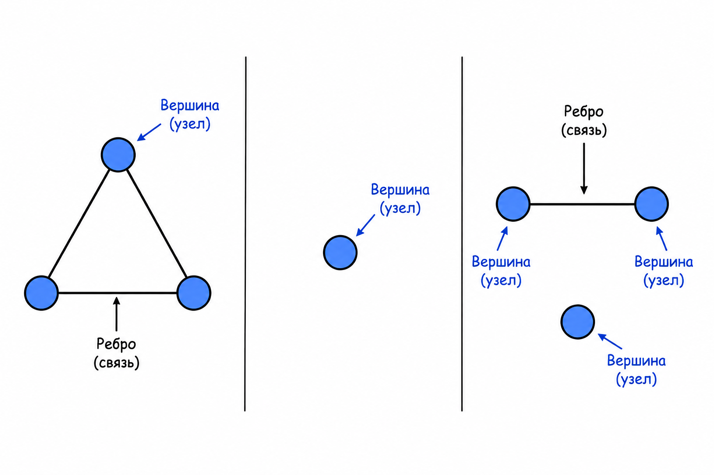

Например, связанный список тоже можно рассматривать как частный случай графа: элементы списка являются вершинами, а ссылки между ними - рёбрами.

Примеры графов:

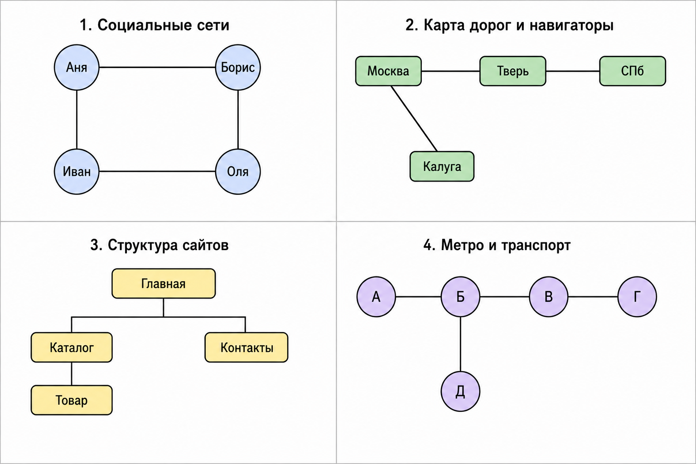

Если ребро не имеет направления, граф называют неориентированным. В таком графе по ребру можно перейти в обе стороны.

Если ребро имеет направление, граф называют ориентированным графом, или орграфом. Рёбра в ориентированном графе также называют дугами.

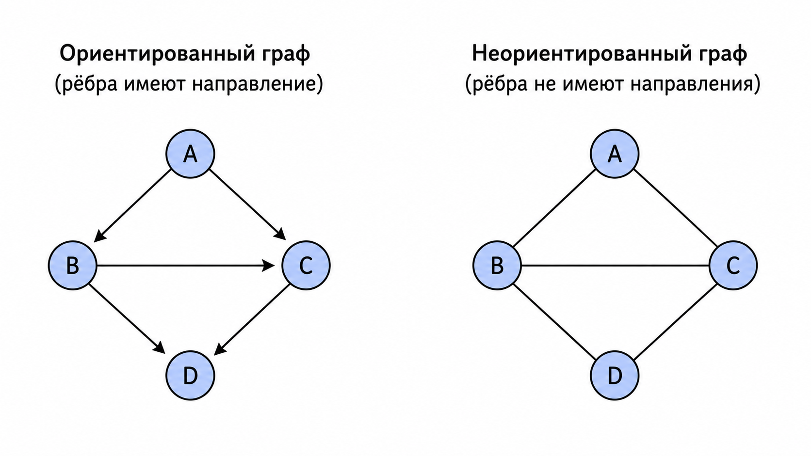

На вершинах и рёбрах можно хранить дополнительную информацию. Это называют разметкой графа.

Например, на рёбрах можно указать числа:

- длину дороги
- стоимость перехода
- время выполнения действия
- пропускную способность канала

Такие числа называют весами рёбер, а граф с весами на рёбрах - взвешенным графом.

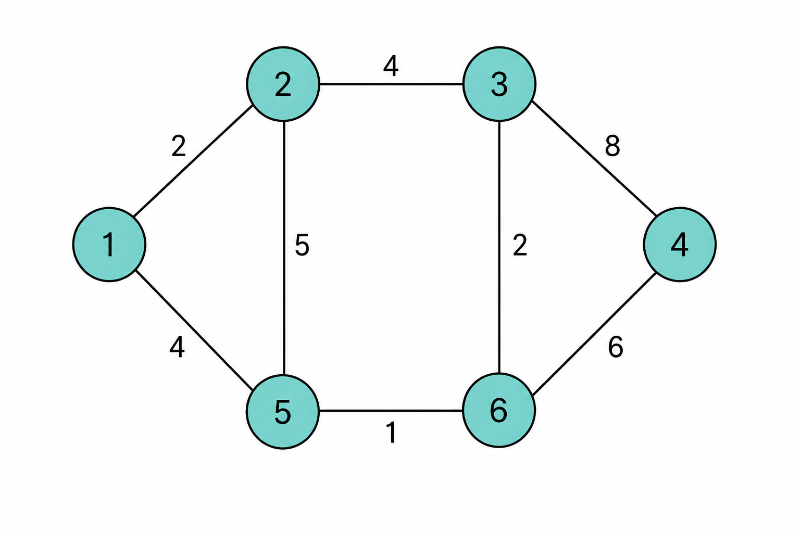

## Основные понятия теории графов

Множество всех вершин графа обычно обозначают `V`, а множество всех рёбер - `E`.

Размеры этих множеств записывают так:

```text
|V| - количество вершин
|E| - количество рёбер
```

В Python для работы с математическими множествами есть тип `set`. Например:

```python
vertices = {"A", "B", "C"}
edges = {("A", "B"), ("B", "C")}
```

Здесь `vertices` хранит вершины, а `edges` хранит рёбра.

### Обозначения

В теории графов часто используют следующие обозначения:

1. `v in V`
   Вершина `v` принадлежит множеству вершин `V`.
2. `e = (u, v)`
   Ребро `e` задано упорядоченной парой вершин. Такое обозначение удобно для ориентированного графа: ребро идёт из `u` в `v`.
3. `e = {u, v}`
   Ребро `e` задано неупорядоченной парой вершин. Такое обозначение удобно для неориентированного графа: порядок вершин не важен.

В ориентированном графе рёбра `(u, v)` и `(v, u)` - это разные рёбра.

В неориентированном графе ребро `{u, v}` совпадает с ребром `{v, u}`.

## Смежность, инцидентность и степень вершины

В алгоритмах на графах часто нужно обращаться к ближайшим вершинам и рёбрам.

Две вершины называют смежными, если между ними есть ребро.

Например, если в неориентированном графе есть ребро `{v, w}`, то вершины `v` и `w` смежны.

Вершина и ребро называются инцидентными, если вершина является одним из концов этого ребра.

Например, если `e = {v, w}`, то:

- вершина `v` инцидентна ребру `e`
- вершина `w` инцидентна ребру `e`

У каждого обычного ребра есть две инцидентные вершины. При этом у вершины может быть любое количество инцидентных рёбер, включая ноль.

Степень вершины - это количество инцидентных ей рёбер.

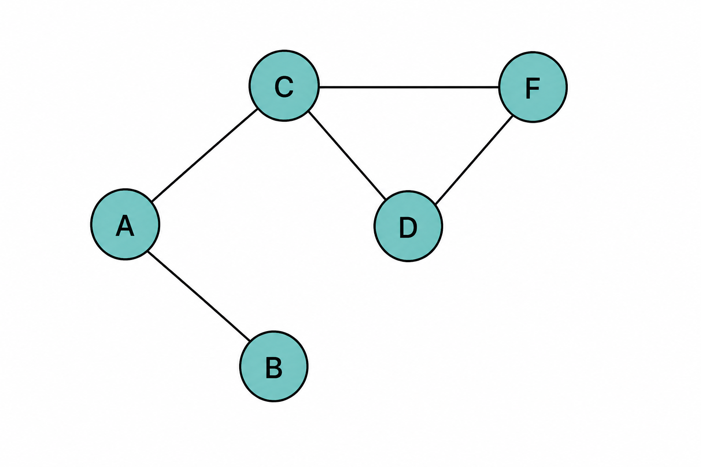

_Степень вершины B равна 1, степень вершин A, F и D равна 2, а степень вершины C равна 3._

В ориентированном графе различают два типа рёбер:

- входящие рёбра
- исходящие рёбра

Поэтому для ориентированных графов вводят два понятия:

- степень входа вершины - количество рёбер, которые входят в эту вершину
- степень выхода вершины - количество рёбер, которые выходят из этой вершины

## Пути в графе

Чаще всего графы строят для того, чтобы исследовать пути.

Путь - это последовательность рёбер, по которым можно последовательно пройти из одной вершины в другую.

Если нужно описать путь из `v0` в `vn`, его можно записать так:

```text
e1 = (v0, v1)
e2 = (v1, v2)
...
en = (v(n - 1), vn)
```

То есть конец каждого ребра совпадает с началом следующего.

Например, на рисунке есть путь `D -> C -> B -> A` из вершины `D` в вершину `A`.

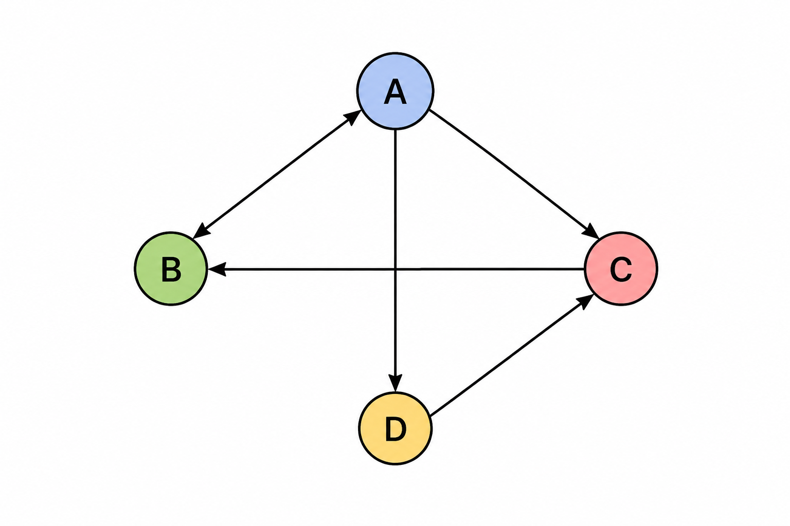

Путей между двумя вершинами может быть несколько. Например, из `A` в `B` могут существовать пути:

- `A -> B`
- `A -> C -> B`
- `A -> D -> C -> B`

В некоторых случаях пути между двумя вершинами может не быть.

Длина пути - это количество рёбер в этом пути.

Например, длина пути `A -> B -> A -> D` равна `3`, потому что в нём три перехода по рёбрам.

Расстояние между вершинами `v` и `w` - это длина кратчайшего пути из `v` в `w`.

Если `v = w`, расстояние от вершины до самой себя равно `0`.

Взвешенный граф добавляет ещё одно понятие: вес пути.

Вес пути - это сумма весов всех рёбер, входящих в этот путь.

## Циклы

В графах могут быть циклы.

Цикл - это путь, в котором начальная и конечная вершины совпадают, а рёбра не повторяются.

Например, в неориентированном графе путь `A -> B -> A` не считается циклом, если он использует одно и то же ребро `{A, B}` два раза: сначала в одну сторону, затем в другую.

На рисунке путь `A -> C -> B -> A` является циклом.

Циклы усложняют работу с графами. Из-за них в графе появляется бесконечно много разных маршрутов между одними и теми же вершинами.

Например, если существует путь `B -> A -> D`, а вершина `A` входит в цикл `A -> C -> B -> A`, то можно построить более длинные пути:

- `B -> A -> C -> B -> A -> D`
- `B -> A -> C -> B -> A -> C -> B -> A -> D`
- и так далее

Именно поэтому в алгоритмах обхода графа нужно запоминать, какие вершины уже были посещены.

## Связность

Иногда между некоторыми вершинами графа нет пути.

Граф называют связным, если для любой пары его вершин существует путь между ними.

Если граф не является связным, его называют несвязным.

Любой неориентированный граф можно разбить на компоненты связности.

Компонента связности вершины `v` - это множество всех вершин, до которых существует путь из `v`.

В связном графе ровно одна компонента связности. В несвязном графе компонент связности несколько.

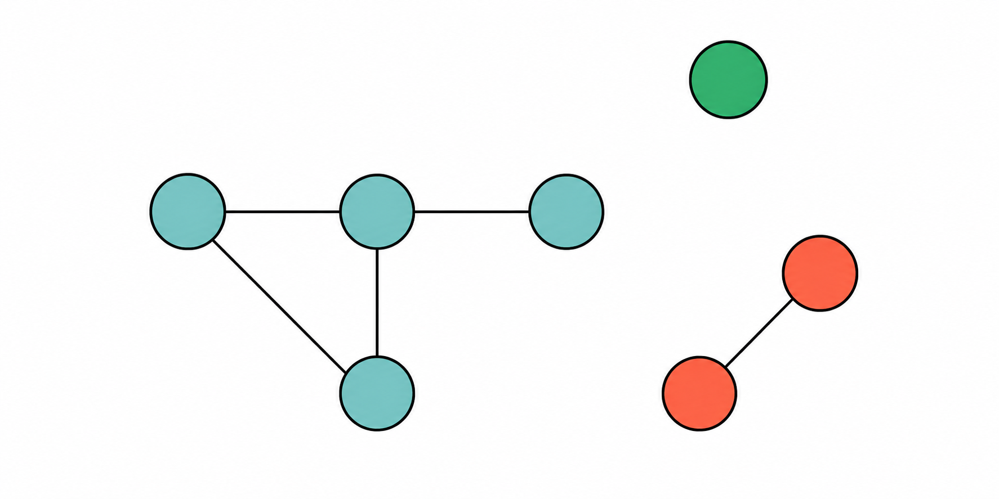

_В этом графе 3 компоненты связности: каждая покрашена в свой цвет. Между вершинами из разных компонент связности нет рёбер._

## Способы хранения графа в памяти

Один и тот же граф можно хранить в памяти разными способами. Выбор представления влияет на:

- расход памяти
- скорость проверки наличия ребра
- скорость перебора соседних вершин
- удобство чтения и записи графа

Рассмотрим три основных представления:

- матрица смежности
- списки смежности
- список рёбер

## Матрица смежности

Матрица смежности - это квадратная матрица `A` размера `|V| x |V|`.

Элемент `A[i][j]` описывает ребро из вершины `i` в вершину `j`.

Точный смысл значения зависит от типа графа:

- в невзвешенном графе `A[i][j] = 1`, если ребро есть, и `A[i][j] = 0`, если ребра нет
- во взвешенном графе `A[i][j]` может хранить вес ребра
- если ребра нет, в ячейке можно хранить `0`, `None` или специальное значение

Пример для невзвешенного графа:

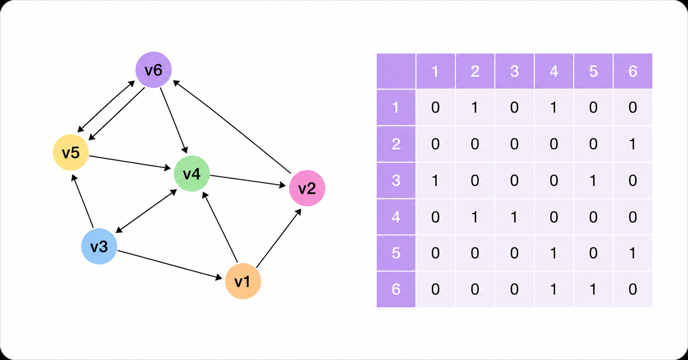

Пример для взвешенного графа:

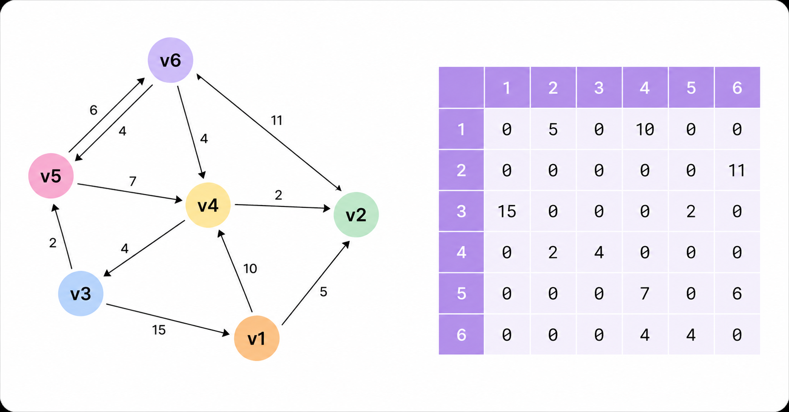

Матрица смежности требует `O(|V|^2)` памяти, потому что для каждой пары вершин выделяется отдельная ячейка.

Это удобно, если нужно быстро проверять наличие конкретного ребра:

```text
Есть ли ребро i -> j? Проверяем A[i][j].
```

Такая проверка работает за `O(1)`.

Но если граф разреженный, большая часть ячеек матрицы будет пустой. В этом случае память расходуется неэкономно.

## Плотные и разреженные графы

Полный граф - это граф, в котором между каждой парой различных вершин есть ребро.

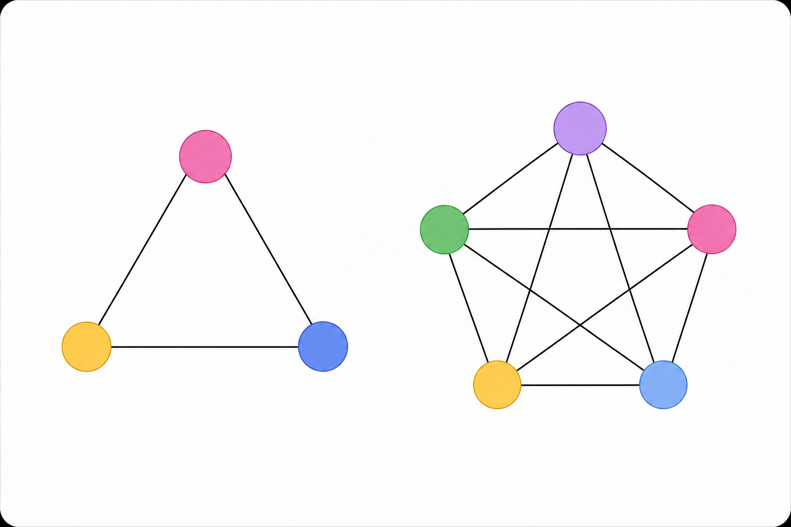

Граф называют плотным, если в нём есть большая часть потенциально возможных рёбер.

Граф называют разреженным, если большая часть потенциально возможных рёбер отсутствует.

Это не строгие математические определения, а удобные практические термины.

Для полного графа количество рёбер квадратично зависит от количества вершин:

```text
|E| = O(|V|^2)
```

Для разреженных графов формально оценка `O(|V|^2)` тоже остаётся верхней границей, но на практике она может сильно завышать реальный размер графа.

Например, дерево - сильно разреженный граф. Для дерева верно:

```text
|E| = O(|V|)
```

Матрицу смежности обычно используют для плотных графов, где количество рёбер близко к `|V|^2`.

## Списки смежности

Второй способ хранения графа - списки смежности.

При таком подходе для каждой вершины `v` хранится список вершин, в которые из `v` ведут рёбра.

В программе граф можно представить:

- массивом списков, если вершины пронумерованы числами
- словарём, если вершины обозначены строками или другими объектами

Для невзвешенного графа списки смежности могут выглядеть так:


```text
v1: [v2, v4]
v2: [v6]
v3: [v1, v5]
v4: [v2, v3]
v5: [v4, v6]
v6: [v4, v5]
```

Для взвешенного графа вместо одной вершины назначения удобно хранить пару: куда ведёт ребро и какой у него вес.


```text
v1: [(to: v2, weight: 5), (to: v4, weight: 10)]
v2: [(to: v6, weight: 11)]
v3: [(to: v1, weight: 15), (to: v5, weight: 2)]
v4: [(to: v2, weight: 2), (to: v3, weight: 4)]
v5: [(to: v4, weight: 7), (to: v6, weight: 6)]
v6: [(to: v4, weight: 4), (to: v5, weight: 4)]
```

Списки смежности требуют `O(|V| + |E|)` памяти.

Это представление особенно удобно для разреженных графов, потому что мы храним только существующие рёбра.

## Список рёбер

Третий способ хранения - список рёбер.

В списках смежности вершина, из которой выходит ребро, задаётся неявно: это индекс массива или ключ словаря.

Иногда удобнее сделать оба конца ребра явными. Тогда граф можно представить как список троек:

```text
(from, to, weight)
```

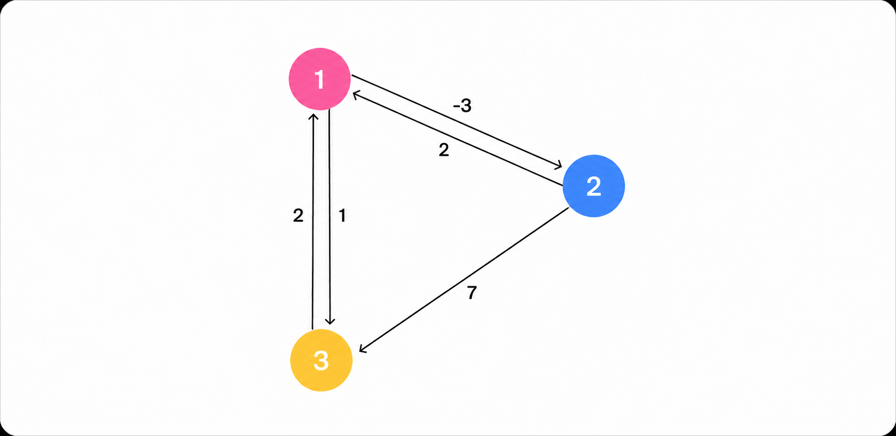

```text
(from: v1, to: v2, weight: -3)
(from: v2, to: v1, weight: 2)
(from: v3, to: v1, weight: 2)
(from: v1, to: v3, weight: 1)
(from: v2, to: v3, weight: 7)
```

Такое представление удобно:

- для хранения графа в файле
- для передачи графа между программами
- для алгоритмов, которым нужно перебирать все рёбра

Список рёбер требует `O(|E|)` памяти.

## Сравнение представлений

| Представление | Занимаемая память | Особенности |
|---|---|---|
| Матрица смежности | `O(\|V\|^2)` | Позволяет быстро проверить наличие ребра между двумя вершинами |
| Списки смежности | `O(\|V\| + \|E\|)` | Позволяют быстро получить все соседние вершины; хорошо подходят для разреженных графов |
| Список рёбер | `O(\|E\|)` | Удобен для хранения, передачи и перебора всех рёбер |

## DFS: обход в глубину

Есть два базовых подхода к обходу графа:

- поиск в ширину, или BFS (_англ._ breadth-first search)
- поиск в глубину, или DFS (_англ._ depth-first search)

На этой лекции рассмотрим DFS.

Основная идея DFS:

1. Выбрать стартовую вершину.
2. Перейти в одну из ещё не посещённых соседних вершин.
3. Из неё снова перейти в ещё не посещённую соседнюю вершину.
4. Продолжать углубляться, пока это возможно.
5. Если из текущей вершины больше некуда идти, вернуться назад.

Такой процесс естественно описывается рекурсией.

Но для корректной рекурсии нужно понимать, какие вершины уже были обработаны. Для этого часто используют раскраску вершин.

## Цвета вершин в DFS

Вершины раскрашивают в три цвета:

- белый (`WHITE`) - вершина ещё не посещена
- серый (`GRAY`) - вершина уже обнаружена, но её исходящие рёбра ещё не обработаны полностью
- чёрный (`BLACK`) - вершина посещена, и все её исходящие рёбра обработаны

Тогда DFS из вершины `v` работает так:

1. Помечаем `v` серым цветом.
2. Перебираем все вершины `w`, в которые есть ребро из `v`.
3. Если `w` белая, рекурсивно запускаем `DFS(w)`.
4. После обработки всех соседей помечаем `v` чёрным цветом.

Внешний цикл по всем вершинам нужен для случая, когда граф несвязный. Если после запуска DFS из одной вершины остались белые вершины, значит они лежат в других компонентах графа или являются изолированными.

## Рекурсивная реализация DFS

```python
WHITE = "white"
GRAY = "gray"
BLACK = "black"


def dfs(graph, vertex, colors, result):
    """
    Рекурсивный обход в глубину из вершины vertex.

    graph[vertex] хранит вершины, в которые ведут исходящие ребра.
    """
    # Вершина обнаружена: теперь важно не зайти в нее повторно.
    colors[vertex] = GRAY
    result.append(vertex)

    # Рекурсивно углубляемся только в еще не посещенные вершины.
    for neighbor in graph[vertex]:
        if colors[neighbor] == WHITE:
            dfs(graph, neighbor, colors, result)

    # Все исходящие ребра обработаны, вершина полностью завершена.
    colors[vertex] = BLACK


def main_dfs(graph):
    """
    Запускает DFS для всего графа.

    Внешний цикл нужен для изолированных вершин
    и отдельных компонент графа.
    """
    colors = [WHITE] * len(graph)
    result = []

    for vertex in range(len(graph)):
        if colors[vertex] == WHITE:
            dfs(graph, vertex, colors, result)

    return result


if __name__ == "__main__":
    # Граф задан списком смежности:
    # graph[v] хранит исходящие ребра из вершины v.
    graph = [
        [1, 2],  # 0 -> 1, 2
        [3, 4],  # 1 -> 3, 4
        [5],     # 2 -> 5
        [],      # 3 без исходящих ребер
        [5],     # 4 -> 5
        [],      # 5 без исходящих ребер
        [],      # 6 изолированная вершина
    ]

    print(main_dfs(graph))  # [0, 1, 3, 4, 5, 2, 6]
```

Порядок обхода зависит от порядка вершин в списках смежности. Если поменять порядок соседей, результат может измениться, но это всё равно будет корректный DFS.

## DFS без рекурсии

У рекурсивной реализации есть практическое ограничение: если граф большой, глубина рекурсии может стать слишком большой, и программа получит переполнение стека вызовов.

Поэтому DFS полезно уметь записывать без рекурсии.

Идея итеративной версии:

1. Использовать собственный стек.
2. Класть в стек вершины, которые нужно обработать.
3. Добавлять вершину в стек дважды:
   - первый раз для входа в вершину
   - второй раз для выхода из вершины после обработки потомков

Так мы имитируем поведение рекурсивного стека.

```python
WHITE = "white"
GRAY = "gray"
BLACK = "black"


def dfs(graph, start_vertex, colors, result):
    """
    Обход в глубину без рекурсии из вершины start_vertex.

    graph[v] хранит вершины, в которые ведут исходящие ребра из v.
    """
    stack = [start_vertex]

    while stack:
        vertex = stack.pop()

        if colors[vertex] == WHITE:
            # Первый раз видим вершину: отмечаем вход в нее.
            colors[vertex] = GRAY
            result.append(vertex)

            # Кладем вершину обратно, чтобы позднее обработать выход из нее.
            stack.append(vertex)

            # Соседей добавляем в обратном порядке, потому что стек работает
            # по принципу LIFO. Так порядок обхода совпадет с рекурсивным DFS.
            for neighbor in reversed(graph[vertex]):
                if colors[neighbor] == WHITE:
                    stack.append(neighbor)

        elif colors[vertex] == GRAY:
            # Второй раз достаем вершину после обработки ее потомков.
            colors[vertex] = BLACK


def main_dfs(graph):
    """
    Запускает DFS для всего графа.

    Внешний цикл учитывает изолированные вершины
    и отдельные компоненты графа.
    """
    colors = [WHITE] * len(graph)
    result = []

    for vertex in range(len(graph)):
        if colors[vertex] == WHITE:
            dfs(graph, vertex, colors, result)

    return result


if __name__ == "__main__":
    # Граф задан списком смежности:
    # graph[v] хранит исходящие ребра из вершины v.
    graph = [
        [1, 2],  # 0 -> 1, 2
        [3, 4],  # 1 -> 3, 4
        [5],     # 2 -> 5
        [],      # 3 без исходящих ребер
        [5],     # 4 -> 5
        [],      # 5 без исходящих ребер
        [],      # 6 изолированная вершина
    ]

    print(main_dfs(graph))  # [0, 1, 3, 4, 5, 2, 6]
```

В этой реализации стек хранит не только вершины, в которые нужно войти, но и вершины, к которым нужно вернуться после обработки соседей.

## Сложность DFS

Сложность обхода в глубину зависит от того, как граф хранится в памяти.

### Если граф хранится матрицей смежности

Чтобы найти все соседние вершины для вершины `v`, нужно просмотреть всю строку матрицы.

В строке `|V|` элементов. Таких вершин тоже `|V|`.

Поэтому время работы DFS при матрице смежности:

```text
O(|V|^2)
```

Память на хранение графа:

```text
O(|V|^2)
```

### Если граф хранится списками смежности

В списках смежности мы перебираем только реально существующие рёбра.

DFS посещает каждую вершину не более одного раза и просматривает списки смежности всех вершин.

Поэтому время работы:

```text
O(|V| + |E|)
```

Память на хранение графа:

```text
O(|V| + |E|)
```

Для неориентированного графа каждое ребро обычно хранится дважды: один раз в списке первой вершины и один раз в списке второй. На асимптотику это не влияет:

```text
O(|V| + 2 * |E|) = O(|V| + |E|)
```

Если граф плотный, то `|E| = O(|V|^2)`, и оценка для списков смежности превращается в:

```text
O(|V| + |E|) = O(|V| + |V|^2) = O(|V|^2)
```

То есть для плотных графов матрица смежности и списки смежности дают похожую асимптотическую оценку обхода.

Если граф разреженный, то `|E|` значительно меньше `|V|^2`. В этом случае DFS по спискам смежности обычно эффективнее, чем DFS по матрице смежности.
