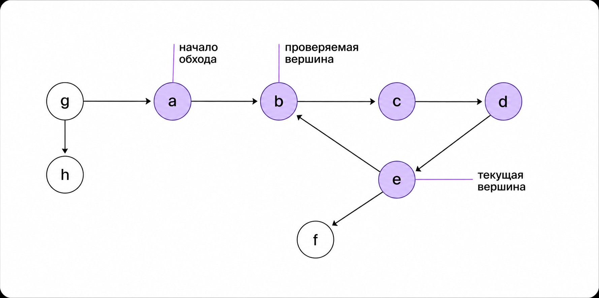
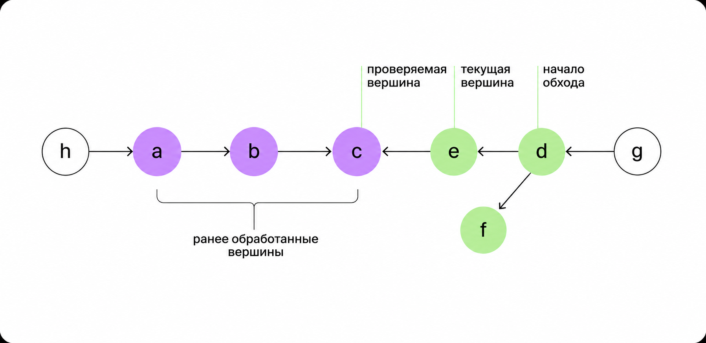
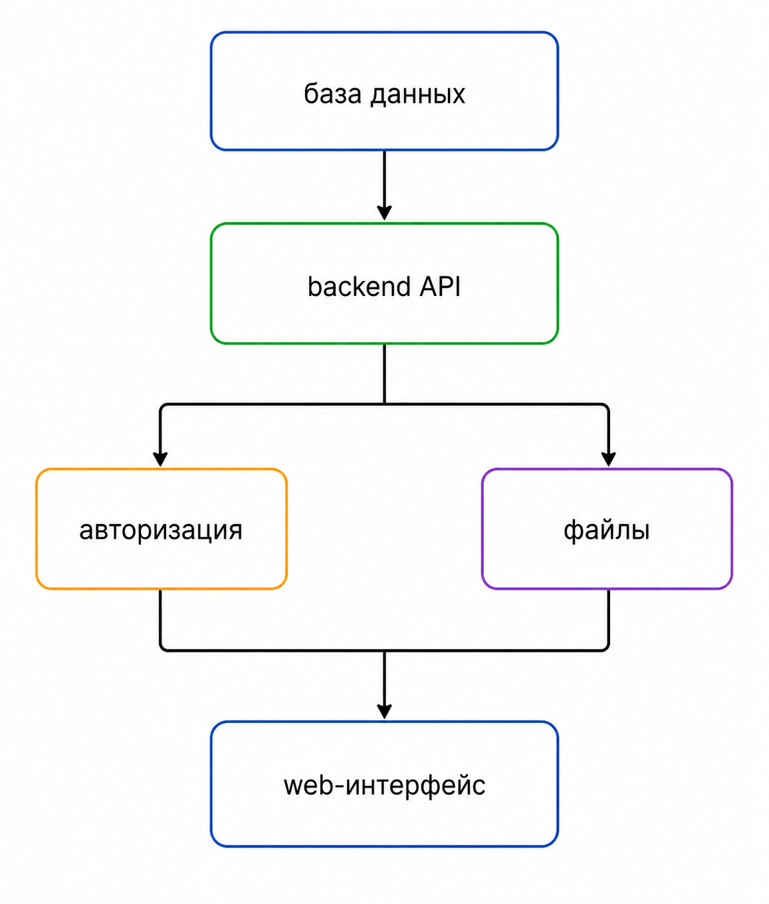
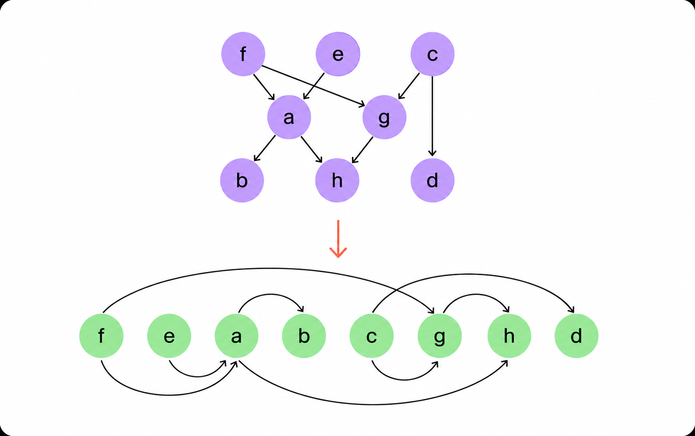
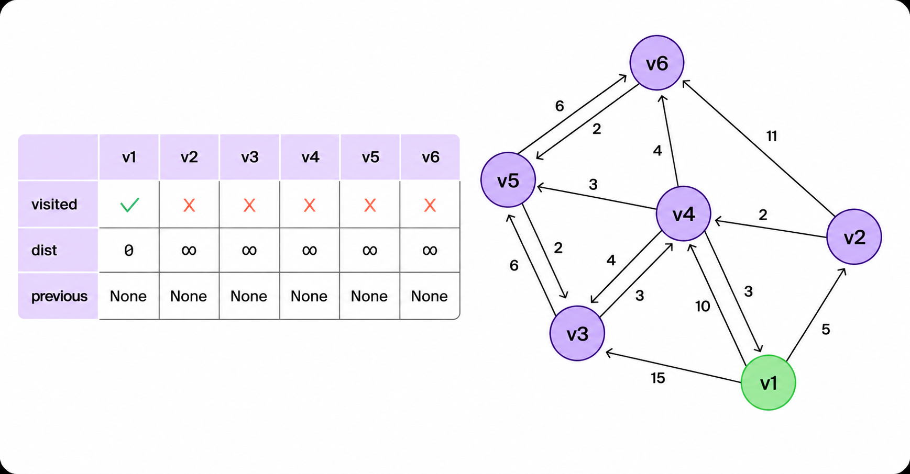
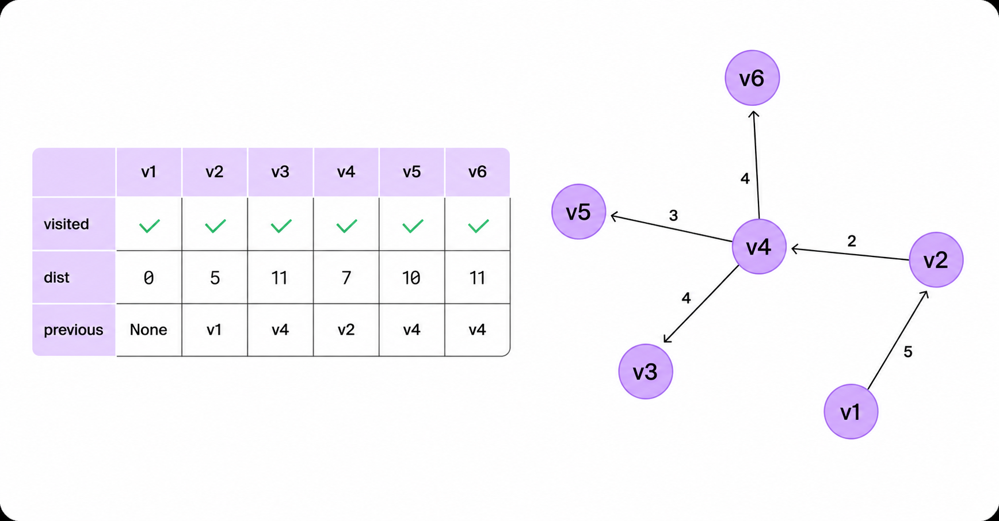

# Циклы, топологическая сортировка, BFS и алгоритм Дейкстры

На прошлой лекции мы начали изучать графы и рассмотрели обход в глубину, или DFS. Мы увидели, что при обходе вершины удобно раскрашивать в три цвета:

- белый (`WHITE`) - вершина ещё не посещена
- серый (`GRAY`) - вершина уже обнаружена, но её исходящие рёбра ещё не обработаны полностью
- чёрный (`BLACK`) - вершина полностью обработана

Сегодня продолжим работу с графами и разберём:

- как с помощью DFS искать циклы в ориентированном графе
- что такое времена входа и выхода из вершины
- как работает топологическая сортировка
- как устроен обход в ширину, или BFS
- почему BFS находит кратчайшие пути в невзвешенном графе
- как алгоритм Дейкстры находит кратчайшие пути во взвешенном графе

## Поиск цикла в ориентированном графе

Обход в глубину позволяет определять циклы в ориентированных графах.

Идея основана на цветах вершин. Если во время DFS из текущей вершины мы видим ребро в серую вершину, значит найден цикл.

Серая вершина уже лежит в текущей цепочке рекурсивных вызовов. Поэтому ребро в неё возвращает обход к вершине, из которой ещё не завершён выход.



Вершина должна быть именно серой. Ребро в чёрную вершину не означает цикл.

Чёрная вершина уже полностью обработана. Она могла быть достигнута раньше другим путём, но сейчас она не лежит в текущей цепочке DFS.



Алгоритм поиска цикла в ориентированном графе:

1. Изначально все вершины белые.
2. При входе в вершину красим её в серый цвет.
3. Перебираем все исходящие рёбра.
4. Если соседняя вершина белая, запускаем DFS из неё.
5. Если соседняя вершина серая, цикл найден.
6. После обработки всех исходящих рёбер красим вершину в чёрный цвет.

```python
WHITE = "white"
GRAY = "gray"
BLACK = "black"


def has_cycle_from(graph, vertex, colors):
    """
    Проверяет, есть ли цикл, достижимый из вершины vertex.

    graph[vertex] хранит вершины, в которые ведут исходящие ребра.
    """
    colors[vertex] = GRAY

    for neighbor in graph[vertex]:
        if colors[neighbor] == GRAY:
            # Ребро ведет в вершину из текущей цепочки DFS.
            return True

        if colors[neighbor] == WHITE:
            if has_cycle_from(graph, neighbor, colors):
                return True

    colors[vertex] = BLACK
    return False


def has_cycle(graph):
    """
    Проверяет наличие цикла во всем ориентированном графе.

    Внешний цикл нужен для изолированных вершин
    и отдельных компонент графа.
    """
    colors = [WHITE] * len(graph)

    for vertex in range(len(graph)):
        if colors[vertex] == WHITE:
            if has_cycle_from(graph, vertex, colors):
                return True

    return False


if __name__ == "__main__":
    graph = [
        [1],     # 0 -> 1
        [2],     # 1 -> 2
        [0, 3],  # 2 -> 0, 3
        [],      # 3 без исходящих ребер
    ]

    print(has_cycle(graph))  # True
```

В этом примере есть цикл `0 -> 1 -> 2 -> 0`.

## Времена входа и выхода

В алгоритмах на графах часто используют времена входа и выхода из вершины.

Это не настоящее время, а счётчик событий внутри DFS:

- время входа фиксируется, когда вершина становится серой
- время выхода фиксируется, когда вершина становится чёрной

Для хранения этих значений заведём два массива:

- `entry[vertex]` - момент входа в вершину
- `leave[vertex]` - момент выхода из вершины

```python
WHITE = "white"
GRAY = "gray"
BLACK = "black"


def dfs(graph, start_vertex, colors, result, entry, leave, time):
    """
    Обход в глубину без рекурсии из вершины start_vertex.

    graph[vertex] хранит вершины, в которые ведут исходящие ребра.
    """
    stack = [start_vertex]

    while stack:
        vertex = stack.pop()

        if colors[vertex] == WHITE:
            colors[vertex] = GRAY
            entry[vertex] = time
            time += 1
            result.append(vertex)

            # Вершина кладется в стек повторно, чтобы позднее
            # зафиксировать момент выхода из нее.
            stack.append(vertex)

            # Соседи добавляются в обратном порядке, потому что стек
            # извлекает последним тот элемент, который был добавлен последним.
            for neighbor in reversed(graph[vertex]):
                if colors[neighbor] == WHITE:
                    stack.append(neighbor)

        elif colors[vertex] == GRAY:
            colors[vertex] = BLACK
            leave[vertex] = time
            time += 1

    return time


def main_dfs(graph):
    """
    Запускает DFS для всего графа.

    Внешний цикл учитывает изолированные вершины
    и отдельные компоненты графа.
    """
    colors = [WHITE] * len(graph)
    entry = [None] * len(graph)
    leave = [None] * len(graph)
    result = []
    time = 0

    for vertex in range(len(graph)):
        if colors[vertex] == WHITE:
            time = dfs(graph, vertex, colors, result, entry, leave, time)

    return result, entry, leave


if __name__ == "__main__":
    graph = [
        [1, 2],  # 0 -> 1, 2
        [3, 4],  # 1 -> 3, 4
        [5],     # 2 -> 5
        [],      # 3 без исходящих ребер
        [5],     # 4 -> 5
        [],      # 5 без исходящих ребер
        [],      # 6 изолированная вершина
    ]

    result, entry, leave = main_dfs(graph)
    print("DFS:", result)
    print("Entry:", entry)
    print("Leave:", leave)
```

Времена входа и выхода позволяют анализировать взаимное расположение вершин в обходе. Например, с их помощью можно классифицировать рёбра и строить топологическую сортировку.

## Граф зависимостей

Ориентированные графы часто применяются для описания зависимостей между задачами.



Такой граф показывает порядок разработки модулей.

Например, сначала нужно разработать модуль базы данных. После этого можно писать API. Систему авторизации и работу с файлами можно разрабатывать независимо друг от друга, но без них нет смысла переходить к интерфейсу.

Подобные графы встречаются:

- при планировании задач
- при компиляции программ
- при установке пакетов
- при запуске конвейеров обработки данных
- при построении учебных планов

Если задача `A` должна быть выполнена раньше задачи `B`, это можно записать ребром `A -> B`.

## Топологическая сортировка

Топологическая сортировка применяется, когда нужно упорядочить объекты с зависимостями.

Например, чтобы одеться перед деловой встречей, нужно учитывать порядок действий. Рубашку следует надеть раньше галстука, носки - раньше ботинок. При этом некоторые действия можно выполнить в разном порядке: например, надеть носки и рубашку независимо друг от друга.

Топологическая сортировка ориентированного графа - это такое упорядочивание всех его вершин, при котором для каждого ребра `(v, w)` вершина `v` расположена раньше вершины `w`.

Из этого следует важное свойство: если в графе есть путь из вершины `s` в вершину `t`, то в топологическом порядке `s` должна стоять раньше `t`.



Топологическая сортировка существует не для любых графов.

Она корректно определена только для ориентированных графов без циклов. Такие графы называют направленными ациклическими графами, или DAG (_англ._ directed acyclic graph).

Если в графе есть цикл, вершины цикла невозможно расположить так, чтобы каждая зависимость была направлена слева направо. Например, если есть зависимости `A -> B`, `B -> C` и `C -> A`, ни одна из вершин не может быть первой.

### Топологическая сортировка через DFS

При обходе в глубину вершина получает время выхода после того, как обработаны все вершины, достижимые из неё.

Поэтому для DAG можно получить топологический порядок так:

1. Запустить DFS для всего графа.
2. Запомнить времена выхода `leave`.
3. Отсортировать вершины по убыванию времени выхода.

```python
def topological_sort(leave):
    """
    Возвращает вершины в порядке убывания времени выхода.

    Такой порядок является топологическим для ориентированного
    ациклического графа.
    """
    return sorted(range(len(leave)), key=lambda vertex: leave[vertex], reverse=True)
```

Перед применением топологической сортировки нужно убедиться, что в графе нет цикла. Если цикл есть, результат сортировки по времени выхода не будет корректным топологическим порядком.

## BFS: обход в ширину

Обход в ширину, или BFS (_англ._ breadth-first search), получает стартовую вершину `s` и посещает все достижимые вершины в порядке возрастания расстояния от `s`.

Можно представить, что вершины разбиваются на слои:

- расстояние `0` - сама стартовая вершина
- расстояние `1` - вершины, до которых можно дойти за одно ребро
- расстояние `2` - вершины, до которых можно дойти за два ребра
- и так далее

BFS сначала обрабатывает все вершины первого слоя, затем второго, затем третьего.

Вершины, до которых нельзя дойти из стартовой вершины, остаются недостижимыми. Их расстояние от `s` можно считать бесконечным или неизвестным.

Для работы BFS используется очередь. Это важно: очередь извлекает вершины в том же порядке, в котором они были добавлены.

Алгоритм BFS:

1. Создаём очередь `planned`.
2. Красим стартовую вершину `s` в серый цвет и добавляем её в очередь.
3. Пока очередь не пуста:
   - извлекаем вершину `u` из начала очереди
   - перебираем все исходящие рёбра `u -> v`
   - если `v` белая, красим её в серый цвет и добавляем в очередь
   - после обработки всех соседей красим `u` в чёрный цвет

```python
from collections import deque


WHITE = "white"
GRAY = "gray"
BLACK = "black"


def bfs(graph, start_vertex):
    """
    Обход в ширину из вершины start_vertex.

    graph[vertex] хранит вершины, в которые ведут исходящие ребра.
    """
    colors = [WHITE] * len(graph)
    result = []
    planned = deque()

    colors[start_vertex] = GRAY
    planned.append(start_vertex)

    while planned:
        vertex = planned.popleft()
        result.append(vertex)

        for neighbor in graph[vertex]:
            if colors[neighbor] == WHITE:
                # Вершина обнаружена и будет обработана позднее,
                # когда дойдет ее очередь.
                colors[neighbor] = GRAY
                planned.append(neighbor)

        colors[vertex] = BLACK

    return result


if __name__ == "__main__":
    graph = [
        [1, 3],
        [5],
        [0, 4],
        [1, 2],
        [3, 5],
        [3, 4],
        [1],
        [],
    ]

    print(bfs(graph, 0))
```

Порядок обхода внутри одного слоя зависит от порядка соседей в списках смежности. Но главное свойство сохраняется: BFS не перейдёт к вершинам на расстоянии `k + 1`, пока не обнаружит все достижимые вершины на расстоянии `k`.

## Кратчайший путь в невзвешенном графе

BFS часто используют для поиска кратчайшего пути в невзвешенном графе.

В невзвешенном графе длина пути равна количеству рёбер. Поэтому когда BFS впервые обнаруживает вершину, он уже нашёл до неё кратчайший путь от старта.

Для восстановления пути нужны два массива:

- `distance[vertex]` - расстояние от стартовой вершины до `vertex`
- `previous[vertex]` - предыдущая вершина на кратчайшем пути

```python
from collections import deque


WHITE = "white"
GRAY = "gray"
BLACK = "black"


def bfs_shortest_paths(graph, start_vertex):
    """
    Находит расстояния и предшественников для всех вершин,
    достижимых из start_vertex.
    """
    colors = [WHITE] * len(graph)
    distance = [None] * len(graph)
    previous = [None] * len(graph)
    result = []
    planned = deque()

    colors[start_vertex] = GRAY
    distance[start_vertex] = 0
    planned.append(start_vertex)

    while planned:
        vertex = planned.popleft()
        result.append(vertex)

        for neighbor in graph[vertex]:
            if colors[neighbor] == WHITE:
                colors[neighbor] = GRAY
                distance[neighbor] = distance[vertex] + 1
                previous[neighbor] = vertex
                planned.append(neighbor)

        colors[vertex] = BLACK

    return result, distance, previous


def shortest_path(previous, start_vertex, finish_vertex):
    """
    Восстанавливает кратчайший путь из start_vertex в finish_vertex.
    """
    path = []
    vertex = finish_vertex

    while vertex is not None:
        path.append(vertex)

        if vertex == start_vertex:
            path.reverse()
            return path

        vertex = previous[vertex]

    return []


if __name__ == "__main__":
    graph = [
        [1, 3],
        [5],
        [0, 4],
        [1, 2],
        [3, 5],
        [3, 4],
        [1],
        [],
    ]

    start_vertex = 0
    finish_vertex = 5

    result, distance, previous = bfs_shortest_paths(graph, start_vertex)

    print("BFS:", result)
    print("Distance:", distance)
    print("Previous:", previous)
    print(
        "Shortest path from",
        start_vertex,
        "to",
        finish_vertex,
        ":",
        shortest_path(previous, start_vertex, finish_vertex),
    )
```

Если `shortest_path` возвращает пустой список, значит вершина `finish_vertex` недостижима из `start_vertex`.

### Сложность BFS

При представлении графа списками смежности BFS работает за:

```text
O(|V| + |E|)
```

Инициализация массивов занимает `O(|V|)`. Каждая вершина добавляется в очередь не более одного раза. Все списки смежности в сумме содержат `|E|` рёбер, поэтому перебор рёбер занимает `O(|E|)`.

Память, не считая хранения самого графа:

```text
O(|V|)
```

Она нужна для цветов, расстояний, предшественников и очереди.

## Алгоритм Дейкстры

BFS находит кратчайшие пути в невзвешенном графе. Если у рёбер есть веса, количество рёбер в пути уже не всегда отражает стоимость пути.

Например, путь из двух рёбер с весами `1` и `1` может быть дешевле пути из одного ребра с весом `10`.

Для графов с неотрицательными весами используют алгоритм Дейкстры.

Алгоритм Дейкстры решает задачу поиска кратчайших путей от стартовой вершины `s` до всех остальных вершин графа.

Результат можно представить как дерево кратчайших путей, или SPT (_англ._ shortest-path tree). В этом дереве для каждой достижимой вершины хранится предшественник, через которого проходит один из кратчайших путей от `s`.

Для работы алгоритма нужны:

- `visited[vertex]` - найден ли для вершины окончательный кратчайший путь
- `distance[vertex]` - минимальное найденное расстояние от `s` до вершины
- `previous[vertex]` - предшественник вершины на кратчайшем пути

В начальный момент:

- расстояние до стартовой вершины равно `0`
- расстояния до остальных вершин равны бесконечности
- у всех вершин предшественник неизвестен
- все вершины считаются непосещёнными



### Релаксация ребра

Основная операция алгоритма Дейкстры называется релаксацией.

Пусть известно расстояние до вершины `u`. Рассмотрим ребро `u -> v` с весом `weight`.

Если путь до `v` через `u` короче текущего известного расстояния до `v`, нужно обновить `distance[v]` и записать `u` как предшественника `v`.

```text
new_distance = distance[u] + weight

если new_distance < distance[v],
то distance[v] = new_distance
и previous[v] = u
```

### Шаги алгоритма

1. Для всех вершин задаём расстояние `inf`, то есть бесконечность.
2. Для стартовой вершины задаём расстояние `0`.
3. Пока есть непосещённая вершина с конечным расстоянием:
   - выбираем непосещённую вершину с минимальным `distance`
   - помечаем её как посещённую
   - просматриваем все исходящие из неё рёбра
   - для каждого ребра пытаемся улучшить расстояние до соседней вершины

```python
INF = float("inf")


def relax(vertex, neighbor, weight, distance, previous):
    """
    Проверяет, не стал ли путь в neighbor короче через vertex.
    """
    new_distance = distance[vertex] + weight

    if new_distance < distance[neighbor]:
        distance[neighbor] = new_distance
        previous[neighbor] = vertex


def get_min_dist_not_visited_vertex(distance, visited):
    """
    Находит непосещенную вершину с минимальным известным расстоянием.
    """
    current_minimum = INF
    current_minimum_vertex = None

    for vertex in range(len(distance)):
        if not visited[vertex] and distance[vertex] < current_minimum:
            current_minimum = distance[vertex]
            current_minimum_vertex = vertex

    return current_minimum_vertex


def dijkstra(graph, start_vertex):
    """
    Алгоритм Дейкстры из вершины start_vertex.

    graph[vertex] содержит пары (neighbor, weight),
    где neighbor - вершина, в которую ведет ребро,
    а weight - вес этого ребра.

    Все веса ребер должны быть неотрицательными.
    """
    distance = [INF] * len(graph)
    previous = [None] * len(graph)
    visited = [False] * len(graph)

    distance[start_vertex] = 0

    while True:
        vertex = get_min_dist_not_visited_vertex(distance, visited)

        if vertex is None:
            break

        visited[vertex] = True

        for neighbor, weight in graph[vertex]:
            if not visited[neighbor]:
                relax(vertex, neighbor, weight, distance, previous)

    return distance, previous


def shortest_path(previous, start_vertex, finish_vertex):
    """
    Восстанавливает кратчайший путь из start_vertex в finish_vertex.
    """
    path = []
    vertex = finish_vertex

    while vertex is not None:
        path.append(vertex)

        if vertex == start_vertex:
            path.reverse()
            return path

        vertex = previous[vertex]

    return []


if __name__ == "__main__":
    # Граф задан списком смежности.
    # Каждое ребро записано как (номер вершины, вес ребра).
    graph = [
        [(1, 4), (2, 1)],  # 0 -> 1 вес 4, 0 -> 2 вес 1
        [(3, 1)],          # 1 -> 3 вес 1
        [(1, 2), (3, 5)],  # 2 -> 1 вес 2, 2 -> 3 вес 5
        [(4, 3)],          # 3 -> 4 вес 3
        [],                # 4 без исходящих ребер
        [(4, 1)],          # 5 отдельная недостижимая компонента
    ]

    start_vertex = 0
    finish_vertex = 4

    distance, previous = dijkstra(graph, start_vertex)

    print("Distance:", distance)
    print("Previous:", previous)
    print(
        "Shortest path from",
        start_vertex,
        "to",
        finish_vertex,
        ":",
        shortest_path(previous, start_vertex, finish_vertex),
    )
```



Алгоритм Дейкстры корректен только при неотрицательных весах рёбер. Если в графе есть отрицательные веса, могут потребоваться другие алгоритмы, например алгоритм Беллмана - Форда.

### Сложность алгоритма Дейкстры

В приведённой реализации расстояния хранятся в массиве, а минимальная непосещённая вершина ищется простым линейным просмотром.

Поиск минимума выполняется до `|V|` раз. Каждый такой поиск занимает `O(|V|)`.

```text
O(|V|) * O(|V|) = O(|V|^2)
```

Релаксация выполняется для исходящих рёбер обработанных вершин. В сумме по всему алгоритму просматриваются все рёбра, поэтому эта часть занимает:

```text
O(|E|)
```

Итоговая сложность:

```text
O(|V|^2 + |E|)
```

Для плотного графа, где `|E| = O(|V|^2)`, эту оценку обычно записывают как:

```text
O(|V|^2)
```

Существуют более эффективные реализации алгоритма Дейкстры с очередью с приоритетом. Для разреженных графов они обычно работают быстрее, но требуют отдельного рассмотрения структуры данных "куча".
