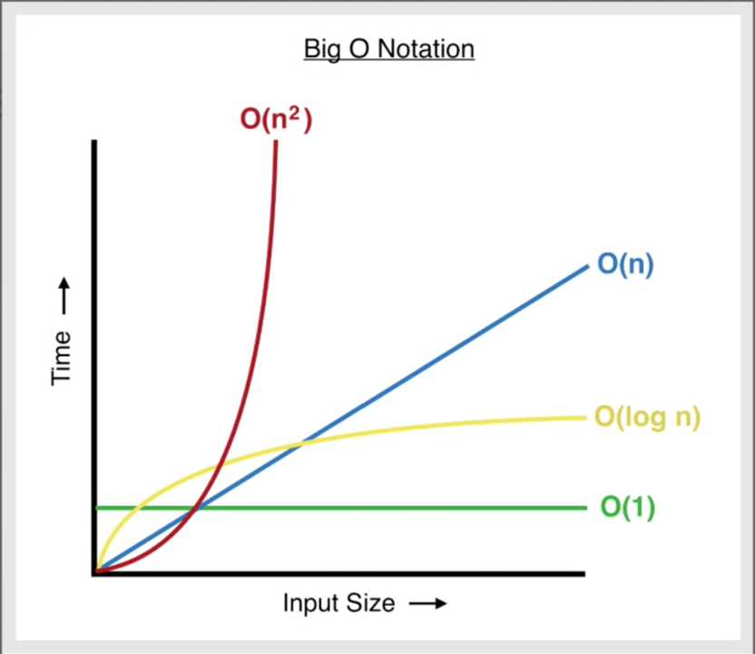

# Массивы, асимптотическая сложность и базовые алгоритмы обработки данных в Python

## Массивы

Рассмотрим следующее здание: в нём 5 этажей, высота каждого этажа равна 10 метрам. Требуется определить, на какой высоте расположен 3-й этаж, если первый этаж начинается с высоты 0.

```
                ┌───────────────┐
                │     Этаж 5    │
                │      10м      │
                └───────────────┘
                ┌───────────────┐
                │     Этаж 4    │
                │      10м      │
                └───────────────┘
                ┌───────────────┐
                │     Этаж 3    │
                │      10м      │
                └───────────────┘
                ┌───────────────┐
                │     Этаж 2    │
                │      10м      │
                └───────────────┘
                ┌───────────────┐
                │     Этаж 1    │
                │      10м      │
                └───────────────┘
```

Поскольку первый этаж начинается на высоте 0, для 3-го этажа получаем:
`0 + 10 * (3 - 1) = 20`

В общем виде это можно выразить формулой:
`Высота = ВысотаПервогоЭтажа + ВысотаЭтажа × (НомерЭтажа - 1)`.

Чтобы избавиться от выражения `НомерЭтажа - 1`, введём допущение, что нумерация этажей начинается с 0.

Важно подчеркнуть следующее: чтобы вычислить высоту заданного этажа, достаточно выполнить фиксированное число действий; при увеличении числа этажей количество действий не растёт. По сути, это и отражает ключевую идею массива: доступ по индексу организован так, что не зависит от количества элементов.

### Память компьютера и индексация элементов

Память компьютера удобно представить как набор ящиков, расположенных последовательно друг за другом. В каждый «ящик» можно положить некоторый объект, и каждый ящик имеет свой номер. Аналогично этому, память можно рассматривать как последовательность ячеек размером 1 байт, которые следуют подряд. При этом память можно организовывать различными способами; в практике программирования для этого используются структуры данных, среди которых одна из базовых — массив.

Пример иллюстрации массива в памяти:

```
Адрес памяти →

0x1000   0x1001   0x1002   0x1003   0x1004
┌───────┬───────┬───────┬───────┬───────┐
│  12   │  45   │   7   │  90   │  33   │ Здесь память другого объекта
└───────┴───────┴───────┴───────┴───────┘
   [0]     [1]     [2]     [3]     [4]
```

Чтобы получить элемент по индексу, достаточно применить формулу:
`АдресЭлемента = АдресПервогоЭлемента + РазмерЭлемента * Индекс`

Из приведённого примера следуют выводы:
- Массив — это некоторая коллекция элементов, расположенных последовательно (друг за другом).
- Элементы массива имеют одинаковый размер (то есть одинаковый тип данных в смысле представления в памяти).
- Получение элемента массива по индексу не зависит от размера массива.
- Массив имеет фиксированный размер.

### Вставка и удаление элементов

Рассмотрим ситуацию: необходимо удалить, например, элемент с индексом 2. Тогда потребуется удалить элемент с индексом 2, а затем сдвинуть каждый последующий элемент влево, чтобы «закрыть» образовавшийся разрыв. Следовательно, чем больше элементов в массиве, тем больше итераций (сдвигов) придётся выполнить.

После удаления образуется свободная ячейка памяти, которую можно заполнить некоторым значением. Эта операция не зависит от размера массива, поскольку к последнему элементу можно обратиться быстро. Однако если требуется вставить элемент в середину массива, тогда придётся сдвигать элементы вправо, то есть выполнять работу, зависящую от числа элементов.

На этом фоне естественно перейти к обсуждению асимптотической сложности алгоритмов.

## О-большое

Ранее отмечалось, что получение элемента массива по индексу не зависит от размера массива. Если условно считать, что операции сложения и умножения занимают 1 мс, то в такой модели доступ к элементу по индексу всегда будет занимать 1 мс. Это можно изобразить графиком зависимости времени от объёма данных.



В то же время мы обсуждали, что при удалении элемента массива требуется сдвигать остальные элементы. Если сдвиг одного элемента занимает 1 мс, то для 2 элементов это 2 мс, для 10 — 10 мс, для 100 — 100 мс. То есть время работы программы возрастает линейно.

При оценке алгоритмов не следует опираться на «реальное» время выполнения, поскольку разные устройства работают по-разному. Для сравнения алгоритмов используют асимптотическую сложность (O-большое).

Так как получение элемента занимает одно и то же время независимо от размера массива, говорят, что асимптотическая сложность доступа к элементу по индексу в массиве является константной: **O(1)**.

А поскольку время удаления элемента (в общем случае) растёт линейно с числом элементов, говорят, что асимптотическая сложность удаления элемента в массиве линейно возрастает: **O(n)**.

Следует помнить, что при обсуждении O-большого обычно (хотя и не всегда) подразумевают время работы в худшем случае. Например, удаление элемента в начале массива и удаление элемента в конце массива отличаются по стоимости.

## Массивы в Python

В глобальном контексте Python «классических» массивов как универсального базового типа нет: вместо них чаще используют списки (о них — далее). Тем не менее для работы с «классическими» массивами существует модуль `array` (класс `array`).

```python
# Импортируем класс array из модуля array
from array import array

# Создаём массив целых чисел с помощью класса array.
# Первый аргумент 'i' указывает на тип данных (целые числа),
# а второй аргумент — список значений для инициализации массива.
arr = array('i', [1, 2, 3, 4, 5])

# Доступ к элементам массива по индексу осуществляется с помощью квадратных скобок.
# Индексация начинается с 0.
# Сложность операции доступа к элементу по индексу: O(1),
# то есть время доступа не зависит от размера массива.
print(arr[0])  # Выводим первый элемент массива (1)
print(arr[1])  # Выводим второй элемент массива (2)

# Сложность операции присваивания значения элементу массива по индексу также O(1),
# поскольку это замена значения по указанному индексу.
arr[2] = 10  # Изменяем значение третьего элемента массива на 10
print(arr[2])  # Выводим изменённое значение третьего элемента массива (10)

# arr[3] = "Hello"  # Попытка присвоить строку элементу массива, который хранит целые числа
# Это вызовет ошибку TypeError, так как массив создан для хранения только целых чисел,
# и строка не может быть преобразована в целое число.

# Сложность добавления элемента в конец массива методом append(): O(1)
# в среднем случае, так как иногда массив может потребовать расширения,
# что может занять больше времени. Однако в большинстве случаев добавление
# в конец выполняется за константное время.
arr.append(6)  # Добавляем новый элемент в конец массива

arr.pop()  # Удаляем последний элемент массива (6).
# Сложность удаления последнего элемента: O(1), так как удаляется элемент в конце.

arr.pop(0)  # Удаляем первый элемент массива (1).
# Сложность удаления элемента в начале: O(n), так как все последующие элементы
# должны быть сдвинуты на одну позицию влево.

arr.insert(0, 0)  # Вставляем новый элемент (0) в начало массива.
# Сложность вставки элемента в начало: O(n), так как все последующие элементы
# должны быть сдвинуты на одну позицию вправо.
```

## Списки в Python

Модулем `array` пользуются относительно редко, потому что в Python есть встроенный тип данных **список** (`list`). В целом он похож на `array`, но допускает хранение значений любых типов.

```python
# Создание пустого списка
l = []
l = list()  # Альтернативный способ создания пустого списка

# Создание списка с элементами
l = [1, 2, 3, 4, 5]

# Создание списка с повторяющимися элементами
l = [0] * 5 # [0, 0, 0, 0, 0]
l = [1, 2] * 3 # [1, 2, 1, 2, 1, 2]

# Создание списка с элементами разных типов
l = [1, "hello", 3.14, True]

# Создание списка с помощью генератора списков (list comprehension)
l = [x for x in range(1, 6)]
l = [x**2 for x in range(1, 6)]

# Список списков (двумерный список)
l = [[1, 2], [3, 4], [5, 6]]

# Доступ к элементам списка
# Сложность доступа: O(1)
l = [10, 20, 30, 40, 50]
print(l[0]) # 10
print(l[2]) # 30
print(l[-1]) # 50

# Изменение элементов списка
# Сложность изменения: O(1)
l[0] = 100

# Добавление элемента в конец списка
# Сложность добавления: O(1)
l.append(60)

# Добавление нескольких элементов в конец списка
# Сложность: O(k), где k — количество добавляемых элементов
l.extend([70, 80])

# Вставка элемента в определённую позицию
# Сложность вставки: O(n)
l.insert(2, 25)

# Удаление элемента по индексу
# Сложность удаления: O(n)
del l[3]

# Проверка наличия элемента в списке
f = 4 in l

# Получение длины списка
print(len(l))

# Итерация по элементам списка
for i in l:
    print(i)

# Итерация по элементам списка с индексами
for i, value in enumerate(l):
    print(f"Индекс: {i}, Значение: {value}")

# Срезы списков
# Сложность получения среза: O(k), где k — количество элементов в срезе
# Параметры: 1 - индекс начала, 2 - конечный индекс (не включая), 3 - шаг
l = [1, 2, 3, 4, 5]
s = l[1:4]  # [2, 3, 4]
s = l[:3]   # [1, 2, 3]
s = l[2:]   # [3, 4, 5]
s = l[-3:]  # [3, 4, 5]
s = l[::2]  # [1, 3, 5]
```

Выше обсуждалось, что элементы массива должны быть одного типа. Тогда возникает вопрос: как в таком случае работают списки? Списки хранят **ссылки** на объекты, а ссылки, в свою очередь, имеют одинаковый размер. Например, на 64-битной системе ссылки имеют размер 8 байт. Поэтому `array` используют, когда требуется экономить память.

## Динамические массивы

Отдельно следует рассмотреть динамические массивы. Классические массивы (в том смысле, который обсуждался в начале) имеют фиксированный размер, однако на практике часто возникает необходимость расширять массив. Массивы, которые можно расширять, в разных языках называются по-разному (например, в C++ это `vector`), но в общем случае их можно назвать **динамическими**. Динамические массивы реализуются по классической схеме структуры данных.

Рассмотрим пример реализации собственного динамического массива на Python:

```python
class DynamicArray:
    def __init__(self):
        # Текущий размер массива (число реально добавленных элементов)
        self._size = 0
        # Вместимость (количество элементов, которые можно вместить без изменения размера)
        self._capacity = 1
        # Инициализация внутреннего массива начальной вместимости
        self._array = [None] * self._capacity

    # Метод изменения размера массива
    def _resize(self, new_capacity):
        # Создание нового массива с новой вместимостью
        new_array = [None] * new_capacity
        # Копирование элементов из старого массива в новый
        # Сложность: O(n)
        for i in range(self._size):
            new_array[i] = self._array[i]

        # Замена старого массива новым и обновление вместимости
        self._array = new_array
        self._capacity = new_capacity

    # Метод добавления элемента в массив
    def append(self, value):
        # Если текущий размер достиг вместимости, увеличиваем вместимость вдвое
        if self._size == self._capacity:
            self._resize(2 * self._capacity)
        # Добавляем новый элемент и увеличиваем размер
        self._array[self._size] = value
        self._size += 1

    # Метод получения элемента по индексу
    def get(self, index):
        # Проверка выхода за границы массива
        if index < 0 or index >= self._size:
            raise IndexError("Index out of bounds")
        return self._array[index]

    # Метод получения текущего размера массива
    def size(self):
        return self._size

    # Метод получения текущей вместимости массива
    def capacity(self):
        return self._capacity

da = DynamicArray()

# Добавляем элементы в динамический массив
for i in range(10):
    # Сложность: O(1) в среднем, O(n) в худшем случае при необходимости изменения размера
    da.append(i)
    print(f"Added {i}, size: {da.size()}, capacity: {da.capacity()}")
```

Как видно, операция инициализации (аллокации) нового «родительского» массива (в рамках переразмещения) является недешёвой. Поэтому обычно стараются заранее оценивать требуемый размер массива (как правило, с запасом).

## Сортировка массива

Далее рассмотрим несколько алгоритмов сортировки массива.

### Сортировка пузырьком (Bubble Sort)

Основная идея следующая: берём элемент массива и сравниваем его со следующим элементом. Если требуется — меняем элементы местами. Затем повторяем это для всех элементов. В итоге после каждой итерации справа оказывается элемент с наибольшим значением. Можно сказать, что этот элемент «всплывает» вверх, подобно пузырьку.

```python
def bubble_sort(arr):
    # Сохраняем длину массива для оптимизации
    n = len(arr)

    # Проходим по всем элементам массива
    for i in range(n):
        # Последние i элементов уже на месте, поэтому не нужно их проверять
        for j in range(n - i - 1):
            # Сравниваем текущий элемент со следующим и меняем местами,
            # если текущий больше следующего
            if arr[j] > arr[j+1]:
                arr[j], arr[j+1] = arr[j+1], arr[j]
```

Поскольку выполняются сравнения «каждого с каждым» (в терминах вложенных проходов), асимптотическая сложность равна `O(n2)`.

Алгоритм **in-place** — не требует дополнительной памяти.

Данное и последующие видео с канала [onjsdev](https://www.tiktok.com/@onjsdev).

[Видео с сортировкой пузырьком](Файлы/lecture4BubbleSort.mp4)

### Сортировка выбором (Selection Sort)

Идея следующая: сравниваем каждый элемент с остальными, находим минимальный элемент и меняем его местами с текущей позицией. По смыслу это можно рассматривать как противоположный взгляд в сравнении с пузырьковой сортировкой: если там большие элементы «уходят» вправо, то здесь минимальные элементы «перемещаются» влево.

```python
def selection_sort(arr):
    # Сохраняем длину массива для оптимизации
    n = len(arr)

    # Проходим по всем элементам массива
    for i in range(n):
        # Ищем минимальный элемент в оставшейся части массива
        min_i = i

        # Проходим по элементам, которые идут после текущего элемента
        for j in range(i + 1, n):
            # Если текущий элемент меньше найденного минимума, обновляем индекс минимума
            if arr[j] < arr[min_i]:
                min_i = j

        # Меняем местами найденный минимум с текущим элементом
        arr[i], arr[min_i] = arr[min_i], arr[i]
```

Аналогично, сложность: `O(n2)`.

Алгоритм **in-place** — не требует дополнительной памяти.

[Видео с сортировкой выбором](Файлы/lecture4SelectionSort.mp4)

### Сортировка вставками (Insertion Sort)

Идея заключается в разделении массива на две части: слева — отсортированная часть, справа — неотсортированная. На первой итерации берём самый левый элемент и считаем, что он уже отсортирован. Затем каждый следующий элемент сравниваем с отсортированной частью, начиная сравнение с её правого края.

```python
def insertion_sort(arr):
    # Начинаем со второго элемента,
    # потому что первый элемент уже считается отсортированным
    for i in range(1, len(arr)):

        # Текущий элемент, который нужно вставить
        key = arr[i]

        # Индекс элемента слева
        j = i - 1

        # Пока не дошли до начала массива
        # и элементы слева больше key,
        # сдвигаем их вправо
        while j >= 0 and arr[j] > key:
            arr[j + 1] = arr[j]  # Сдвиг элемента вправо
            j -= 1               # Двигаемся дальше влево

        # Когда нашли правильное место, вставляем элемент
        arr[j + 1] = key
```

В худшем случае сложность равна `O(n2)`, а в лучшем случае (когда массив уже отсортирован) — `O(n)`.

Алгоритм **in-place** — не требует дополнительной памяти.

[Видео с сортировкой вставками](Файлы/lecture4InsertionSort.mp4)

Это одни из самых простых и наименее эффективных алгоритмов сортировки. Они редко используются на практике (если только частично и в некоторых модификациях). Однако принципиально важно понимать их логику, а также то, что отсортированные массивы в ряде операций отличаются от «обычных» массивов.

## Отсортированные массивы

Во-первых, нельзя «быстро» вставить элемент в отсортированный массив: при каждой вставке необходимо находить корректную позицию для нового значения, чтобы не нарушить упорядоченность.

На первой лекции рассматривался алгоритм простого поиска, где идея состоит в прямом переборе значений. Эффективность такого алгоритма посредственная и равна `O(n)`. Однако отсортированные массивы позволяют использовать бинарный поиск.

### Бинарный поиск

Идея состоит в следующем: выбираем элемент в середине массива, сравниваем его с искомым значением и отбрасываем левую или правую половину массива — в зависимости от того, больше или меньше выбранный элемент по сравнению с искомым. Далее с оставшейся частью массива выполняем аналогичную процедуру.

```python
def binary_search(arr, target):

    left = 0
    right = len(arr) - 1

    while left <= right:

        # Находим середину
        mid = (left + right) // 2

        # Если нашли элемент
        if arr[mid] == target:
            return mid

        # Если элемент меньше
        elif arr[mid] < target:
            left = mid + 1

        # Если элемент больше
        else:
            right = mid - 1

    return -1
```

Каждый шаг делит массив пополам. Иными словами, на каждом шаге размер рассматриваемой части массива уменьшается в 2 раза, то есть происходит деление на степень двойки. Отсюда следует сложность $\log_2 n$. Логарифмы по основанию 2 и 10 отличаются постоянным коэффициентом 3,322 (как и любые логарифмы — они пропорциональны друг другу); эту константу можно обозначить как `K`, получая $K * \log n$. Константы при определении асимптотической сложности обычно отбрасывают, поэтому получаем $O(\log n)$. Это очень быстро на больших объёмах данных.

|элементов|максимум шагов|
|---|---|
|10|4|
|100|7|
|1 000|10|
|1 000 000|20|

[Видео с бинарным поиском](Файлы/lecture4BinarySearch.mp4)